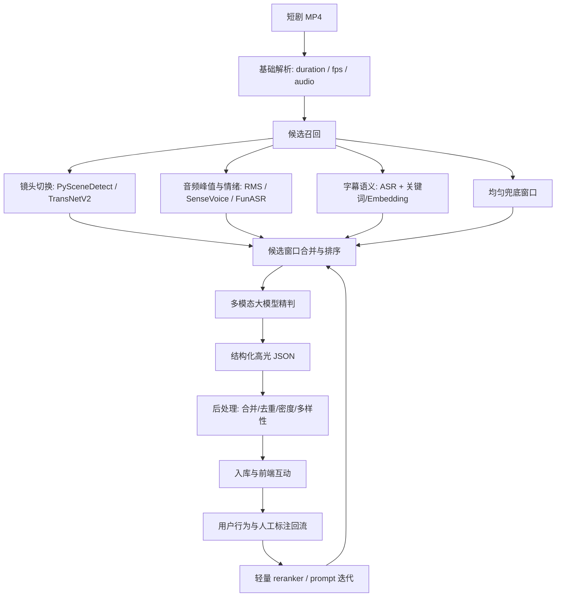

# AI 高光识别技术选型调研与落地方案

> 调研日期：2026-05-31  
> 适用场景：短剧播放过程中的剧情高光识别、互动触发、热力时间线和后续剪辑推荐  
> 当前项目基线：`FFmpeg/PySceneDetect 抽帧 + Whisper ASR + Doubao 多模态判断 + highlights.json 入库`

## 0. 结论先行

短剧“高光识别”不建议理解成单纯的视频摘要，也不建议直接把整集视频丢给大模型一次性生成结果。更稳的工程路线是：

1. **候选召回用便宜信号**：镜头切换、音频能量/情绪、字幕关键词、固定时间窗、历史互动热力先召回候选窗口。
2. **语义判定用多模态大模型**：对候选窗口做剧情理解，输出高光类型、互动按钮、强度、证据和置信度。
3. **上线后用数据回流降成本**：用人工标注和用户行为训练轻量排序模型，只把疑难窗口交给大模型复判。

对本项目的推荐选型：

- **MVP/答辩/小规模内容库**：继续用 `Doubao-Seed-2.0-lite + Whisper/FunASR + PySceneDetect`，保持离线批处理。当前代码方向是对的。
- **生产可用 V1**：升级为“候选召回 + Doubao 原生视频/音频理解或关键帧+字幕精判 + 结构化输出 + 评测集”的流水线。
- **规模化 V2**：引入 `Qwen3-VL` 或 `Nemotron 3 Nano Omni` 自部署做二级判定/兜底，配合自有高光标注数据微调轻量 reranker，降低 API 成本和供应商依赖。

## 1. 高光识别的业务定义

短剧高光不是“画面好看”或“声音变大”，而是**适合打断播放并触发互动的剧情节点**。它至少包含三层含义：

| 层级 | 判断问题 | 示例 |
|---|---|---|
| 感知层 | 这一段是否有明显节奏变化？ | 争吵、打斗、哭声、BGM 起势、镜头快速切换 |
| 剧情层 | 这一段是否推动故事或释放情绪？ | 身份揭露、反杀、打脸、护短、误会解除、剧尾钩子 |
| 产品层 | 这一段是否值得弹互动？ | “爽”“震惊”“燃”“破防”“上头追更” |

所以技术上要避免两个误区：

- **只做视觉/音频显著性**：会漏掉安静但关键的身份反转、名台词、悬念铺垫。
- **只做字幕关键词**：会漏掉表情反应、肢体冲突、道具暴露、镜头语言和音效。

## 2. 当前项目基线评估

当前 `ai_pipeline` 的核心链路是：

```text
mp4
  -> PySceneDetect + 固定间隔抽帧
  -> Whisper ASR 生成字幕段
  -> 按 8s 窗口聚合代表帧和字幕
  -> Doubao 多模态输出高光 JSON
  -> 后端 import 到 Highlight 表
```

已有优点：

- **离线处理是正确方向**：短剧内容固定，离线批处理一次，在线只下发 JSON，延迟和成本都更稳。
- **“画面 + 字幕”已经比单模态强**：能覆盖表情、角色关系、台词信息。
- **输出 schema 已贴近产品**：`type / interaction / intensity / description / raw.evidence` 可以直接驱动 Flutter 高光组件。

主要短板：

- **候选召回还偏粗**：目前窗口主要由抽帧聚合而来，音频峰值和镜头切点是可选过滤，缺少统一候选评分。
- **还没有原生音视频联合理解**：当前 Doubao 输入是图片和字幕，不是完整视频片段，动作连续性、音画一致性和语气情绪会损失。
- **缺少评测闭环**：没有固定标注集，很难判断 prompt 调整是提升还是只是“看起来更会说”。
- **缺少用户行为回流**：点击率、跳过率、复看率还没有反哺高光排序。

## 3. 技术路线对比

| 路线 | 典型做法 | 优点 | 风险 | 适合阶段 | 判断 |
|---|---|---|---|---|---|
| 规则/传统特征 | 音量峰值、镜头切换、字幕关键词 | 成本低、速度快、可解释 | 剧情理解弱，误报多 | 候选召回 | 必须用，但不能单独用 |
| 端到端大模型 | 整集视频直接问大模型 | 开发快，语义强 | 成本/延迟高，长视频定位不稳定，难控密度 | POC | 不建议作为主链路 |
| 监督式高光检测 | CLIP/SlowFast/Transformer 训练打分模型 | 成本低、吞吐高 | 需要大量标注，跨剧泛化难 | 规模化后 | 中后期上 |
| 混合架构 | 便宜召回 + 大模型精判 + 后处理 | 准确、可控、成本合理 | 工程模块多 | MVP 到生产 | 推荐 |
| 自部署多模态模型 | Qwen3-VL/Nemotron 等本地服务 | 数据可控、可微调、边际成本低 | GPU 成本、部署复杂、中文短剧需调优 | 生产 V2 | 做备选和降本 |

核心判断：**短剧高光是“剧情语义 + 产品触发”的任务，最佳路线不是追一个万能模型，而是构建可评测、可回流、可降本的流水线。**

## 4. 推荐架构



### 4.1 候选召回

候选召回的目标不是直接判断高光，而是把整集压缩成少量值得精判的窗口。

建议候选信号：

| 信号 | 技术 | 召回内容 | 注意点 |
|---|---|---|---|
| 镜头切换 | PySceneDetect；后续可试 TransNetV2 | 转场、冲突升级、反应镜头 | 短剧剪辑频繁，不能每个 cut 都判高光 |
| 音频强度 | RMS/Z-score、BGM 起势 | 争吵、打斗、尖叫、哭声 | 安静反转会漏，需要字幕兜底 |
| 音频语义 | SenseVoice / FunASR | 笑声、哭声、掌声、语气情绪、说话人变化 | 比纯 Whisper 更适合捕捉情绪和事件声 |
| 字幕关键词 | ASR + 词典 + embedding | 身份、婚约、背叛、真相、复仇、离婚、继承 | 关键词要按剧类维护，避免俗套误判 |
| 视觉语义 | CLIP/Qwen3-VL embedding | 打斗、跪地、拥抱、病床、婚礼、法庭等场景 | 适合做召回/聚类，不宜单独决策 |
| 固定窗口 | 每 6-10 秒兜底 | 保证召回率 | 后续由模型和后处理过滤 |

候选评分可以先用线性加权：

```text
candidate_score =
  0.25 * scene_score
  + 0.25 * audio_peak_score
  + 0.25 * subtitle_keyword_score
  + 0.15 * visual_semantic_score
  + 0.10 * position_score
```

其中 `position_score` 可对片头、片尾钩子、集末 cliffhanger 做轻微加权，但不要过强，否则会把每集结尾都判成高光。

### 4.2 多模态精判

推荐精判输入从“单帧 + 字幕”升级到“短视频片段 + 字幕 + 候选原因”。

窗口建议：

- 默认窗口：`8-12s`
- 冲突/打斗：可扩到 `12-18s`
- 名台词/身份反转：以 ASR 句子边界对齐，前后各补 `2-4s`
- 集末钩子：允许覆盖到片尾

模型输出必须结构化，建议 schema：

```json
{
  "window_id": "ep_063_00125",
  "is_highlight": true,
  "ts_start": 123.2,
  "ts_end": 131.6,
  "type": "身份反转",
  "interaction": "震惊",
  "intensity": 0.92,
  "confidence": 0.84,
  "description": "男主揭露真实身份，众人当场愣住",
  "narrative_role": "真相揭露",
  "trigger": "身份被点破",
  "evidence": {
    "subtitle": "你根本不知道他是谁",
    "visual": "角色集体转头，女配表情僵住",
    "audio": "背景音乐突然增强"
  },
  "quality_flags": ["clear_evidence", "good_interaction_timing"]
}
```

精判 prompt 要坚持三件事：

- 让模型**引用证据**，否则很容易“凭短剧套路脑补”。
- 让模型输出 `confidence` 和 `quality_flags`，方便后处理和人工复核。
- 让模型区分“剧情信息点”和“互动触发点”，不是所有剧情信息都值得弹窗。

### 4.3 后处理

后处理决定产品体验，比模型本身更容易被低估。

建议规则：

- 同类高光间隔小于 `2-4s` 合并。
- 单集高光密度设上限，例如 `2-4 个/分钟`，具体按前端遮挡和互动节奏调。
- 连续同类型降权，避免整集都是“燃/悬念”。
- `confidence < 0.55` 默认不弹，只进热力/列表候选。
- `intensity >= 0.85` 且证据完整的才触发强动效。
- 集末 `上头追更/剧情悬念` 可单独保留，不与前一段强合并。

### 4.4 数据回流

上线后要把“高光好不好”从主观判断变成数据闭环。

建议采集：

| 数据 | 用途 |
|---|---|
| 高光曝光次数 | 计算真实触达 |
| 互动点击率 | 判断互动标签是否匹配 |
| 高光前后留存/跳出 | 判断弹窗是否打扰 |
| 用户复看/拖动回看 | 判断剧情吸引力 |
| 分享/收藏/评论 | 判断传播价值 |
| 人工审核结果 | 训练评测集和 reranker |

后期可训练轻量模型：

- 输入：候选窗口的音频特征、字幕 embedding、视觉 embedding、模型初判、用户行为统计。
- 模型：LightGBM / XGBoost / 小型 Transformer reranker。
- 作用：先本地打分，只有边界样本调用大模型复判。

## 5. 模型与工具选型

### 5.1 多模态大模型

| 选型 | 能力特征 | 优点 | 风险 | 建议 |
|---|---|---|---|---|
| Doubao-Seed-2.0-lite / 火山方舟 | 2026 年升级为全模态理解，支持视频、图像、音频、文本联合理解，官方文档已有视频理解入口 | 国内访问和商业化链路顺，当前项目已接入，适合批量离线 | 供应商绑定；输出稳定性依赖 prompt/schema | **主选** |
| Qwen3-VL | 官方模型卡强调 256K 上下文、可扩到 1M、小时级视频、秒级索引，Apache-2.0 | 开源可自部署，适合数据隐私和成本优化 | GPU/推理服务复杂；对短剧高光要调参和标注 | **生产 V2 备选** |
| Qwen3-Omni / Qwen3.5-Omni | 统一音频、视频、图像、文本，强调音视频理解和时间同步字幕 | 音频情绪/事件能力强 | 资源要求更高，部分强模型未必开放权重 | 做专项 POC |
| Gemini API Video | 官方支持视频+音频输入，1M 上下文模型可处理长视频，并说明 1 FPS、音频 token 计算 | 长视频能力和文档清晰，适合对标评测 | 境内访问、合规、成本和数据出境问题 | 只做对照/海外方案 |
| NVIDIA Nemotron 3 Nano Omni | 2026 年发布的开放 omni 模型，30B-A3B，面向视频/音频/图像/文本 | 开放、效率路线清晰，企业部署友好 | 新模型，中文短剧适配未知 | 技术储备 |

当前建议：**继续以 Doubao 为主模型**，同时保留模型路由层，让同一批候选窗口可以切换到 Qwen3-VL/Nemotron/Gemini 做 A/B 评测。

### 5.2 ASR 与音频理解

| 选型 | 建议用途 |
|---|---|
| Whisper | 当前可继续使用，稳定、简单、跨语言，适合 MVP |
| FunASR / Paraformer | 中文短剧生产环境更值得评估，支持 VAD、标点、说话人、流式等工程能力 |
| SenseVoice | 适合补充情绪、笑声、哭声、BGM、事件声等音频语义 |
| Doubao/Qwen/Gemini 原生音频理解 | 精判阶段可以直接让大模型联合看音画，但候选阶段仍建议本地音频特征降成本 |

建议短期做法：保留 Whisper，同时加一个可选 `--asr-engine funasr|whisper`。如果中文台词密集、背景乐强、方言多，FunASR/SenseVoice 往往更适合进一步 POC。

### 5.3 镜头检测与视觉特征

| 选型 | 建议用途 |
|---|---|
| PySceneDetect | 当前继续使用，简单稳定，适合硬切和内容差异检测 |
| TransNetV2 | 后续用于更稳的镜头边界识别，尤其是复杂转场 |
| CLIP / OpenCLIP | 做视觉 embedding、场景聚类、粗召回和轻量 reranker |
| Qwen3-VL embedding/reranker | 如果未来要统一多模态检索和排序，可以试 |

## 6. 评测体系

没有评测集，高光识别会陷入“prompt 看起来更聪明”的错觉。建议先做一个小而稳定的 golden set。

### 6.1 标注规范

每集抽 3-5 集做人工标注，至少两人交叉：

- `strong_highlight`：应该触发互动。
- `weak_highlight`：剧情有信息，但不一定弹互动。
- `not_highlight`：普通过场。

每条标注包含：

- `ts_start / ts_end`
- `type`
- `interaction`
- `evidence`
- `why_not`（误报样本很重要）

### 6.2 离线指标

| 指标 | 含义 |
|---|---|
| Recall@K | 前 K 个候选是否覆盖人工高光 |
| Precision@trigger | 实际弹出的高光有多少是强高光 |
| mAP / Hit@1 | 高光排序质量 |
| Time MAE | 起止时间偏差 |
| Type Accuracy | 高光类型是否正确 |
| Evidence Completeness | 是否有台词/画面/音频证据 |
| Density Error | 单集触发密度是否过高/过低 |

时间匹配可以用 `IoU >= 0.3` 或中心点误差 `<= 4s`，不要要求帧级精确。

### 6.3 在线指标

| 指标 | 判断 |
|---|---|
| 高光互动 CTR | 标签和时机是否有吸引力 |
| 高光后 10s 留存 | 弹窗是否增强观看 |
| 高光后跳出率 | 是否打扰用户 |
| 复看/拖动回高光 | 是否真是剧情爆点 |
| 每分钟互动次数 | 是否刷屏 |
| 类型分布 | 是否过度偏向“燃/悬念” |

## 7. 对当前项目的落地改造建议

### V0：保持现状，补文档和评测

- 固定 3 集样本做人工标注。
- 写 `eval_highlights.py`，支持候选 JSON 与人工 JSON 的 `Recall@K / Precision / Time MAE`。
- 当前 Doubao prompt 加强 `confidence`、`evidence`、`quality_flags`。

### V1：升级候选召回

新增模块建议：

```text
ai_pipeline/
  candidate_builder.py     # 汇总 scene/audio/asr/fixed/visual 候选
  postprocess_highlights.py # 合并、去重、密度、多样性
  eval_highlights.py       # 离线评测
```

候选 JSON 建议：

```json
{
  "window_id": "ep_063_0125",
  "ts_start": 120.0,
  "ts_end": 132.0,
  "candidate_score": 0.78,
  "signals": {
    "scene_cut": 0.4,
    "audio_peak": 0.9,
    "subtitle_keyword": 0.7,
    "visual_semantic": 0.5
  },
  "candidate_reason": ["audio_peak", "subtitle:真相", "scene_cut"]
}
```

### V2：模型路由与原生视频理解

新增 `model_router.py`：

- `doubao_frames_subtitles`：当前方式，低成本兜底。
- `doubao_video_clip`：上传短片段，走原生视频/音频理解。
- `qwen3_vl_local`：本地模型服务。
- `gemini_video`：对照实验。

核心是保持同一份输入输出 schema，模型可以换，后处理和前端不用换。

### V3：数据回流和轻量排序

- 后端记录 `highlight_exposure`、`click`、`skip_after_prompt`、`rewatch`。
- 每周导出样本训练 reranker。
- 大模型从“全量精判”退到“疑难样本复判”，降低成本。

## 8. 技术风险与规避

| 风险 | 表现 | 规避 |
|---|---|---|
| 模型脑补 | 没有证据也判身份反转 | 强制输出证据；无证据降置信 |
| 过度触发 | 每几十秒弹一次 | 密度上限、同类降权、低置信不弹 |
| 安静高光漏召回 | 名台词/反转没有音频峰值 | 字幕 embedding、固定窗口兜底 |
| 成本失控 | 全集视频都给大模型 | 候选召回、批量推理、缓存、reranker |
| 跨剧泛化弱 | 古装/霸总/家庭伦理风格差异大 | 高光类型按剧类配置，分剧类评测 |
| 输出 JSON 不稳 | 导入失败或字段缺失 | 使用结构化输出能力；加 schema 校验和重试 |
| 数据合规 | 视频/音频上传第三方 | 私有化备选、脱敏、只上传短窗口、权限审计 |

## 9. 推荐排期

| 周期 | 目标 | 产出 |
|---|---|---|
| 1-2 天 | 建立评测样本 | 3 集人工标注 + 评测脚本 |
| 2-3 天 | 候选召回升级 | `candidate_builder.py` + 候选分数 |
| 2-3 天 | Prompt/schema 升级 | `confidence/evidence/quality_flags` |
| 3-5 天 | 原生视频片段 POC | Doubao video clip 与当前方案 A/B |
| 1 周 | 行为回流 | 曝光/点击/跳出/复看埋点 |
| 2 周+ | reranker | 小模型排序，减少大模型调用 |

## 10. 参考资料

- 火山引擎：Doubao-Seed-2.0-lite 全模态理解升级，支持视频、图像、音频、文本统一理解，并提到视频事件定位与音频情绪/环境声理解能力。  
  https://developer.volcengine.com/articles/7636596381943070763
- 火山方舟：视频理解文档入口、模型列表、结构化输出、文件输入、批量推理和数据回流能力。  
  https://www.volcengine.com/docs/82379/1895586  
  https://www.volcengine.com/docs/82379/1330310  
  https://www.volcengine.com/docs/82379/1568221  
  https://www.volcengine.com/docs/82379/1399517  
  https://www.volcengine.com/docs/82379/1528785
- Qwen2.5-VL 官方博客：长视频理解和事件定位能力。  
  https://qwenlm.github.io/blog/qwen2.5-vl/
- Qwen3-VL 官方 Hugging Face 模型卡：长上下文、视频理解、秒级索引、Apache-2.0。  
  https://huggingface.co/Qwen/Qwen3-VL-8B-Instruct
- Qwen3-Omni / Qwen3.5-Omni 技术报告：统一音频、视频、图像、文本理解，音视频 grounding 与时间同步能力。  
  https://arxiv.org/abs/2509.17765  
  https://arxiv.org/abs/2604.15804
- Gemini API 视频理解文档：视频+音频输入、1 FPS、token 计算和长视频上下文。  
  https://ai.google.dev/gemini-api/docs/video-understanding
- NVIDIA Nemotron 3 Nano Omni：开放 omni 模型，面向视频/音频/图像/文本理解。  
  https://blogs.nvidia.com/blog/nemotron-3-nano-omni-multimodal-ai-agents/
- Video-MME：覆盖短/中/长视频、多模态输入的视频理解评测基准。  
  https://arxiv.org/abs/2405.21075
- VideoLights：视频高光检测与 moment retrieval 的多模态特征对齐方案。  
  https://arxiv.org/abs/2412.01558
- Highlight-CLIP：利用 CLIP 知识做视频高光检测。  
  https://arxiv.org/abs/2404.01745
- PySceneDetect 文档：场景检测工具。  
  https://www.scenedetect.com/docs/latest/
- TransNetV2：镜头边界检测网络。  
  https://github.com/soCzech/TransNetV2
- Whisper：通用 ASR 基线。  
  https://openai.com/index/whisper/
- FunASR / SenseVoice：中文 ASR、说话人、情绪和音频事件检测相关工程工具。  
  https://github.com/modelscope/FunASR  
  https://github.com/FunAudioLLM/SenseVoice
