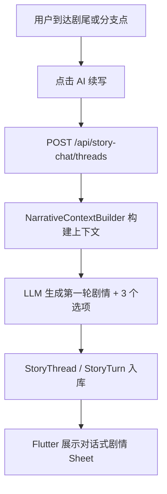
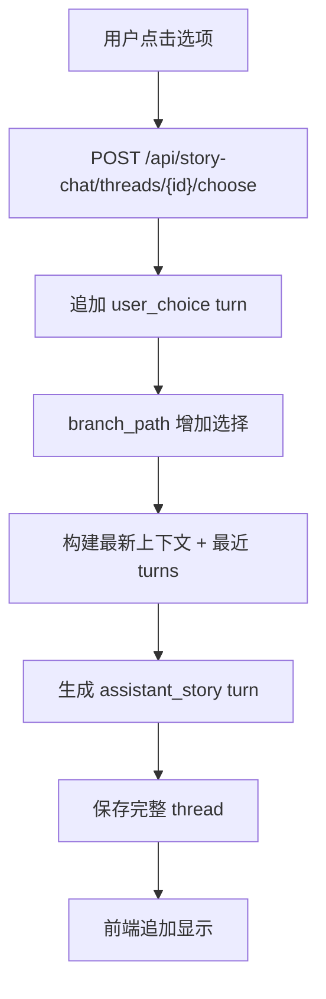
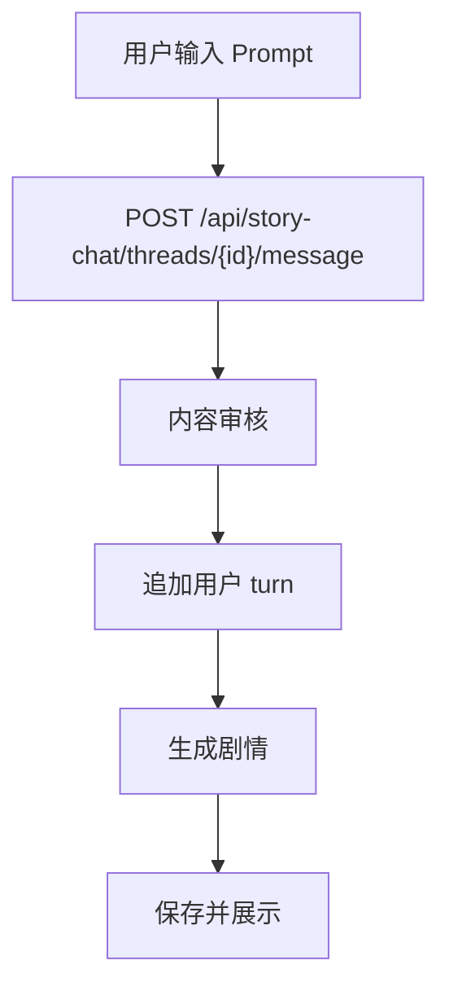
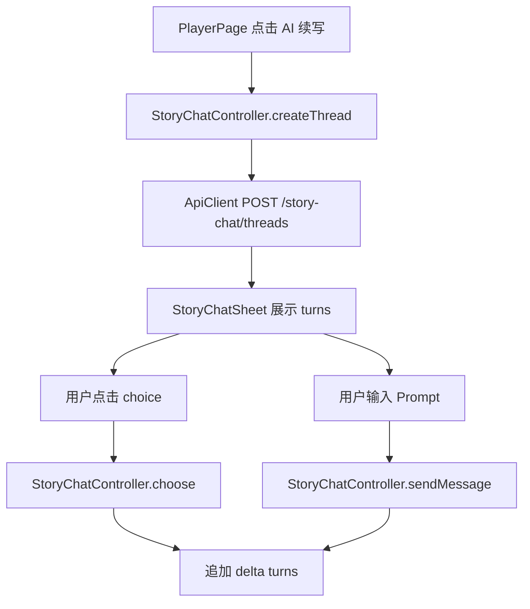
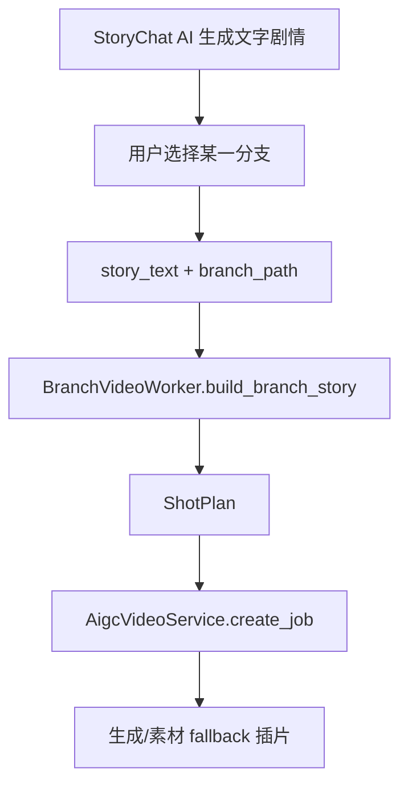

# AI 对话式剧情分支续写 PRD 与技术方案

调研日期：2026-06-08

## 1. 背景

用户希望在剧集播放到关键剧情或剧尾时，不只是看到固定选项，而是能像和 AI 编剧对话一样继续剧情：

1. 系统先准确理解这一集发生了什么。
2. 从台词、画面高光、剧情事件中构建上下文。
3. 用户选择一个分支或输入 Prompt。
4. AI 生成对应的文字剧情。
5. AI 同时生成下一轮可选分支。
6. 用户继续选择，形成多轮剧情树。
7. 之前的剧情内容保留、可回看、可继续。

当前项目已有雏形：

- `backend/app/api/story_chat.py`
- `backend/app/domains/story_chat/service.py`
- `backend/app/domains/story_chat/db_repository.py`
- `backend/app/domains/narrative/context_builder.py`
- `ai_pipeline/plot_event_extractor.py`
- `data/story_chat_threads`
- `StoryThreadModel / StoryTurnModel`

本方案目标是把它升级成更完整、更准确、更可解释的 AI 剧情对话式分支系统。

## 2. 外部产品与技术调研

### 2.1 AI Dungeon：记忆和 Story Cards

AI Dungeon 是 AI 原生文字冒险产品。其官方/应用说明中强调 Story Cards、Memory Banks 等上下文记忆能力，用于存储世界观、角色和上下文相关信息。

参考：

- [AI Dungeon App Store 页面](https://apps.apple.com/us/app/ai-dungeon/id1491268416)
- [AI Dungeon Help: What are Story Cards?](https://help.aidungeon.com/faq/story-cards)
- [AI Dungeon Help: What goes into the Context sent to the AI?](https://help.aidungeon.com/faq/what-goes-into-the-context-sent-to-the-ai)

可借鉴点：

- 长剧情必须有“可检索记忆”，不能只把最近几轮对话塞给模型。
- 角色、地点、重要设定应作为 Story Cards/Role Cards。
- 每次生成都要控制上下文预算，优先放当前剧情和关键记忆。

### 2.2 NovelAI：Memory、Author's Note、Lorebook

NovelAI Lorebook 用关键词触发条目，把角色、地点、阵营等资料插入上下文。官方文档说明 Lorebook 条目有 activation keys，当关键词出现在最近上下文时插入条目。

参考：

- [NovelAI Documentation: Lorebook](https://docs.novelai.net/en/text/lorebook)
- [NovelAI Documentation: Story Settings](https://docs.novelai.net/en/text/editor/storysettings)

可借鉴点：

- 短剧续写也需要角色卡、地点卡、关系卡。
- 不必每次注入全部设定，只注入当前场景相关的卡片。
- Author's Note 类似本项目的风格 profile，可控制“爽感、悬疑、克制、电影感”。

### 2.3 Character.AI / ChatGPT Memory：可控记忆

Character.AI 的 Pinned Memories 允许用户在每个 chat 中固定重要消息；OpenAI Memory 强调用户可查看、删除、关闭记忆。

参考：

- [Character.AI Help: Pinned Memories](https://support.character.ai/hc/en-us/articles/24327914463003-New-Feature-Pinned-Memories)
- [OpenAI Help: What is Memory?](https://help.openai.com/en/articles/8983136-what-is-memory)

可借鉴点：

- 用户应该能看到系统记住了哪些剧情选择。
- 敏感或错误记忆需要可删除/重置。
- 关键分支选择应被固定到 branch path，不被后续轮次遗忘。

### 2.4 互动故事生成研究

STORIUM 指出长篇故事生成评价困难，需要丰富上下文和更可靠评测；CALYPSO 强调 AI 可以作为 Dungeon Master 助手，在既有世界观中同步提供创意辅助。

参考：

- [STORIUM: A Dataset and Evaluation Platform for Machine-in-the-Loop Story Generation](https://arxiv.org/abs/2010.01717)
- [CALYPSO: LLMs as Dungeon Masters' Assistants](https://arxiv.org/abs/2308.07540)

可借鉴点：

- AI 续写不能只追求好看，还要保持角色一致和剧情因果。
- 人机共创更适合“给用户选择”和“给编剧建议”，而不是完全放飞。
- 评测要看连贯性、设定一致性、选择遵循度。

## 3. 产品目标

### 3.1 用户目标

- 看完一集后能继续剧情，不用等下一集。
- 能通过选项或自由输入影响剧情方向。
- 每次选择后都能看到对应文字剧情。
- 之前所有选择和生成内容都保留，像聊天记录一样可回看。
- 多轮选择后仍然不忘记前文。

### 3.2 业务目标

- 增强剧尾追更场景的停留时长。
- 提高用户对剧情的参与感。
- 为个性化分支视频/AIGC 插片提供文本剧情计划。
- 沉淀用户偏好和分支路径。

### 3.3 技术目标

- 从台词、高光、剧情事件构建准确上下文。
- 生成严格 JSON，包含正文、3 个选项、证据事件。
- 线程和 turn 入库，支持继续、回看、列表。
- 生成失败时有 fallback，不让 UI 报错。
- 支持后续流式输出和质量评测。

## 4. 用户流程

### 4.1 创建剧情线程



### 4.2 选择分支继续



### 4.3 自由输入继续



## 5. 信息架构

### 5.1 页面结构

Flutter 建议新增或增强：

- `StoryChatSheet`
- `StoryThreadListSheet`
- `StoryTurnBubble`
- `StoryChoiceChips`
- `StoryMemoryPanel`

页面元素：

- 顶部：剧集标题、当前时间点、风格切换。
- 中部：剧情 turns。
- 底部：3 个 AI 选项 + 自由输入框。
- 侧边/折叠：剧情证据、已选择路径、角色记忆。

### 5.2 交互原则

- 每轮 AI 输出控制在 150-220 字。
- 选项最多 3 个，文案 12 字以内。
- 用户点击选项后立即显示用户气泡，AI 气泡 loading。
- 保留所有历史 turns，不覆盖之前剧情。
- 支持重新生成当前 AI turn，但不删除原 turn，标记为 alternative。

## 6. 数据模型

### 6.1 现有模型

```python
class StoryThreadOut(BaseModel):
    thread_id: str
    episode_id: str
    user_id: str
    fork_id: int | None
    ts_in_video: float
    style_code: str
    title: str
    turns: list[StoryTurnOut]
    branch_path: list[str]
    created_at: datetime
    updated_at: datetime
```

```python
class StoryTurnOut(BaseModel):
    turn_id: str
    thread_id: str
    role: Literal["system", "user_choice", "assistant_story"]
    parent_turn_id: str | None
    selected_choice_id: str | None
    text: str
    choices: list[StoryChoiceOut]
    evidence_event_ids: list[str]
    created_at: datetime
```

### 6.2 建议增强字段

`StoryThreadModel` 增强：

```python
summary: str
current_state_json: dict
pinned_memory_json: list[dict]
quality_score: float
status: str  # active/archived/blocked
```

`StoryTurnModel` 增强：

```python
raw_model_output: dict
quality_warnings: list[str]
alternative_group_id: str | None
token_usage_json: dict
```

新增 `StoryMemoryItem`：

```python
class StoryMemoryItem(Base):
    id: str
    thread_id: str
    memory_type: str  # character/choice/fact/conflict/forbidden
    text: str
    source_turn_id: str | None
    priority: int
    status: str  # active/archived
```

### 6.3 PlotEvent 数据

现有：

```python
class PlotEvent(BaseModel):
    event_id: str
    episode_id: str
    scene_id: str
    ts_start: float
    ts_end: float
    characters: list[str]
    event_type: PlotEventType
    summary: str
    dialogue_evidence: list[str]
    visual_evidence: list[str]
    narrative_role: NarrativeRole
    confidence: float
    source_signals: list[str]
```

建议新增：

```python
dialogue_speakers: list[dict]  # speaker/text
relations_delta: list[dict]   # A 对 B 的关系变化
open_questions: list[str]     # 本场景留下的悬念
```

## 7. 内容理解方案

### 7.1 台词提取

现有：

- `ai_pipeline/whisper_asr.py`

建议输出格式：

```json
{
  "start": 12.3,
  "end": 15.8,
  "text": "你以为我真的怕你吗？",
  "speaker": "unknown",
  "confidence": 0.82
}
```

建议新增函数：

```python
def normalize_transcript_segments(raw_segments: list[dict]) -> list[dict]:
    """统一字幕字段。"""

def infer_speaker_from_context(segment: dict, role_cards: list[dict]) -> str:
    """根据称谓、上下文、角色名推断说话人。"""
```

### 7.2 剧情事件抽取

现有：

- `ai_pipeline/plot_event_extractor.py`

建议增强：

```python
def extract_plot_events_from_transcript(
    episode_id: str,
    segments: list[dict],
    role_cards: list[dict],
) -> list[dict]:
    """从台词中提取冲突、承诺、威胁、关系变化、身份信息。"""

def merge_highlight_and_dialogue_events(
    highlight_events: list[dict],
    dialogue_events: list[dict],
) -> list[dict]:
    """合并视觉高光和台词事件，避免重复。"""

def build_episode_story_summary(events: list[dict]) -> str:
    """生成一集剧情摘要。"""
```

### 7.3 上下文构建

现有：

- `NarrativeContextBuilder.build(payload)`
- `retrieve_current_events`
- `retrieve_recent_events`
- `NarrativeRepository.load_role_cards`
- `NarrativeRepository.previous_summary`

建议增强：

```python
async def build_story_chat_context(
    thread: StoryThreadOut,
    action_text: str,
) -> StoryChatContext:
    """综合剧集剧情、当前事件、历史 turns、固定记忆，生成本轮上下文。"""

def select_relevant_memories(thread: StoryThreadOut, action_text: str) -> list[StoryMemoryItem]:
    """按当前用户选择和关键词检索相关记忆。"""

def compress_old_turns(turns: list[StoryTurnOut]) -> str:
    """压缩较早 turns，避免上下文超长。"""
```

## 8. 生成方案

### 8.1 Prompt 结构

当前 `story_chat/prompt_builder.py` 已有：

```python
def build_story_chat_messages(thread, context, style, action_text) -> list[dict]:
```

建议 Prompt 拆成固定结构：

```json
{
  "role_cards": [],
  "episode_summary": "",
  "current_scene_events": [],
  "recent_events": [],
  "branch_path": [],
  "recent_turns": [],
  "pinned_memories": [],
  "user_action": "",
  "style": "",
  "constraints": {
    "max_text_chars": 220,
    "choice_count": 3,
    "must_reference_evidence": true,
    "forbid_new_core_character_without_reason": true
  }
}
```

### 8.2 输出 Schema

```json
{
  "text": "续写正文",
  "choices": [
    {
      "choice_id": "c1",
      "label": "正面揭穿",
      "intent": "让主角当众拿出证据",
      "preview": "众人反应开始反转",
      "tone": "爽"
    }
  ],
  "evidence_event_ids": ["ep_063_0004"],
  "memory_updates": [
    {
      "memory_type": "choice",
      "text": "用户选择让向云正面揭穿讨债人",
      "priority": 8
    }
  ],
  "warnings": []
}
```

### 8.3 质量校验

当前：

- `story_chat/quality_guard.py`
- `fallback_assistant_turn`
- `parse_assistant_turn`

建议新增：

```python
def validate_story_turn(
    turn: StoryTurnOut,
    context: BranchGenerationContext,
) -> list[str]:
    """检查是否引用证据、是否越界、是否忘记用户选择。"""

def check_choice_diversity(choices: list[StoryChoiceOut]) -> list[str]:
    """检查三个选项方向是否明显不同。"""

def check_character_consistency(text: str, role_cards: list[RoleCard]) -> list[str]:
    """检查人物关系和设定是否冲突。"""

def repair_story_output(raw: str, errors: list[str]) -> StoryTurnOut:
    """模型输出格式不合法时尝试修复。"""
```

## 9. API 设计

现有 API：

```http
POST /api/story-chat/threads
GET /api/story-chat/threads/{thread_id}
GET /api/story-chat/users/{user_id}/threads
POST /api/story-chat/threads/{thread_id}/choose
POST /api/story-chat/threads/{thread_id}/message
```

建议新增：

```http
GET /api/story-chat/threads/{thread_id}/memory
POST /api/story-chat/threads/{thread_id}/regenerate
POST /api/story-chat/threads/{thread_id}/archive
GET /api/story-chat/episodes/{episode_id}/suggested-starts
```

### 9.1 创建线程

请求：

```json
{
  "episode_id": "ep_063",
  "user_id": "u_123",
  "ts_in_video": 120.0,
  "context_hint": "从讨债人逼近这里继续",
  "style_code": "cinematic_literary"
}
```

服务函数：

```python
async def StoryChatService.create_thread(payload: StoryThreadCreateIn) -> StoryThreadOut:
    """创建 thread，追加第一条 user turn 和 assistant turn。"""
```

### 9.2 选择继续

服务函数：

```python
async def StoryChatService.choose(thread_id: str, payload: StoryChoiceIn) -> StoryThreadDeltaOut:
    """用户选择分支，追加用户选择和 AI 续写。"""
```

### 9.3 自由输入

服务函数：

```python
async def StoryChatService.message(thread_id: str, payload: StoryMessageIn) -> StoryThreadDeltaOut:
    """用户自由输入 Prompt，生成下一轮剧情。"""
```

### 9.4 重新生成

新增：

```python
async def StoryChatService.regenerate(
    thread_id: str,
    parent_turn_id: str,
    style_code: str | None = None,
) -> StoryThreadDeltaOut:
    """保留原 turn，生成一个 alternative assistant turn。"""
```

## 10. 前端设计

### 10.1 组件

```dart
class StoryChatSheet extends StatefulWidget
```

职责：

- 展示线程 turns。
- 展示选择 chips。
- 支持输入 Prompt。
- 支持 loading、错误、重试。

```dart
class StoryChatController extends ChangeNotifier
```

职责：

- `createThread`
- `loadThread`
- `choose`
- `sendMessage`
- `regenerate`
- `loadUserThreads`

```dart
class StoryMemoryPanel extends StatelessWidget
```

职责：

- 展示“AI 已记住”的剧情选择、角色关系和关键事实。

### 10.2 前端数据流



## 11. 存储和历史

### 11.1 当前能力

`StoryChatDbRepository` 已支持：

- `get_thread`
- `save_thread`
- `list_user_threads`
- DB 保存 + 文件 fallback。

### 11.2 建议增强

```python
async def append_turns(thread_id: str, turns: list[StoryTurnOut]) -> StoryThreadOut:
    """增量追加 turns，不每次 delete 全量重写。"""

async def update_thread_summary(thread_id: str, summary: str) -> None:
    """更新线程摘要。"""

async def save_memory_items(thread_id: str, items: list[StoryMemoryItem]) -> None:
    """保存记忆项。"""
```

### 11.3 历史展示

用户入口：

- 播放页剧尾“继续上次续写”。
- 个人中心“我的剧情分支”。
- 剧集详情“我的分支路径”。

API：

```http
GET /api/story-chat/users/{user_id}/threads?episode_id=ep_063
```

## 12. 与 AIGC 分支视频联动

文字剧情可作为视频生成前置规划：



新增函数：

```python
def story_turn_to_branch_video_prompt(turn: StoryTurnOut, choice: StoryChoiceOut) -> str:
    """把文字分支转成 AIGC 视频生成 Prompt。"""

def extract_shot_requirements(text: str) -> list[dict]:
    """从文字剧情中提取镜头、动作、对白。"""
```

## 13. 评测方案

### 13.1 自动评测

指标：

- Evidence Coverage：输出是否引用当前剧情事件。
- Choice Following：是否遵循用户选择。
- Character Consistency：人物关系是否冲突。
- Branch Diversity：三个选项是否方向不同。
- Continuity Score：是否承接上一轮。

建议函数：

```python
def evaluate_story_turn(turn: StoryTurnOut, context: BranchGenerationContext) -> dict:
    """输出多维质量分。"""
```

### 13.2 人工评测

每集抽 5 个线程，每个线程 3 轮：

| 维度 | 评分 |
| --- | --- |
| 是否符合原剧情 | 1-5 |
| 是否记住用户选择 | 1-5 |
| 是否有短剧爽感 | 1-5 |
| 选项是否有吸引力 | 1-5 |
| 是否适合转视频 | 1-5 |

## 14. 风险与应对

| 风险 | 说明 | 应对 |
| --- | --- | --- |
| 台词识别错误 | Whisper 误识别影响剧情理解 | 人工复核主展示集字幕 |
| AI 编造人物关系 | 模型幻觉 | role cards + evidence_event_ids + consistency check |
| 多轮后遗忘 | 上下文过长 | branch_path + pinned memory + old turns summary |
| 输出格式不合法 | JSON 解析失败 | repair + fallback turn |
| 生成太慢 | 影响体验 | loading 文案、缓存、预生成剧尾首轮 |
| 内容安全 | 用户 Prompt 不可控 | moderation + review item |

## 15. 实施排期

### 阶段 A：1-2 天，答辩可见

1. 把主展示集字幕转剧情事件。
2. 确保 story thread 入库和历史列表可用。
3. 在 Flutter 展示多轮 turns 和 choices。
4. 添加“继续上次续写”入口。

### 阶段 B：2-4 天，质量提升

1. 增加角色卡和 story memory。
2. 增加输出质量校验。
3. 增加 regenerate。
4. 增加证据事件展示。

### 阶段 C：长期

1. 引入流式输出。
2. 支持剧情树可视化。
3. 支持从文字剧情一键生成分支视频。
4. 做用户偏好个性化续写。

## 16. 当前代码修改清单

| 模块 | 文件 | 修改 |
| --- | --- | --- |
| 台词事件抽取 | `ai_pipeline/plot_event_extractor.py` | 增加 transcript event、episode summary |
| 叙事上下文 | `backend/app/domains/narrative/context_builder.py` | 增加 thread memories 和 compressed turns |
| Story Chat Schema | `backend/app/domains/story_chat/schemas.py` | 增加 memory_updates、warnings、quality_score |
| Story Chat Service | `backend/app/domains/story_chat/service.py` | 增加 regenerate、memory update、quality evaluate |
| Repository | `backend/app/domains/story_chat/db_repository.py` | 增量 append turns、memory table |
| Prompt | `backend/app/domains/story_chat/prompt_builder.py` | 强化证据链、输出 schema、约束 |
| API | `backend/app/api/story_chat.py` | 增加 memory/regenerate/archive |
| Flutter | `flutter_app/lib/features/player/widgets/ai_branch_sheet.dart` | 升级为对话式 StoryChatSheet |
| API Client | `flutter_app/lib/data/api_client.dart` | 增加 story chat 相关方法 |

## 17. 最终推荐方案

最终落地方案：

```text
字幕/高光 -> PlotEvent 剧情事件
PlotEvent + RoleCard + PreviousSummary -> NarrativeContext
NarrativeContext + StoryThread turns + branch_path -> Prompt
LLM -> assistant_story + 3 choices + evidence_event_ids + memory_updates
DB 保存 StoryThread / StoryTurn / StoryMemory
Flutter 对话式展示，可继续选择或自由输入
```

这能满足用户提出的关键诉求：

- “台词提取出来知道这一集剧情”：由 Whisper + PlotEvent + Episode Summary 完成。
- “根据一集剧情开始 AI 编写后续”：由 NarrativeContextBuilder + StoryChatService 完成。
- “用户可以选分支”：由 choices 和 choose API 完成。
- “选了分支生成对应文字剧情”：由 choose 后追加 assistant_story 完成。
- “之前的可以显示出来被存储”：由 StoryThread/StoryTurn 入库和 Flutter turns 展示完成。

## 18. 参考资料

- [AI Dungeon App Store 页面](https://apps.apple.com/us/app/ai-dungeon/id1491268416)
- [AI Dungeon Help: What are Story Cards?](https://help.aidungeon.com/faq/story-cards)
- [AI Dungeon Help: What goes into the Context sent to the AI?](https://help.aidungeon.com/faq/what-goes-into-the-context-sent-to-the-ai)
- [NovelAI Documentation: Lorebook](https://docs.novelai.net/en/text/lorebook)
- [NovelAI Documentation: Story Settings](https://docs.novelai.net/en/text/editor/storysettings)
- [Character.AI Help: Pinned Memories](https://support.character.ai/hc/en-us/articles/24327914463003-New-Feature-Pinned-Memories)
- [OpenAI Help: What is Memory?](https://help.openai.com/en/articles/8983136-what-is-memory)
- [STORIUM: A Dataset and Evaluation Platform for Machine-in-the-Loop Story Generation](https://arxiv.org/abs/2010.01717)
- [CALYPSO: LLMs as Dungeon Masters' Assistants](https://arxiv.org/abs/2308.07540)
