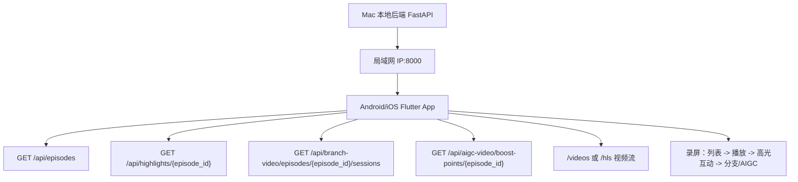
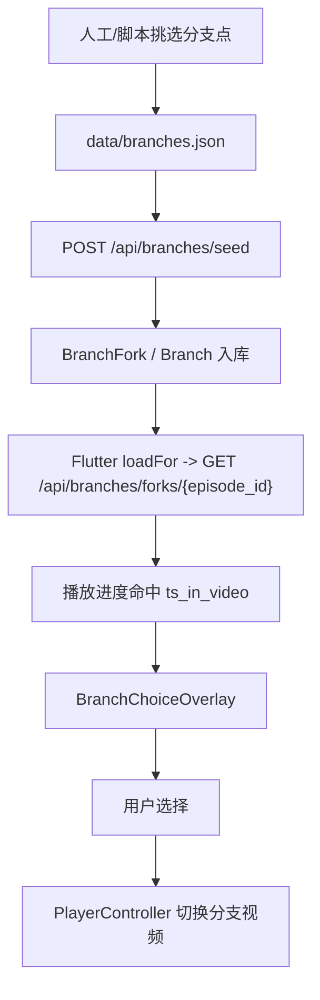
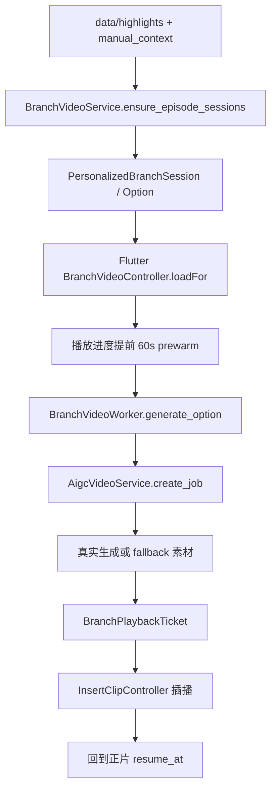
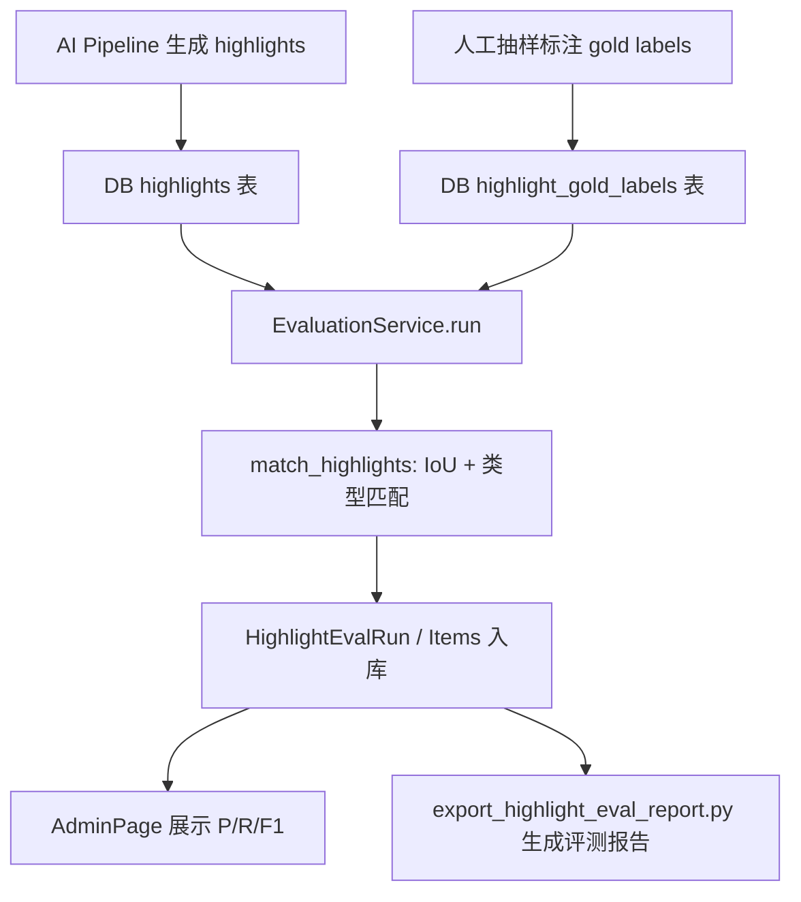
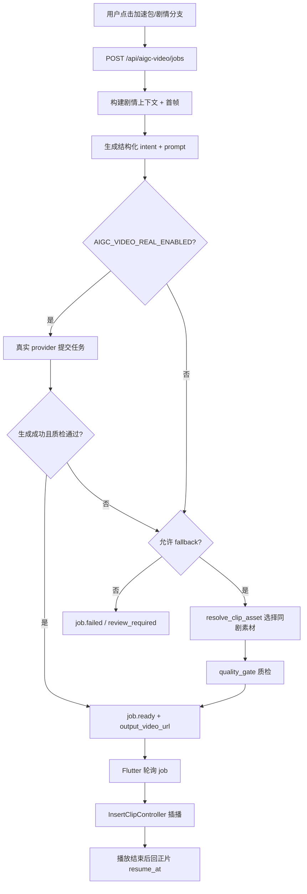
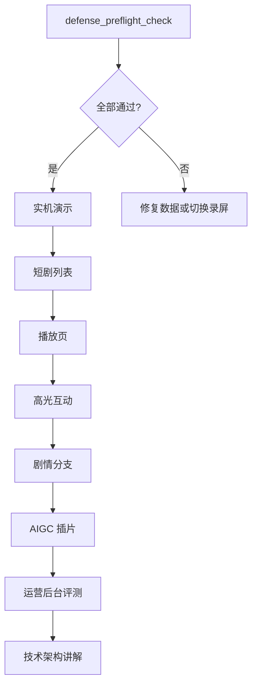

# 最终交付补强需求分析与技术方案

> 面向课题《AI 全栈项目——基于短剧剧情的及时互动激发》的最终交付补强。
> 本文聚焦五个短期最有价值的补强项：移动端录屏验证、主展示剧分支点扩充、高光评测结果整理、AIGC 插片双模式说明、最终答辩脚本。

## 1. 背景与目标

### 1.1 当前项目状态

当前项目已经具备课题 MVP 主链路：

- Flutter 客户端：短剧列表、短剧流、播放页、播控、高光互动、分支选择、AIGC 插片、运营后台入口。
- FastAPI 后端：剧集、高光、互动、弹幕、分支、个性化分支视频、AIGC 视频、评测、运营后台、安全治理等 API。
- AI Pipeline：抽帧、字幕、高光识别、候选窗口生成、高光 JSON 落库。
- 数据资产：多部短剧、多集高光、HLS、分支视频、AIGC/clip fallback 资产。

但从最终答辩和评分维度看，还需要补齐交付证据和演示密度：

- 证明 Flutter 客户端不只是在 macOS 跑通，也能在移动端或模拟器完成录屏演示。
- 每部主展示剧至少有多个分支触发点，避免分支能力看起来只是单点 Demo。
- 高光识别要能给出可解释评测结果，回答“识别准不准”。
- AIGC 插片要明确“真实生成”和“素材 fallback”两种模式，避免评委误解为全量实时生成。
- 答辩流程要有稳定脚本和预检步骤，降低现场演示风险。

### 1.2 补强目标

| 补强项 | 核心目标 | 优先级 |
| --- | --- | --- |
| 移动端录屏验证 | 产出 Android 或 iOS 端可运行证据和录屏路径 | P0 |
| 分支点扩充 | 三部主展示剧每部 3-5 个关键分支点 | P0 |
| 高光评测结果 | 形成 gold label、评测指标、误差分析和展示页/报告 | P0 |
| AIGC 双模式说明 | 代码、配置、文档明确 real / fallback / hybrid 的边界 | P0 |
| 最终答辩脚本 | 形成 3-5 分钟稳定演示路线、预检清单、Q&A 口径 | P0 |

### 1.3 非目标

短期内不追求：

- 覆盖全部 10 部指定短剧。
- 实现生产级账号体系、支付体系、推荐算法。
- 让真实视频生成 API 保证实时完成并完全替代素材 fallback。
- 建立复杂 CI/CD 和公网生产运维体系。

## 2. 总体技术选型

### 2.1 原则

1. 复用现有架构，不重写主链路。
2. 补强围绕“最终交付可信度”：能跑、能录、能解释、能回退。
3. 功能实现和答辩表达同步设计：每个补强点都要能在录屏或文档中被看见。
4. 对模型生成类能力使用双模式：真实 provider 提供上限，素材 fallback 保证演示稳定。

### 2.2 模块边界

| 层 | 现有模块 | 补强方向 |
| --- | --- | --- |
| Flutter 客户端 | `flutter_app/lib/features/player`、`features/shorts`、`features/admin` | 移动端适配验证、录屏路径、后台评测展示 |
| 后端 API | `backend/app/api/*` | 增加/复用评测、AIGC、分支、后台接口 |
| 业务域 | `backend/app/domains/*` | 明确生成模式、分支会话、评测统计 |
| 数据配置 | `data/branches.json`、`data/branch_context_overrides`、`data/highlights` | 扩充分支点、人工上下文、gold labels |
| 脚本 | `scripts/*` | 增加预检、报告导出、分支配置校验 |
| 文档 | `documents/*`、`DELIVERY_DEMO_GUIDE.md` | 最终答辩脚本、技术口径、风险说明 |

## 3. 功能一：移动端录屏验证

### 3.1 需求分析

课题交付要求前端呈现部分在 Android / iOS / Harmony 中任选其一。当前 Flutter 项目具备跨端能力，但最终答辩需要明确证据：

- App 能在 Android 模拟器/真机或 iOS 模拟器/真机启动。
- 能访问本机或局域网后端。
- 能完成列表、播放、互动、分支、AIGC 插片至少一条演示链路。
- 能产出录屏文件或截图，作为最终提交材料。

### 3.2 技术选型

优先选择 Android debug 包验证：

- Flutter 构建 Android 成本低，不依赖 Apple Developer 证书。
- 真机可通过局域网访问 Mac 后端，演示接近移动端真实体验。
- macOS 已验证的 media_kit / Flutter 页面可复用。

备选方案：

- iOS Simulator：适合 macOS 开发环境，但视频解码和网络配置需要额外确认。
- Android Emulator：不用真机，但录屏性能可能受机器影响。

### 3.3 现有代码落点

- App 入口：`flutter_app/lib/main.dart`
- API 配置：`flutter_app/lib/core/config.dart`
- 路由：`flutter_app/lib/core/router.dart`
- 短剧流：`flutter_app/lib/features/shorts/shorts_feed_page.dart`
- 播放页：`flutter_app/lib/features/player/player_page.dart`
- API 客户端：`flutter_app/lib/data/api_client.dart`

### 3.4 需要新增/补充的模块与函数

#### 3.4.1 移动端预检脚本

新增脚本：`scripts/mobile_delivery_preflight.py`

目标：在录屏前检查后端、数据、端侧配置是否满足移动端演示。

建议函数：

```python
def detect_lan_ip() -> str:
    """返回当前 Mac 在局域网内可被手机访问的 IP。"""

def check_backend_health(base_url: str) -> dict:
    """检查后端是否能访问，至少请求 /api/episodes。"""

def check_demo_episode_data(base_url: str, episode_ids: list[str]) -> dict:
    """检查演示剧集、高光、分支、AIGC boost point 是否存在。"""

def check_video_range_support(base_url: str, episode_id: str) -> dict:
    """用 HEAD 或 Range 请求验证移动端播放器所需的视频 Range 支持。"""

def write_mobile_report(result: dict, out_path: Path) -> None:
    """输出 Markdown 或 JSON 预检报告，供答辩材料引用。"""
```

输入：

- `--base-url http://192.168.x.x:8000`
- `--episodes ep_063,txy_001,sbtnn_001`

输出：

- `data/generated/review/mobile_delivery_preflight.md`

#### 3.4.2 Flutter 配置确认函数

现有 `AppConfig.adjustForPlatform()` 需要在移动端确认：

```dart
static void adjustForPlatform()
```

建议补充：

```dart
static String resolveApiBaseUrl()
```

职责：

- 优先读取 `--dart-define=API_BASE_URL`。
- Android Emulator 默认可回退到 `http://10.0.2.2:8000`。
- 真机必须显式传入局域网 IP。

#### 3.4.3 录屏检查清单文档生成

新增脚本函数：

```python
def build_recording_checklist(platform: str, base_url: str) -> str:
    """生成录屏操作清单：启动后端、启动 App、进入剧集、触发互动、保存录屏。"""
```

### 3.5 数据流



### 3.6 验收标准

- Android 或 iOS 至少一个目标端能启动。
- 使用移动端访问局域网后端，剧集列表不为空。
- 能播放一集主展示剧，完成暂停/播放、进度条拖动。
- 能触发一次高光互动。
- 能看到至少一个分支或 AIGC 插片入口。
- 产出 30 秒以上移动端录屏。

## 4. 功能二：每部主展示剧扩充多个分支点

### 4.1 需求分析

当前 `data/branches.json` 中有三部主展示剧各一个固定分支点：

- `ep_063`：北派寻宝笔记
- `txy_001`：天下第一纨绔
- `sbtnn_001`：十八岁太奶奶

这能证明分支能力存在，但演示密度不够。最终建议每部主展示剧补到 3-5 个分支点，覆盖：

- 冲突爆发点
- 爽点反击点
- 关系转折点
- 剧尾追更点
- 用户自由 Prompt 点

### 4.2 技术选型

采用“双轨分支”：

1. 固定分支视频：通过 `data/branches.json` + 预剪辑视频实现，演示最稳定。
2. 个性化分支视频：通过 `branch_video` 域自动从高光/人工上下文生成 session，可进入 AIGC/fallback 插片链路。

短期优先：

- 固定分支：用于答辩主流程。
- 个性化分支：用于展示创新和用户 Prompt。

### 4.3 现有代码落点

固定分支：

- `data/branches.json`
- `data/branches_config.json`
- `backend/app/api/branches.py`
- `flutter_app/lib/features/player/controllers/interaction_controller.dart`
- `flutter_app/lib/features/player/widgets/branch_choice_overlay.dart`

个性化分支视频：

- `backend/app/api/branch_video.py`
- `backend/app/domains/branch_video/service.py`
- `backend/app/domains/branch_video/manual_context.py`
- `backend/app/domains/branch_video/worker.py`
- `flutter_app/lib/features/branch_video/controllers/branch_video_controller.dart`
- `flutter_app/lib/features/branch_video/widgets/personalized_branch_overlay.dart`

### 4.4 需要新增/补充的模块与函数

#### 4.4.1 分支点候选生成脚本

新增脚本：`scripts/propose_branch_points.py`

目标：从高光 JSON 和现有剧集数据中生成候选分支点，供人工挑选。

建议函数：

```python
def load_highlights(episode_id: str, data_root: Path) -> list[dict]:
    """读取 data/highlights/{episode_id}.json。"""

def score_branch_candidate(highlight: dict) -> float:
    """按 intensity、type、interaction、位置等计算分支候选分。"""

def classify_branch_scene(highlight: dict) -> str:
    """输出 conflict/reversal/romance/ending/custom_prompt 等场景类型。"""

def propose_points(episode_id: str, limit: int = 5) -> list[dict]:
    """返回建议分支点：trigger_ts、question、reason、scene_type。"""

def write_branch_point_inventory(points: list[dict], out_path: Path) -> None:
    """输出 Markdown/JSON 清单，方便人工复核。"""
```

输出示例：

```json
{
  "episode_id": "txy_001",
  "trigger_ts": 85.5,
  "scene_type": "reversal",
  "question": "对方步步紧逼，你要怎么反击？",
  "reason": "高光强度 0.91，类型为反转/冲突"
}
```

#### 4.4.2 分支配置校验函数

新增脚本：`scripts/validate_branch_config.py`

建议函数：

```python
def validate_branch_config(path: Path) -> list[str]:
    """校验 branches.json 结构、episode_id、时间戳、分支数量。"""

def validate_branch_video_urls(branches: list[dict], base_url: str) -> list[str]:
    """校验每个 video_url 是否可访问，是否支持 Range。"""

def validate_branch_duration(branch: dict, tolerance: float = 2.0) -> list[str]:
    """用 ffprobe 或接口返回值校验配置 duration 与真实视频时长差异。"""

def summarize_branch_coverage(config: dict) -> dict:
    """统计每部剧分支点数量、分支选项数量、场景类型覆盖。"""
```

#### 4.4.3 固定分支导入接口增强

现有函数：

```python
async def seed_branches(db: AsyncSession = Depends(get_db))
```

建议拆分内部函数，便于测试：

```python
def load_branch_seed_payload(data_root: str) -> dict:
    """读取 branches.json。"""

async def validate_branch_episode_ids(db: AsyncSession, payload: dict) -> None:
    """校验 episode_id 是否存在。"""

async def replace_branch_forks(db: AsyncSession, payload: dict) -> dict:
    """清空并重新写入 BranchFork / Branch。"""
```

#### 4.4.4 个性化分支人工上下文扩展

现有函数：

```python
def list_manual_branch_points(drama_id: str, episode_id: str) -> list[dict]
def load_manual_branch_context(drama_id: str, episode_id: str, trigger_source: str, trigger_ts: float) -> dict
```

建议人工上下文 JSON 增加字段：

```json
{
  "trigger_source": "manual",
  "trigger_ts": 85.5,
  "force_trigger_ts": true,
  "scene_type": "reversal",
  "question": "你要怎么反击？",
  "current_conflict": "对手公开羞辱主角，众人围观",
  "must_keep": ["人物身份不变", "场景仍在正片当前地点"],
  "forbidden": ["不能让主角死亡", "不能跳到无关年代"],
  "options": [
    {
      "label": "正面揭穿",
      "action": "当众拿出证据",
      "emotion": "爽感"
    }
  ]
}
```

对应服务函数保持：

```python
async def BranchVideoService.ensure_episode_sessions(...)
async def BranchVideoService._create_detected_sessions(...)
```

但 `_create_detected_sessions` 应优先使用 `manual_points`，确保答辩触发点稳定。

### 4.5 数据流

固定分支：



个性化分支视频：



### 4.6 验收标准

- 三部主展示剧每部至少 3 个分支点。
- 每个分支点至少 2 个选项，主演示分支点建议 3 个选项。
- 至少 1 个分支点支持用户自由 Prompt。
- 分支触发后视频播放不 404，结束后能回到正片。
- 分支配置脚本校验无错误。

## 5. 功能三：整理高光评测结果

### 5.1 需求分析

课题鼓励使用 AI 内容理解识别剧情高光。答辩时评委可能追问：

- 高光是人工标的还是模型识别的？
- 模型识别准不准？
- 高光误触发怎么办？
- 有无人工复核和评测闭环？

因此需要把现有评测能力整理成可展示结果：

- 每部主展示剧选 1-2 集建立 gold labels。
- 对比 DB 中 AI highlights 和 gold labels。
- 输出 precision、recall、F1、type accuracy。
- 输出 TP/FP/FN 样例和误差原因。

### 5.2 技术选型

使用轻量离线评测：

- 不重新训练模型。
- 不要求全量人工标注。
- 用 IoU 匹配时间段，给出可解释指标。
- 结合运营后台展示和 Markdown 报告。

### 5.3 现有代码落点

- API：`backend/app/api/evaluation.py`
- 服务：`backend/app/domains/evaluation/service.py`
- 指标：`backend/app/domains/evaluation/metrics.py`
- 后台页面：`flutter_app/lib/features/admin/admin_page.dart`
- 后台 API client：`flutter_app/lib/data/api_client.dart`

### 5.4 需要新增/补充的模块与函数

#### 5.4.1 Gold Label 导入脚本

新增脚本：`scripts/import_highlight_gold_labels.py`

建议函数：

```python
def load_gold_label_file(path: Path) -> list[dict]:
    """读取人工标注 JSON/CSV。"""

def normalize_gold_label(row: dict) -> dict:
    """统一字段：episode_id、ts_start、ts_end、type、interaction、description。"""

def post_gold_label(base_url: str, admin_token: str, label: dict) -> dict:
    """调用 POST /api/evaluation/gold-labels。"""

def import_gold_labels(base_url: str, admin_token: str, labels: list[dict]) -> dict:
    """批量导入并返回成功/失败统计。"""
```

建议数据文件：

- `data/generated/review/gold_labels_ep_063.json`
- `data/generated/review/gold_labels_txy_001.json`
- `data/generated/review/gold_labels_sbtnn_001.json`

#### 5.4.2 评测报告导出脚本

新增脚本：`scripts/export_highlight_eval_report.py`

建议函数：

```python
def run_highlight_eval(base_url: str, admin_token: str, episode_id: str) -> dict:
    """调用 POST /api/evaluation/runs。"""

def fetch_eval_run(base_url: str, admin_token: str, run_id: str) -> dict:
    """调用 GET /api/evaluation/runs/{run_id}。"""

def group_eval_items(items: list[dict]) -> dict:
    """按 tp/fp/fn/type_mismatch 分组。"""

def build_error_analysis(run: dict, highlights: list[dict], labels: list[dict]) -> str:
    """生成误差分析文字：偏早、偏晚、漏召、类型错判。"""

def render_eval_markdown(runs: list[dict]) -> str:
    """输出最终 Markdown 报告。"""

def write_eval_report(markdown: str, out_path: Path) -> None:
    """写入 documents 或 data/generated/review。"""
```

输出：

- `data/generated/review/highlight_eval_report.md`
- 可复制摘要到最终答辩文档。

#### 5.4.3 后台页面增强函数

现有 `AdminPage` 已能展示 gold labels 和评测结果，建议增加：

```dart
Future<void> _createGoldLabelFromHighlight(Highlight highlight)
```

职责：

- 在后台中从 AI 高光一键复制为 gold label 草稿。
- 人工只需微调起止时间和类型。

```dart
Widget _evalItemRow(HighlightEvalItem item)
```

职责：

- 展示 TP/FP/FN 明细，而不仅是总分。

### 5.5 数据流



### 5.6 指标口径

- Precision：模型预测高光中，有多少命中人工标注。
- Recall：人工标注高光中，有多少被模型找到。
- F1：Precision 和 Recall 的调和平均。
- Type Accuracy：命中的高光中，类型是否一致。
- IoU Threshold：建议答辩使用 `0.1` 或 `0.2`，因为短剧高光通常是时间段模糊边界，不宜过严。

### 5.7 验收标准

- 至少 3 集有 gold labels，每集建议 10-20 条。
- 每集能跑出一次 eval run。
- 产出包含 P/R/F1、TP/FP/FN、误差分析的 Markdown 报告。
- 运营后台能展示评测结果。
- 答辩时能解释识别结果和误差处理策略。

## 6. 功能四：AIGC 插片真实生成 / 素材 fallback 双模式

### 6.1 需求分析

课题示例三是“加速包”类 AIGC 插片：用户点击后插入生成视频。当前项目已经有 AIGC 视频任务、质量闸门、插片播放和素材 fallback。最终需要清楚表达：

- 真实生成模式：调用 Seedance/即梦等视频生成 provider，生成上限更高，但耗时和权限不可控。
- 素材 fallback 模式：使用同剧同集或同系列片段，保证演示稳定。
- Hybrid 模式：优先真实生成，失败或未开通时回退素材。

### 6.2 技术选型

采用三模式配置：

| 模式 | 配置 | 适用场景 |
| --- | --- | --- |
| fallback | `AIGC_VIDEO_REAL_ENABLED=false` | 本地演示、无视频生成权限 |
| real | `AIGC_VIDEO_REAL_ENABLED=true`、`AIGC_VIDEO_FALLBACK_TO_ASSETS=false` | 展示真实生成能力 |
| hybrid | `AIGC_VIDEO_REAL_ENABLED=true`、`AIGC_VIDEO_FALLBACK_TO_ASSETS=true` | 答辩推荐，兼顾真实和稳定 |

### 6.3 现有代码落点

- API：`backend/app/api/aigc_video.py`
- 服务：`backend/app/domains/aigc_video/service.py`
- mock provider：`backend/app/domains/aigc_video/providers/mock.py`
- real provider：`backend/app/domains/aigc_video/providers/jimeng.py`
- 素材解析：`backend/app/domains/aigc_video/asset_resolver.py`
- 质量闸门：`backend/app/domains/aigc_video/quality_gate.py`
- 转码检测：`backend/app/domains/aigc_video/transcoder.py`
- Flutter 控制器：`flutter_app/lib/features/aigc_video/aigc_video_controller.dart`
- 插片控制器：`flutter_app/lib/features/player/controllers/insert_clip_controller.dart`
- 播放聚合：`flutter_app/lib/features/player/controllers/player_controller.dart`

### 6.4 需要新增/补充的模块与函数

#### 6.4.1 显式生成模式解析

建议在 `backend/app/domains/aigc_video/service.py` 中补充：

```python
def _generation_mode(self) -> str:
    """返回 fallback / real / hybrid，用于状态记录和后台展示。"""
    if settings.aigc_video_real_enabled and settings.aigc_video_fallback_to_assets:
        return "hybrid"
    if settings.aigc_video_real_enabled:
        return "real"
    return "fallback"
```

并在 `create_job` 的 `source_context` 中写入：

```python
"generation_mode": self._generation_mode()
```

#### 6.4.2 AIGC 任务推进拆分

当前核心函数：

```python
async def AigcVideoService.advance_job(job_id: str) -> AigcVideoJobOut
```

建议内部拆分：

```python
async def _advance_real_provider(self, job: AigcVideoJob) -> None:
    """提交/查询真实视频生成 provider。"""

async def _advance_fallback_provider(self, job: AigcVideoJob, reason: str) -> None:
    """选择素材 fallback，跑质量闸门并回填 output_video_url。"""

async def _finalize_ready_job(self, job: AigcVideoJob, candidate: ClipCandidate) -> None:
    """写入视频 URL、duration、quality_score、状态历史。"""
```

这样答辩和后续维护能清晰说明每个阶段。

#### 6.4.3 后台展示生成模式

Flutter `AdminPage` 中 AIGC 任务行建议展示：

```dart
String _generationModeLabel(AigcVideoJob job)
```

展示字段：

- `job.provider`
- `job.sourceContext['generation_mode']`
- `job.sourceContext['fallback_reason']`
- `job.qualityScore`

#### 6.4.4 Boost Point 预生成脚本增强

现有脚本：`scripts/pregen_aigc_boosts.py`

建议补充函数：

```python
def resolve_mode_from_args(args) -> str:
    """根据 --real / --fallback / --hybrid 解析生成模式。"""

def create_boost_job(base_url: str, payload: dict, token: str) -> dict:
    """创建 AIGC job。"""

def wait_until_ready(base_url: str, job_id: str, token: str, timeout: int) -> dict:
    """轮询直到 ready/review_required/failed。"""

def publish_boost_point(base_url: str, job: dict, token: str) -> dict:
    """将 ready job 发布为 boost point。"""

def write_boost_generation_report(results: list[dict], out_path: Path) -> None:
    """输出真实生成/fallback 的结果报告。"""
```

### 6.5 数据流

Hybrid 推荐数据流：



### 6.6 答辩说明口径

建议明确表达：

- “我们实现了 AIGC 插片任务状态机和播放链路。”
- “真实生成 provider 支持接入，但视频生成耗时和权限存在外部依赖。”
- “为了答辩稳定，我们使用 hybrid 策略：真实生成可用时走真实模型，不可用时回退到同剧素材，并用质量闸门避免牛头不对马嘴。”
- “fallback 不是假功能，它是生产系统常见的降级策略，保证用户体验不被外部模型失败打断。”

### 6.7 验收标准

- 后台能看到 AIGC job 的 provider、generation_mode、fallback_reason。
- 至少有 1 个 fallback boost point 可稳定播放。
- 如果真实 provider 可用，至少保留 1 个真实生成 job 记录和质量结果。
- Flutter 播放中能触发插片并回到正片。
- 文档清楚区分 real/fallback/hybrid。

## 7. 功能五：完善最终答辩脚本

### 7.1 需求分析

最终答辩一般包含实机演示、技术讲解、评委提问。需要把演示压缩成稳定路径：

- 3-5 分钟展示最强能力。
- 每一步都有备选路径。
- 出错时能快速切到 fallback 或录屏。
- 技术讲解要贴合评分维度。

### 7.2 技术选型

采用“预检脚本 + 主演示路线 + 兜底录屏 + Q&A 口径”。

文档分工：

- `DELIVERY_DEMO_GUIDE.md`：最终操作脚本。
- `documents/highlight_eval_report.md` 或 `data/generated/review/highlight_eval_report.md`：评测结果。
- 当前文档：补强技术方案。

### 7.3 需要新增/补充的模块与函数

#### 7.3.1 答辩预检脚本

新增脚本：`scripts/defense_preflight_check.py`

建议函数：

```python
def check_backend(base_url: str) -> dict:
    """检查后端 API 是否可用。"""

def check_demo_episodes(base_url: str, episode_ids: list[str]) -> dict:
    """检查演示剧集、视频 URL、高光数量。"""

def check_branch_points(base_url: str, episode_ids: list[str]) -> dict:
    """检查固定分支和个性化分支 session 数量。"""

def check_aigc_boost_points(base_url: str, episode_ids: list[str]) -> dict:
    """检查 boost point 是否存在且 output_video_url 可访问。"""

def check_eval_results(base_url: str, admin_token: str, episode_ids: list[str]) -> dict:
    """检查 gold labels 和 eval runs 是否已准备。"""

def render_defense_preflight_report(result: dict) -> str:
    """生成答辩前检查报告。"""
```

输出：

- `data/generated/review/defense_preflight_report.md`

#### 7.3.2 最终答辩脚本模板

建议在 `DELIVERY_DEMO_GUIDE.md` 中补充以下结构：

```markdown
## 最终答辩 5 分钟路线

1. 入口：短剧列表/短剧流
2. 播放：进入主展示剧，展示播控和弹幕
3. 高光互动：命中高光，点击情绪互动，看全屏特效和互动人数
4. 分支剧情：命中分支点，选择一个分支，播放分支片段
5. AIGC 插片：点击加速包，展示插片播放和回正片
6. 后台/评测：展示高光评测 P/R/F1 和 AIGC 质量闸门
7. 总结：架构、AI 参与、创新点、后续生产化
```

#### 7.3.3 Q&A 口径函数化整理

新增文档段落生成函数可放在脚本中：

```python
def build_qa_cheatsheet() -> str:
    """输出常见问题回答口径：高光来源、AIGC 真假、部署方式、移动端能力。"""
```

建议 Q&A：

- 高光怎么来的？
- 是否实时识别？
- 为什么 AIGC 有 fallback？
- 用户互动如何同步？
- 分支视频是生成还是剪辑？
- 移动端是否真机可跑？
- 生产化还差什么？

### 7.4 最终演示数据流



### 7.5 验收标准

- 有一条 3-5 分钟稳定演示路线。
- 有答辩前预检报告。
- 有移动端录屏或模拟器录屏。
- 有高光评测报告。
- 有 AIGC 双模式说明。
- 有 Q&A 口径，能解释功能边界和未完成项。

## 8. 推荐实施顺序

### 阶段 A：一天内完成，优先保证答辩观感

1. 补 `DELIVERY_DEMO_GUIDE.md` 最终演示脚本。
2. 跑一次移动端/模拟器录屏。
3. 输出 AIGC real/fallback/hybrid 说明。
4. 整理现有高光评测结果截图或 Markdown。

### 阶段 B：1-2 天，增强演示密度

1. 给三部主展示剧各补 2-4 个分支点。
2. 补 `validate_branch_config.py`。
3. 重跑 `/api/branches/seed`。
4. 检查 Flutter 播放页触发是否稳定。

### 阶段 C：2-3 天，增强技术可信度

1. 建立 3 集 gold labels。
2. 跑评测并导出报告。
3. 后台展示 eval item 明细。
4. 加 defense preflight 脚本。

## 9. 任务拆分清单

| 任务 | 文件/模块 | 函数 | 产物 |
| --- | --- | --- | --- |
| 移动端预检 | `scripts/mobile_delivery_preflight.py` | `check_backend_health`、`check_demo_episode_data`、`write_mobile_report` | 移动端预检报告 |
| API URL 适配确认 | `flutter_app/lib/core/config.dart` | `resolveApiBaseUrl` | 真机/模拟器可访问后端 |
| 分支候选生成 | `scripts/propose_branch_points.py` | `propose_points`、`score_branch_candidate` | 分支候选清单 |
| 分支配置校验 | `scripts/validate_branch_config.py` | `validate_branch_config`、`summarize_branch_coverage` | 配置校验结果 |
| 固定分支导入增强 | `backend/app/api/branches.py` | `load_branch_seed_payload`、`replace_branch_forks` | 可测试的 seed 逻辑 |
| gold label 导入 | `scripts/import_highlight_gold_labels.py` | `import_gold_labels` | gold labels 入库 |
| 评测报告导出 | `scripts/export_highlight_eval_report.py` | `run_highlight_eval`、`render_eval_markdown` | 高光评测报告 |
| AIGC 模式显式化 | `backend/app/domains/aigc_video/service.py` | `_generation_mode`、`_advance_real_provider`、`_advance_fallback_provider` | real/fallback/hybrid 可追踪 |
| 后台展示模式 | `flutter_app/lib/features/admin/admin_page.dart` | `_generationModeLabel` | 后台可见生成模式 |
| 答辩预检 | `scripts/defense_preflight_check.py` | `check_demo_episodes`、`check_aigc_boost_points`、`render_defense_preflight_report` | 答辩前检查报告 |
| 答辩脚本 | `DELIVERY_DEMO_GUIDE.md` | 不涉及代码函数 | 3-5 分钟演示路线 |

## 10. 风险与回滚策略

### 10.1 移动端网络访问失败

风险：

- 真机无法访问 `127.0.0.1`。
- 防火墙阻断局域网端口。

策略：

- 使用 `--dart-define=API_BASE_URL=http://<Mac局域网IP>:8000`。
- 预检脚本输出局域网 IP。
- 保留 macOS 客户端和录屏兜底。

### 10.2 分支视频 404 或播放异常

风险：

- `branches.json` 配置视频路径不对。
- 分支视频未剪辑或时长配置错误。

策略：

- `validate_branch_video_urls` 录屏前逐个检查。
- 主演示只使用已验证的 1-2 个分支点。
- 个性化分支失败时允许跳过，不阻塞正片。

### 10.3 评测结果不够好看

风险：

- Precision/Recall 偏低影响观感。

策略：

- 说明评测是抽样评测，不是刷分。
- 输出误差分析，体现工程闭环。
- 展示“高光可以人工复核和运营调整”，而不是只强调模型分数。

### 10.4 真实 AIGC provider 不可用

风险：

- API key、权限、耗时、生成失败影响现场。

策略：

- 答辩使用 hybrid。
- 提前预生成 boost point。
- 后台展示真实生成尝试记录和 fallback reason。

### 10.5 现场演示不稳定

风险：

- 后端未启动、DB 空、视频路径错误、网络卡顿。

策略：

- 使用 `defense_preflight_check.py`。
- 准备录屏兜底。
- 演示前固定剧集和时间点，不临场探索。

## 11. 最终交付材料建议

最终提交建议包含：

- GitHub 仓库链接。
- 移动端或模拟器录屏。
- 主演示录屏。
- `README.md` 和 `LOCAL_RUN_GUIDE.md`。
- `DELIVERY_DEMO_GUIDE.md`。
- 高光评测报告。
- AIGC 双模式说明。
- 本文档。

## 12. 一句话总结

这五个补强项的目标不是推翻现有系统，而是把已经跑通的 MVP 打磨成“可验证、可解释、可演示、可回退”的最终交付形态：移动端证明交付真实，分支点提高互动密度，高光评测证明 AI 能力，AIGC 双模式解释工程取舍，答辩脚本保证现场稳定。
