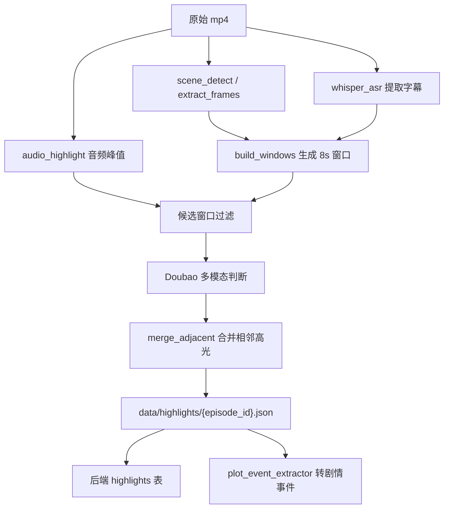
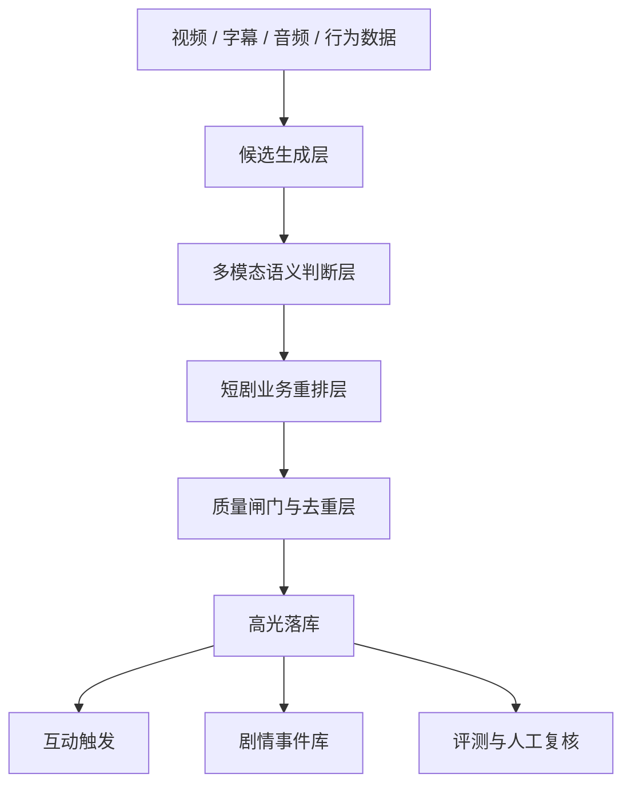

# 剧情高光识别调研与技术选型方案

调研日期：2026-06-08

## 1. 结论摘要

短剧高光识别不建议只说“导入一个预训练模型”。更稳妥、更容易拿技术分的方案是：

1. 先用音频峰值、镜头切分、字幕情绪词、剧情节奏生成候选窗口。
2. 再用多模态大模型或视频理解模型判断窗口是否是高光。
3. 再用短剧业务规则和人工 gold labels 做重排、校准、评测。
4. 最后把识别结果转成剧情事件，给高光互动、分支触发和 AI 续写共用。

当前项目已经有一个可用基线：

- `ai_pipeline/extract_frames.py`：抽帧。
- `ai_pipeline/whisper_asr.py`：字幕转写。
- `ai_pipeline/audio_highlight.py`：音频峰值。
- `ai_pipeline/scene_detect.py`：镜头切点。
- `ai_pipeline/highlight_detector.py`：Doubao 多模态窗口判断。
- `ai_pipeline/plot_event_extractor.py`：高光和字幕转剧情事件。

推荐最终答辩口径：

> 我们没有把预训练模型当黑盒直接套用，而是采用“多信号候选生成 + 多模态语义判断 + 短剧类型体系 + gold set 评测”的工程方案。预训练模型负责视觉/语言理解，短剧高光定义、交互类型、召回/误触发控制和评测闭环由我们实现。

## 2. 评分影响判断

### 2.1 直接导入预训练模型会怎样影响评分

直接导入现有预训练模型不是问题，但评分取决于是否说明清楚：

- 模型来源：论文、开源项目、官方 API、模型能力边界。
- 为什么选它：与短剧场景的匹配度。
- 怎么接入：输入输出、窗口切分、后处理、落库。
- 怎么评测：人工 gold labels、Precision/Recall/F1、误差分析。
- 怎么做工程取舍：速度、成本、稳定性、端云协同。

如果只是“拿一个模型跑一下”，技术复杂度和完整性会偏弱；如果能做多方案对比、数据闭环和业务适配，会更像完整 AI 全栈项目。

### 2.2 推荐评分叙事

| 做法 | 评分风险 | 加分方式 |
| --- | --- | --- |
| 纯人工标注 | AI 能力弱，技术探索不足 | 可作为 gold set 和兜底 |
| 纯预训练模型 | 解释性和业务适配弱 | 加候选生成、Prompt 设计、后处理、评测 |
| 多模态大模型识别 | 成本和稳定性风险 | 批处理、缓存、失败 fallback |
| 自训练/微调模型 | 技术深度高但周期长 | 小样本重排模型即可，不必重训大模型 |
| 多信号融合 | 最适合当前项目 | 展示完整工程闭环和可解释性 |

## 3. 外部方案调研

### 3.1 CLIP / 语言引导视频摘要

OpenAI CLIP 证明了图像和文本可以映射到共同语义空间，并支持 zero-shot 迁移。官方介绍中提到 CLIP 可以通过自然语言类别名应用到视觉分类任务；论文也释放了代码和预训练模型权重。

参考：

- [OpenAI CLIP: Connecting text and images](https://openai.com/index/clip/)
- [Learning Transferable Visual Models From Natural Language Supervision](https://arxiv.org/abs/2103.00020)

适合短剧的用法：

- 把每个视频窗口的代表帧编码成 embedding。
- 把高光查询语句编码成 embedding，例如“主角被羞辱后反击”“身份揭露”“搞笑反差”“剧尾悬念”。
- 用相似度召回候选窗口。
- 再交给 VLM/LLM 解释剧情。

优点：

- 不需要大量本项目标注。
- 可以快速构建召回层。
- 查询词可业务化，适合短剧类型体系。

局限：

- 单帧能力强于长时序剧情理解。
- 对“反转”“隐忍”“关系变化”这类叙事高光，需要字幕和上下文补充。

### 3.2 CLIP-It：语言引导视频摘要

CLIP-It 提出语言引导的视频摘要框架，可以支持通用摘要和查询聚焦摘要。它的核心启发是：视频摘要不应只看视觉重要性，也可以由文本查询引导。

参考：

- [CLIP-It! Language-Guided Video Summarization, NeurIPS 2021](https://papers.nips.cc/paper/2021/hash/7503cfacd12053d309b6bed5c89de212-Abstract.html)
- [CLIP-It arXiv](https://arxiv.org/abs/2107.00650)

适合短剧的用法：

- 用“爽点/反转/名台词/CP 糖/泪点”作为 query-focused summarization 查询。
- 对候选片段做类型化摘要，而不是只输出一段剪辑。

可借鉴点：

- Query-focused video summarization 很适合本项目的高光互动类型。
- 可以把用户反馈也转成 query，例如“用户喜欢爽点，就多召回打脸反击”。

### 3.3 VideoXum：视频摘要和文本摘要联合

VideoXum 提出“视频摘要 + 文本摘要”联合任务，强调视觉片段和文本叙述的语义一致性，并构建了大规模人工标注数据集。

参考：

- [VideoXum: Cross-modal Visual and Textural Summarization of Videos](https://arxiv.org/abs/2303.12060)

适合短剧的用法：

- 高光不只输出时间段，还输出文本解释。
- 用文本解释作为后续互动卡、分支问题、AI 续写上下文。
- 评测时不只看时间命中，还看“解释是否和剧情一致”。

### 3.4 HL-CLIP / Highlight-CLIP 类高光检测

Highlight-CLIP 方向尝试释放 CLIP 在视频高光检测任务中的潜力，说明通用视觉语言预训练模型可以作为高光检测的强基座。

参考：

- [Unleash the Potential of CLIP for Video Highlight Detection](https://arxiv.org/abs/2404.01745)

适合短剧的用法：

- 作为离线重排模型或召回模型。
- 先用 CLIP-like 模型召回高光片段，再用 Doubao 多模态做细分类和解释。

### 3.5 音频 + 视觉无监督高光检测

无监督音频视觉高光检测利用视频中反复出现的视觉/音频模式构造 pseudo labels，适合缺少人工标注的场景。

参考：

- [Unsupervised Video Highlight Detection by Learning from Audio and Visual Recurrence](https://arxiv.org/abs/2407.13933)

适合短剧的用法：

- 用音频峰值、BGM 变化、喊叫、掌声、转场声效作为候选源。
- 对无字幕或字幕质量差的短剧尤其有用。

局限：

- 短剧高光常常是台词反转，音频峰值只能做召回，不适合最终判断。

### 3.6 多模态 Transformer 高光检测

MCT-VHD 这类工作强调视频、音频、文本多模态融合对高光检测很重要。

参考：

- [MCT-VHD: Multi-modal contrastive transformer for video highlight detection](https://www.sciencedirect.com/science/article/pii/S1047320324001172)

适合短剧的用法：

- 作为长期方向：用视觉、音频、字幕、互动行为构建统一高光分。
- 当前项目可先做轻量版特征融合，不必重训大型 Transformer。

### 3.7 视频大模型 / 长视频理解模型

InternVideo2、Video-LLaVA 等视频理解模型强调视频-文本对齐、长视频理解和视频对话能力。

参考：

- [InternVideo2: Scaling Foundation Models for Multimodal Video Understanding](https://arxiv.org/abs/2403.15377)
- [Video-LLaVA: Learning United Visual Representation by Alignment Before Projection](https://arxiv.org/abs/2311.10122)

适合短剧的用法：

- 让模型直接阅读一段视频窗口并输出剧情事件。
- 用于长线升级：减少单帧误判，提升角色关系和动作连续性理解。

短期风险：

- 本地推理成本高。
- 接入工程复杂。
- 对中文短剧、竖屏视频、强剧情梗的适配仍需评测。

## 4. 当前项目基线方案分析

### 4.1 当前 pipeline



核心函数：

- `run_pipeline.run_one(video, episode_id, out, work_dir, skip_asr, candidates)`
- `highlight_detector.build_windows(frames, segments, window_size)`
- `highlight_detector.detect_batch(windows, batch_size)`
- `highlight_detector._merge_adjacent(hits, gap)`
- `plot_event_extractor.convert_highlights_to_events(episode_id, highlights_payload, subtitles)`

### 4.2 当前优点

- 已经不是纯人工：支持抽帧、字幕、多模态模型判断。
- 有短剧类型体系：`家族冲突`、`身份反转`、`打脸爽点`、`剧情悬念` 等。
- 输出可直接驱动互动：每个高光有 `interaction`。
- 可以转剧情事件，给 AI 续写和分支上下文使用。

### 4.3 当前不足

- 候选窗口仍偏粗：默认 8 秒窗口，可能边界不准。
- 识别结果缺少系统性评测：虽然已有 evaluation API，但需要更多 gold labels 和报告。
- 缺少多信号评分融合：现在 VLM 判断较重，行为数据和弹幕数据没有进入模型。
- 缺少模型/规则 ablation：答辩时无法量化“音频候选”“字幕候选”“VLM 判断”各自贡献。

## 5. 推荐高光识别方案

### 5.1 分层架构



### 5.2 候选生成层

目标：高召回，宁可多一点候选，不要漏掉高光。

输入：

- 镜头切点
- 音频能量峰
- 字幕情绪词
- 剧集尾部
- 已有弹幕/互动密度
- 角色关键词

建议函数：

```python
def build_visual_candidates(frames: list[dict], scene_cuts: list[dict]) -> list[dict]:
    """根据镜头切点、画面变化、人物特写生成视觉候选。"""

def build_audio_candidates(audio_peaks: list[dict]) -> list[dict]:
    """根据 BGM、喊叫、冲突音效生成音频候选。"""

def build_subtitle_candidates(segments: list[dict], lexicon: dict) -> list[dict]:
    """根据短剧情绪词、反转词、人物称谓生成字幕候选。"""

def build_tail_candidates(duration: float) -> list[dict]:
    """为剧尾追更和悬念互动生成候选。"""

def merge_candidates(candidates: list[dict], window_size: float = 8.0) -> list[dict]:
    """合并多源候选，输出统一时间窗口。"""
```

### 5.3 多模态语义判断层

目标：判断候选窗口是否是高光，并输出类型、互动词、证据。

当前可继续使用 Doubao 多模态 API：

```python
def detect_batch(windows: list[Window], batch_size: int = 4) -> list[Highlight]:
    """把候选窗口送入多模态模型，输出高光列表。"""
```

建议增强：

```python
def build_highlight_prompt(window: dict, taxonomy: dict, examples: list[dict]) -> list[dict]:
    """构造包含类型体系、正负样例、输出 schema 的 Prompt。"""

def parse_highlight_response(text: str) -> list[dict]:
    """严格解析模型输出，失败时返回可复核错误。"""

def validate_highlight_schema(item: dict) -> tuple[bool, list[str]]:
    """校验 type、interaction、intensity、evidence。"""
```

### 5.4 短剧业务重排层

目标：把模型输出转换成更适合用户互动的高光。

建议特征：

- `model_score`：VLM 给出的 intensity/confidence。
- `audio_score`：音频峰值归一化分。
- `subtitle_score`：情绪词、冲突词、反转词命中。
- `narrative_score`：是否是冲突升级、真相揭露、情绪释放、剧尾钩子。
- `diversity_penalty`：避免同一集全是同一类型。
- `cooldown_penalty`：避免高光太密集。

建议函数：

```python
def score_highlight_candidate(candidate: dict, signals: dict) -> float:
    """融合模型分、音频分、字幕分、叙事分。"""

def apply_type_diversity(hits: list[dict], max_same_type_ratio: float = 0.45) -> list[dict]:
    """控制类型多样性。"""

def apply_trigger_cooldown(hits: list[dict], min_gap: float = 8.0) -> list[dict]:
    """避免互动组件连续弹出。"""

def calibrate_interaction_type(hit: dict) -> str:
    """把高光类型映射成用户可点击互动，如爽、笑、破防、炸裂。"""
```

### 5.5 剧情事件抽取层

高光识别不应只服务互动，也应服务 AI 续写。建议把高光和字幕都转为 `PlotEvent`：

```python
def convert_highlights_to_events(
    episode_id: str,
    highlights_payload: dict | list[dict],
    subtitles: list[dict] | None = None,
) -> dict:
    """把高光、字幕和证据转成剧情事件库。"""
```

建议增强：

```python
def extract_dialogue_events(segments: list[dict]) -> list[dict]:
    """从台词中提取人物、关系、冲突、承诺、威胁等事件。"""

def link_events_to_characters(events: list[dict], role_cards: list[dict]) -> list[dict]:
    """把剧情事件中的别名归一到角色卡。"""

def build_episode_summary(events: list[dict]) -> str:
    """生成一集剧情摘要，给 AI 续写使用。"""
```

## 6. 评测方案

### 6.1 Gold Label 设计

每集抽 10-20 个高光人工标注：

```json
{
  "episode_id": "ep_063",
  "ts_start": 53.0,
  "ts_end": 61.0,
  "type": "剧情悬念",
  "interaction": "炸裂",
  "description": "讨债人逼近，主角陷入选择"
}
```

### 6.2 指标

- Precision：预测高光中命中人工高光的比例。
- Recall：人工高光中被预测命中的比例。
- F1：综合指标。
- Type Accuracy：命中高光中类型是否一致。
- Trigger Offset：触发时间与人工标注中心点偏差。
- Interaction Accept Rate：用户是否点击互动。
- False Trigger Rate：用户快速关闭或无点击的高光比例。

### 6.3 Ablation 评测

建议至少做 4 组：

| 版本 | 说明 | 目的 |
| --- | --- | --- |
| Rule-only | 字幕词 + 音频峰 + 剧尾规则 | 证明简单规则上限 |
| VLM-only | 当前 Doubao 多模态窗口判断 | 证明多模态收益 |
| Fusion | 候选生成 + VLM + 重排 | 最终推荐版本 |
| Fusion + Human Review | 运营复核后版本 | 证明可控生产流程 |

### 6.4 现有代码可复用

- `backend/app/api/evaluation.py`
- `backend/app/domains/evaluation/service.py`
- `backend/app/domains/evaluation/metrics.py`
- `flutter_app/lib/features/admin/admin_page.dart`

建议新增：

```python
def export_eval_report(run_ids: list[str]) -> str:
    """导出 Markdown 评测报告。"""

def build_ablation_report(results: list[dict]) -> str:
    """对比不同识别策略的 P/R/F1。"""
```

## 7. 推荐落地路径

### 阶段 1：答辩前快速增强

1. 为三集主展示剧建立 gold labels。
2. 跑当前 pipeline 的评测。
3. 输出 P/R/F1 + 误差分析。
4. 文档说明预训练模型来源、为什么选择 Doubao 多模态。

### 阶段 2：增强高光识别丰富度

1. 增加 subtitle candidate 和 audio candidate 分源记录。
2. 高光 JSON 的 `raw` 中写入 `source_signals`。
3. 增加重排分数 `final_score` 和 `reason`。
4. 运营后台展示命中证据。

### 阶段 3：长期提升

1. 引入 CLIP/InternVideo 类 embedding 召回。
2. 用项目 gold labels 训练轻量 reranker。
3. 加入用户行为反馈，形成 personalized highlight。
4. 把剧情事件库扩展成“角色-关系-事件”图谱。

## 8. 最终推荐方案

最终项目应采用：

```text
候选召回：镜头切点 + 音频峰 + 字幕情绪词 + 剧尾规则
模型判断：Doubao 多模态窗口分类
语义增强：PlotEvent 剧情事件提取
业务后处理：类型映射、冷却、去重、多样性控制
评测闭环：gold labels + P/R/F1 + 误差分析
```

这比“直接导入预训练模型”更符合课题评分逻辑，因为它同时体现：

- AI 内容理解。
- 全栈工程闭环。
- 互动产品设计。
- 可解释评测。
- 成本和稳定性取舍。

## 9. 参考资料

- [OpenAI CLIP: Connecting text and images](https://openai.com/index/clip/)
- [Learning Transferable Visual Models From Natural Language Supervision](https://arxiv.org/abs/2103.00020)
- [CLIP-It! Language-Guided Video Summarization](https://papers.nips.cc/paper/2021/hash/7503cfacd12053d309b6bed5c89de212-Abstract.html)
- [CLIP-It arXiv](https://arxiv.org/abs/2107.00650)
- [VideoXum: Cross-modal Visual and Textural Summarization of Videos](https://arxiv.org/abs/2303.12060)
- [Unleash the Potential of CLIP for Video Highlight Detection](https://arxiv.org/abs/2404.01745)
- [Unsupervised Video Highlight Detection by Learning from Audio and Visual Recurrence](https://arxiv.org/abs/2407.13933)
- [MCT-VHD: Multi-modal contrastive transformer for video highlight detection](https://www.sciencedirect.com/science/article/pii/S1047320324001172)
- [InternVideo2: Scaling Foundation Models for Multimodal Video Understanding](https://arxiv.org/abs/2403.15377)
- [Video-LLaVA: Learning United Visual Representation by Alignment Before Projection](https://arxiv.org/abs/2311.10122)
