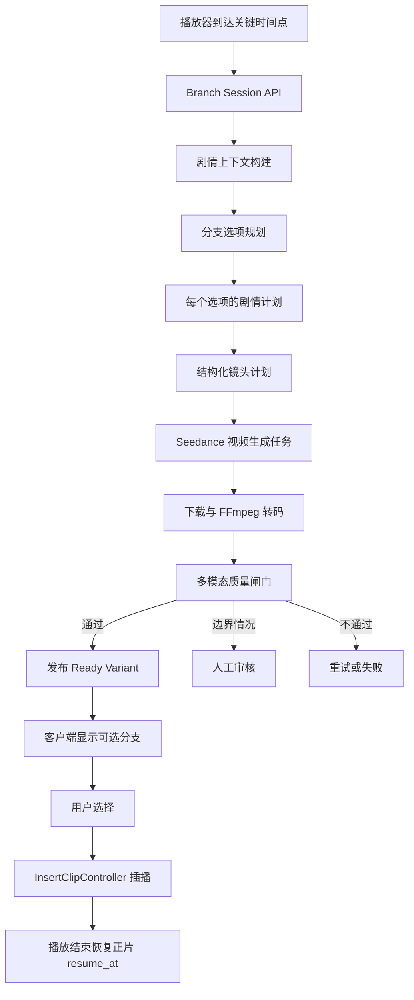

# 个性化剧情分支视频需求分析与技术实现方案

> 项目：short-drama-interaction  
> 日期：2026-06-06  
> 范围：高光评测诊断、剧情分支规划、个性化短视频生成、播放器插播与回正片  
> 本文先完成需求和技术方案，不直接修改业务代码或清理现有评测数据。

## 1. 结论摘要

当前项目已经分别具备以下能力：

- 在指定时间点展示预配置剧情分支。
- 使用 AI 生成连续的文字剧情、分支选项和多轮续写。
- 调用 Seedance 进行首帧图生视频。
- 对生成视频执行下载、转码、多模态质检、首帧 SSIM 校验和人工审核。
- 将 AIGC 视频作为插片播放，并在结束后恢复正片。

但这些能力还没有串成完整的“个性化剧情分支视频”产品链路。当前主要问题是：

1. 高光评测数据被 smoke test 重复写入，截图中的 F1 8.3% 不能代表真实识别水平。
2. 现有剧情分支使用预先剪辑的后续集素材，选择后会替换播放器主视频，而不是插播后回到正片。
3. 固定分支、AI 文字续写、AIGC 插片是三套相对独立的状态，没有统一编排。
4. 截图中“剧情分支”和“AI 加速包”同时出现，说明播放器缺少互斥的体验状态管理。
5. 视频生成是异步任务。要做到用户选择后立即播放，固定选项必须提前生成并缓存；自由 Prompt 需要明确展示生成状态，不能承诺零等待。

推荐目标架构：

```text
高光/追更尾部/用户主动触发
  -> 构建剧情上下文
  -> 生成结构化分支选项
  -> 为每个选项生成剧情计划和镜头计划
  -> 提前调用 Seedance 生成候选视频
  -> 下载、转码、多模态质检、人工审核
  -> 只向客户端发布 ready 选项
  -> 用户选择
  -> 插播对应个性化短视频
  -> 播放结束回到正片 resume_at
```

## 2. 评测结果 8.3% 的含义

### 2.1 它不是“准确率”

截图中的 8.3% 是高光检测任务的 F1 分数，而不是通常意义上的分类准确率。

当前结果为：

```text
TP = 1
FP = 14
FN = 8

Precision = TP / (TP + FP)
          = 1 / 15
          = 6.7%

Recall = TP / (TP + FN)
       = 1 / 9
       = 11.1%

F1 = 2 * Precision * Recall / (Precision + Recall)
   = 8.3%
```

字段含义：

- `TP`：预测出的高光与 Gold Label 在时间上成功匹配。
- `FP`：系统预测为高光，但没有匹配到 Gold Label。
- `FN`：Gold Label 中存在，但系统没有匹配到。
- `Precision`：所有预测结果中，有多少被标注数据认定为正确。
- `Recall`：所有标注高光中，有多少被系统找出来。
- `F1`：Precision 和 Recall 的调和平均，用于综合衡量二者。

当前实现位于：

```text
backend/app/domains/evaluation/metrics.py
backend/app/domains/evaluation/service.py
```

匹配算法使用时间区间 IoU，默认阈值为 `0.3`，并执行一对一贪心匹配。一个预测结果最多只能匹配一个 Gold Label。

### 2.2 数学计算正确，但评测结论不准确

当前数据库中该集存在 9 条 Gold Label，时间区间都是 `53.0-61.0s`，类型都是“剧情悬念”。其中 8 条描述为 `advanced smoke gold label`，来源是高级功能 smoke 脚本被重复执行后写入的测试数据。

这会造成两个问题：

1. 9 条相同 Gold Label 中，最多只有 1 条能和某个预测高光完成一对一匹配，其余 8 条都会成为 FN。
2. 当前该集有 15 条预测高光，而 Gold Label 只标了一个局部时间段。未标注的其他时间段会被全部当作 FP，即使其中可能确实存在有效高光。

因此：

- `F1=8.3%` 对当前数据库里的脏数据和不完整标注来说，计算是正确的。
- 它不能用于判断高光识别模型的真实效果。
- 目前不能据此得出“模型准确率只有 8.3%”的结论。

即使把 9 条重复 Gold Label 去重成 1 条，结果也会近似变成：

```text
TP = 1
FP = 14
FN = 0
Precision = 6.7%
Recall = 100%
F1 = 12.5%
```

这个结果仍不可信，因为该集并没有完成全片标注。

### 2.3 评测系统应先完成的修复

#### P0：清理测试数据

- 删除或标记 `source=smoke_test` 的重复 Gold Label。
- smoke test 使用独立测试数据库，或在事务中执行并回滚。
- smoke test 创建数据后必须清理，不能污染演示数据库。

#### P0：阻止重复写入

建议增加业务唯一键：

```text
(dataset_version, episode_id, ts_start, ts_end, type, annotator_id)
```

创建 Gold Label 时先做规范化和幂等检查：

```python
async def upsert_gold_label(
    db: AsyncSession,
    label: GoldLabelCreate,
) -> HighlightGoldLabel:
    """同一数据集、同一标注者、同一时间段和类型只能存在一条。"""
```

#### P1：建立可用的 Gold Set

- 每集从头到尾完整标注，不能只标一个高光点。
- 至少选择 10-20 集，覆盖悬念、反转、打脸、爽点、情感、搞笑等类型。
- 同一片段由至少两名标注者独立标注。
- 对冲突标签进行复核，记录最终裁决。
- 区分训练集、验证集和测试集，评测时固定测试集版本。

建议新增字段：

```text
dataset_version
dataset_split       # train / validation / test
annotation_status   # draft / reviewed / accepted
source              # manual / imported / smoke_test
reviewer_id
```

#### P1：统一类型词表

当前 Gold Label 使用“剧情悬念”，预测结果可能使用“悬念”，两者在字符串比较中会被判定为类型不一致。

建议建立类型注册表：

```python
HIGHLIGHT_TYPE_ALIASES = {
    "剧情悬念": "suspense",
    "悬念": "suspense",
    "炸裂": "explosive",
    "反转": "reversal",
    "打脸": "face_slap",
    "爽点": "satisfying",
}
```

评测和入库前统一转换为稳定枚举，界面再映射为中文名称。

#### P1：补充业务指标

只看单一 IoU 阈值的 F1 不足以评估互动触发效果。建议同时输出：

| 指标 | 用途 |
|---|---|
| Temporal P/R/F1@IoU 0.1/0.3/0.5 | 衡量时间段检测 |
| Type Macro-F1 | 防止热门类型掩盖少数类型 |
| Trigger Window Hit Rate | 是否在允许触发窗口内命中 |
| Top-K Recall | 每集前 K 个推荐点能覆盖多少真实高光 |
| False Triggers Per Minute | 每分钟误触发次数 |
| Boundary MAE | 预测起止点与人工标注相差多少秒 |
| Human Acceptance Rate | 运营审核通过率 |
| Interaction Lift | 触发后互动率、完播率是否提升 |

面向当前产品，最重要的不是“每一秒都分类正确”，而是：

```text
关键位置能触发 + 不频繁误打扰 + 分支内容与当前剧情衔接
```

## 3. 产品需求分析

### 3.1 目标体验

在剧情关键位置、强悬念位置或本集尾部，系统暂停或弱化正片并展示一个问题，例如：

```text
讨债人逼到面前，向云要怎么应对？
```

系统提供 2-3 个 AI 规划的选项，并允许用户输入自定义 Prompt：

```text
选项 A：假意接钱伺机反击
选项 B：拜入老者门下学本事
选项 C：硬刚到底当场对峙
自定义：用户输入自己的处理方式
```

每个选项不是跳转到后面的剧集，也不是只生成一段文字，而是对应一段独立生成、经过质检的个性化短视频。

用户选择后的行为：

```text
记录正片地址和 resume_at
  -> 播放选择对应的个性化短视频
  -> 短视频播放结束
  -> 重新打开原正片
  -> seek 到 resume_at
  -> 继续播放
```

### 3.2 触发来源

系统需要支持四类触发：

| 触发来源 | 示例 | 生成策略 |
|---|---|---|
| 高光点 | 悬念、反转前、冲突爆发 | 提前生成固定选项 |
| 预配置分叉点 | 运营指定 56s 展示问题 | 提前生成固定选项 |
| 追更尾部 | 本集结尾、下一集未上线 | 生成番外或下一步猜想 |
| 用户主动触发 | 点击 AI 剧情续写或输入 Prompt | 异步按需生成 |

触发规则不能由各个 Controller 独立判断，应统一交给播放器体验协调器。

### 3.3 固定选项与自由 Prompt 的体验差异

视频生成 API 是异步任务，通常需要等待。由此可以推导出：

#### 固定选项

- 在用户到达触发点之前生成。
- 可以离线批量预生成，也可以在播放到触发点前 30-120 秒启动。
- 只向客户端展示已经通过质检并发布的选项。
- 用户点击后立即播放。

#### 自由 Prompt

- 用户输入内容不可预测，不能完全提前生成。
- 提交后显示“规划剧情、生成镜头、质检中”等真实状态。
- 用户可以留在选择页等待，也可以继续看正片，生成完成后收到提示。
- 生成失败时允许修改 Prompt 或重试，不能回退成与选择无关的旧视频。
- Demo 阶段可设置每个用户每日生成次数和最长视频时长，控制成本。

### 3.4 功能范围

必须实现：

- 分支问题和 2-3 个选项生成。
- 每个选项独立生成剧情计划、镜头计划和视频。
- 用户自定义 Prompt。
- 视频任务状态展示。
- 内容安全审核。
- 视频质量闸门和人工审核。
- 选项就绪状态和失败状态。
- 插播结束恢复原正片 `resume_at`。
- 分支历史、用户选择和播放结果持久化。
- 多次进入同一节点时复用缓存，避免重复扣费。

本阶段不建议实现：

- 无限深度的永久世界线。
- 每次选择后实时生成完整下一集。
- 未经审核的用户 Prompt 视频直接公开给其他用户。
- 为追求“立即播放”而用无关素材静默替代生成失败的视频。

## 4. 现有代码能力与差距

### 4.1 已有模块

| 能力 | 现有位置 | 可复用内容 |
|---|---|---|
| 预配置分叉点 | `backend/app/api/branches.py` | Fork 和 Branch 查询 |
| 分支数据模型 | `backend/app/models.py` | `BranchFork`、`Branch` |
| AI 文字剧情 | `backend/app/domains/narrative/` | 剧情上下文、角色和事件 |
| AI 多轮续写 | `backend/app/domains/story_chat/` | Thread、Turn、用户 Prompt |
| AIGC 视频 | `backend/app/domains/aigc_video/` | Seedance provider、任务状态 |
| 视频质检 | `backend/app/domains/aigc_video/` | 多模态质检、SSIM、审核 |
| 插片播放 | `flutter_app/lib/features/player/controllers/insert_clip_controller.dart` | 插播与回正片 |
| 播放器编排 | `flutter_app/lib/features/player/controllers/player_controller.dart` | 播放状态入口 |

### 4.2 当前分支播放错误

当前 `PlayerController.chooseBranch()` 的行为是：

```dart
_currentMainVideoUrl = option.videoUrl;
await playback.open(option.videoUrl!, autoplay: true);
```

这会把分支视频写成新的正片地址。分支播放结束后，播放器不知道原正片地址和恢复位置，因此无法回到原剧情。

正确实现应复用 `InsertClipController`：

```dart
await insertClip.playInsertedClip(
  playback: playback,
  currentMainVideoUrl: originalMainVideoUrl,
  clipUrl: ticket.videoUrl,
  resumeAt: Duration(milliseconds: (ticket.resumeAt * 1000).round()),
);
```

分支视频只能是 inserted clip，不能修改 `_currentMainVideoUrl`。

### 4.3 当前界面状态冲突

截图中剧情分支选项和 AI 加速包同时覆盖在播放器中间。原因是：

- 分支由 `pendingFork` 控制。
- 加速包由 `activeBoostPoint` 控制。
- 二者分别更新，没有统一的互斥状态。

需要新增 `PlayerExperienceCoordinator`，保证同一时刻只有一个主互动层。

建议状态：

```dart
enum PlayerExperienceState {
  idle,
  highlight,
  branchChoice,
  branchGenerating,
  insertedClip,
  boost,
  storyChat,
}
```

建议优先级：

```text
insertedClip
  > branchChoice / branchGenerating
  > boost
  > highlight
```

进入高优先级状态时，低优先级浮层自动隐藏；退出后再根据时间窗决定是否恢复。

## 5. 推荐技术架构

### 5.1 总体架构



### 5.2 模块目录

建议增加独立的业务编排域，避免把业务逻辑塞进 Seedance provider：

```text
backend/app/
  api/
    branch_video.py
  domains/
    branch_video/
      __init__.py
      schemas.py
      repository.py
      context_builder.py
      option_planner.py
      story_planner.py
      shot_planner.py
      cache.py
      quality_policy.py
      service.py
      worker.py
    aigc_video/
      providers/
        base.py
        jimeng.py
        mock.py
      multimodal_quality.py
      first_frame_quality.py
      transcoder.py

flutter_app/lib/features/
  branch_video/
    data/
      branch_video_api.dart
      branch_video_models.dart
    controllers/
      branch_video_controller.dart
    widgets/
      branch_choice_overlay.dart
      branch_generation_progress.dart
      branch_prompt_sheet.dart
      branch_video_result_badge.dart
  player/
    controllers/
      player_experience_coordinator.dart
      insert_clip_controller.dart
      player_controller.dart
```

职责边界：

- `branch_video`：决定生成什么、何时生成、选项状态和播放票据。
- `aigc_video`：负责向 provider 提交、轮询、下载、转码和基础质检。
- `story_chat`：负责用户多轮文字输入和历史上下文。
- `narrative`：提供角色、事件、关系和剧情记忆。
- `player`：只负责展示、选择和播放，不在客户端拼接 Prompt。

## 6. 数据模型

### 6.1 personalized_branch_sessions

代表某个用户在一个剧情节点上的分支生成会话。

| 字段 | 类型 | 说明 |
|---|---|---|
| id | string | `pbs_xxx` |
| episode_id | string | 当前正片 |
| fork_id | int/null | 预配置分叉点 |
| highlight_id | int/null | 关联高光 |
| user_id | string | 用户 |
| trigger_source | string | highlight/fork/episode_tail/manual |
| trigger_ts | float | 展示选择的时间 |
| resume_at | float | 插片结束后恢复位置 |
| question | string | 分支问题 |
| context_snapshot | JSON | 生成时的剧情快照 |
| status | string | 会话状态 |
| prompt_version | string | Prompt 版本 |
| expires_at | datetime/null | 预生成结果有效期 |
| created_at | datetime | 创建时间 |

### 6.2 personalized_branch_options

代表一个分支选项及其语义，不直接保存 provider 细节。

| 字段 | 类型 | 说明 |
|---|---|---|
| id | string | `pbo_xxx` |
| session_id | string | 所属会话 |
| option_key | string | A/B/C/custom |
| label | string | 前台短标题 |
| description | string | 选项解释 |
| intent | JSON | 行为、情绪、关系变化 |
| user_prompt | text | 自定义 Prompt |
| story_plan | JSON | 结构化剧情计划 |
| shot_plan | JSON | 结构化镜头计划 |
| status | string | planned/generating/ready/failed |
| order_idx | int | 展示顺序 |
| created_at | datetime | 创建时间 |

### 6.3 branch_video_variants

一个选项可以多次生成候选视频，只有一个版本被发布。

| 字段 | 类型 | 说明 |
|---|---|---|
| id | string | `bvv_xxx` |
| option_id | string | 所属选项 |
| aigc_job_id | string | 复用 `aigc_video_jobs` |
| provider | string | seedance |
| model | string | 使用的模型 |
| source_frame_url | string | 正片首帧 |
| output_video_url | string | 成片地址 |
| duration | float | 实际时长 |
| quality_score | float | 综合质检分 |
| quality_detail | JSON | 各维度评分 |
| review_status | string | pending/approved/rejected |
| publish_status | string | draft/published/retired |
| cache_key | string | 幂等和复用键 |
| created_at | datetime | 创建时间 |

### 6.4 branch_playback_events

用于分析选择和播放效果。

```text
session_id
option_id
variant_id
user_id
event_type       # impression/select/play_start/play_complete/resume/error
ts_in_main_video
clip_position
payload
created_at
```

### 6.5 缓存键

建议缓存键包含：

```text
episode_id
fork_id/highlight_id
source_frame_hash
option_intent_hash
story_plan_hash
model
prompt_version
duration
resolution
```

示例：

```python
cache_key = sha256(
    canonical_json({
        "episode_id": episode_id,
        "fork_id": fork_id,
        "source_frame_hash": source_frame_hash,
        "intent": option.intent,
        "model": model,
        "prompt_version": prompt_version,
        "duration": duration,
    }).encode("utf-8")
).hexdigest()
```

## 7. API 设计

### 7.1 创建或获取分支会话

```http
POST /api/branch-video/sessions
```

输入：

```json
{
  "episode_id": "ep_063",
  "ts_in_video": 56.0,
  "fork_id": 1,
  "highlight_id": 12,
  "trigger_source": "fork",
  "option_count": 3,
  "target_duration": 12,
  "style": "短剧电影感"
}
```

输出：

```json
{
  "session_id": "pbs_063_xxx",
  "question": "讨债人逼到面前，向云要怎么应对？",
  "trigger_ts": 56.0,
  "resume_at": 61.0,
  "status": "partially_ready",
  "options": [
    {
      "id": "pbo_a",
      "label": "假意接钱伺机反击",
      "description": "先稳住对方，再抓住破绽反制",
      "status": "ready",
      "duration": 12.0,
      "quality_score": 0.91
    }
  ]
}
```

服务端应保证幂等：同一用户、同一节点在有效期内重复请求时返回已有会话。

### 7.2 查询生成进度

```http
GET /api/branch-video/sessions/{session_id}
```

用于固定选项预热和自由 Prompt 的进度轮询。后续可升级为 WebSocket/SSE。

### 7.3 选择分支

```http
POST /api/branch-video/sessions/{session_id}/select
```

输入：

```json
{
  "option_id": "pbo_a",
  "client_event_id": "evt_uuid"
}
```

输出：

```json
{
  "status": "ready",
  "playback_ticket": {
    "variant_id": "bvv_xxx",
    "video_url": "/generated/aigc/branch_xxx.mp4",
    "duration": 12.04,
    "main_video_url": "/videos/ep_063.mp4",
    "resume_at": 61.0,
    "expires_at": null
  }
}
```

只有 `published + approved + quality_passed` 的 Variant 才能返回播放票据。

### 7.4 创建自定义分支

```http
POST /api/branch-video/sessions/{session_id}/custom-options
```

输入：

```json
{
  "prompt": "向云假装认怂，暗中录下讨债人的威胁作为证据",
  "style": "克制悬疑、现实主义",
  "target_duration": 12
}
```

输出：

```json
{
  "option_id": "pbo_custom_xxx",
  "status": "planning",
  "estimated_stage": "story_planning"
}
```

不能返回虚假的精确完成时间。客户端展示阶段和进度区间即可。

### 7.5 后台审核接口

```http
GET  /api/admin/branch-video/reviews
POST /api/admin/branch-video/variants/{variant_id}/approve
POST /api/admin/branch-video/variants/{variant_id}/reject
POST /api/admin/branch-video/variants/{variant_id}/retry
```

拒绝时必须保存原因，例如：

```text
character_drift
scene_mismatch
action_mismatch
first_frame_discontinuity
visual_artifact
unsafe_content
copyright_risk
```

## 8. 核心函数输入输出

### 8.1 构建剧情上下文

```python
async def build_branch_context(
    *,
    episode_id: str,
    ts_in_video: float,
    fork_id: int | None,
    highlight_id: int | None,
    user_id: str,
    history_limit: int = 8,
) -> BranchGenerationContext:
    ...
```

输出应包含：

```python
class BranchGenerationContext(BaseModel):
    episode_id: str
    drama_title: str
    current_time: float
    recent_events: list[StoryEvent]
    active_characters: list[CharacterCard]
    relationship_state: list[RelationshipState]
    current_conflict: str
    unresolved_hooks: list[str]
    transcript_window: str
    visual_summary: str
    source_frame_url: str
    forbidden_changes: list[str]
```

### 8.2 规划分支选项

```python
async def plan_branch_options(
    context: BranchGenerationContext,
    *,
    option_count: int = 3,
    style: str = "",
) -> list[BranchOptionPlan]:
    ...
```

输出：

```python
class BranchOptionPlan(BaseModel):
    option_key: str
    label: str
    description: str
    action: str
    emotion: str
    relationship_change: str
    expected_hook: str
    risk_level: str
```

约束：

- 选项必须彼此有明显差异，不能只是换措辞。
- 选项必须基于当前人物能力和关系，不能凭空增加关键设定。
- 12 秒内只能表达一个核心动作和一个结果钩子。
- 至少一个选项保持主线性格，其他选项提供合理偏离。

### 8.3 生成剧情计划

```python
async def build_branch_story(
    context: BranchGenerationContext,
    option: BranchOptionPlan,
    *,
    user_prompt: str = "",
    target_duration: int = 12,
) -> BranchStoryPlan:
    ...
```

输出：

```python
class BranchStoryPlan(BaseModel):
    premise: str
    opening_continuity: str
    beats: list[StoryBeat]
    dialogue: list[DialogueLine]
    ending_hook: str
    character_constraints: list[str]
    negative_constraints: list[str]
```

### 8.4 生成镜头计划

```python
async def build_shot_plan(
    context: BranchGenerationContext,
    story: BranchStoryPlan,
    *,
    target_duration: int,
    aspect_ratio: str = "9:16",
) -> BranchShotPlan:
    ...
```

输出示例：

```json
{
  "duration": 12,
  "aspect_ratio": "9:16",
  "source_frame_url": "/generated/frames/ep_063_56.jpg",
  "shots": [
    {
      "start": 0,
      "end": 3,
      "framing": "中近景",
      "action": "向云接过钱，目光快速扫过对方手腕",
      "camera": "轻微推进"
    },
    {
      "start": 3,
      "end": 8,
      "framing": "手部特写转双人中景",
      "action": "向云突然扣住对方手腕并侧身卸力",
      "camera": "快速跟随"
    },
    {
      "start": 8,
      "end": 12,
      "framing": "低机位中景",
      "action": "讨债人失衡，向云压低声音警告",
      "camera": "稳定收束"
    }
  ],
  "negative_constraints": [
    "不得改变人物服装和发型",
    "不得新增无关角色",
    "不得切换到其他地点",
    "避免多余手指、面部漂移、文字乱码"
  ]
}
```

### 8.5 保证可播放 Variant

```python
async def ensure_video_variant(
    *,
    session: PersonalizedBranchSession,
    option: PersonalizedBranchOption,
    force_regenerate: bool = False,
) -> BranchVideoVariant:
    ...
```

逻辑：

```text
计算 cache_key
  -> 命中已发布 Variant：直接返回
  -> 未命中：创建 AigcVideoJob
  -> 使用正片 trigger_ts 首帧提交 Seedance
  -> 轮询任务
  -> 下载
  -> FFmpeg 转码
  -> 质量检测
  -> 自动通过 / 人工审核 / 失败
```

### 8.6 选择并返回播放票据

```python
async def select_option(
    *,
    session_id: str,
    option_id: str,
    user_id: str,
    client_event_id: str,
) -> BranchPlaybackTicket:
    ...
```

输出：

```python
class BranchPlaybackTicket(BaseModel):
    variant_id: str
    video_url: str
    duration: float
    main_video_url: str
    resume_at: float
```

必须验证：

- 会话属于当前用户或允许匿名设备访问。
- Option 属于 Session。
- Variant 已发布并通过审核。
- `client_event_id` 幂等，防止重复记账和重复选择。

## 9. 变量与数据流

### 9.1 固定选项预生成

```text
episode_id + trigger_ts
  -> narrative context
  -> BranchGenerationContext
  -> option_planner
  -> BranchOptionPlan[]
  -> story_planner
  -> BranchStoryPlan[]
  -> shot_planner
  -> BranchShotPlan[]
  -> AigcVideoJob[]
  -> Seedance provider_job_id[]
  -> local output_video_url[]
  -> AigcQualityCheck[]
  -> BranchVideoVariant[]
  -> published ready options
```

### 9.2 用户选择与播放

```text
session_id + option_id
  -> POST select
  -> BranchPlaybackTicket
  -> pause main video
  -> originalMainVideoUrl 保持不变
  -> InsertClipController.playInsertedClip()
  -> inserted clip completed
  -> InsertClipController.resumeMainVideo()
  -> openAt(originalMainVideoUrl, resumeAt)
  -> continue main video
```

客户端关键变量：

```dart
final originalMainVideoUrl = controller.currentMainVideoUrl;
final resumeAt = ticket.resumeAt;
final insertedClipUrl = ticket.videoUrl;
```

`originalMainVideoUrl` 在整个插片周期中不可被分支视频覆盖。

### 9.3 用户自由 Prompt

```text
user_prompt
  -> 内容安全检查
  -> 与 BranchGenerationContext 合并
  -> 生成 custom option
  -> story plan
  -> shot plan
  -> 异步视频任务
  -> 进度查询/推送
  -> 质检与审核
  -> ready 后通知客户端
  -> 用户确认播放
```

### 9.4 状态机

Session：

```text
draft
  -> planning
  -> generating
  -> partially_ready
  -> ready
  -> active
  -> completed / expired / failed
```

Option：

```text
planned
  -> submitted
  -> generating
  -> downloading
  -> transcoding
  -> quality_checking
  -> review_required
  -> ready / rejected / failed
  -> selected
  -> played
```

## 10. 模型与基础设施选型

### 10.1 文本规划模型

建议继续使用项目已经接入的 Doubao Seed 2.0 Lite，负责：

- 分支问题生成。
- 选项差异化规划。
- 剧情 Beat 生成。
- 结构化镜头计划。
- 用户 Prompt 改写和安全约束补充。

输出必须使用严格 JSON Schema，不允许直接将自由文本拼进视频 Prompt。

模型输入由服务端构建，至少包括：

```text
角色卡
最近剧情事件
当前冲突
人物关系
字幕窗口
视觉摘要
用户选择/Prompt
时长约束
禁止修改项
```

### 10.2 视频生成模型

当前项目已跑通 Seedance 首帧图生视频，可作为第一阶段 Provider。

建议：

- 12 秒 Demo：沿用当前已验证的 Seedance 图生视频链路。
- 需要 10-15 秒时：选择支持目标时长的 Seedance 模型版本，并在提交前检查模型能力。
- 需要更强人物、场景和动作一致性时：优先使用支持首尾帧或多模态参考的模型。
- 正片真人脸、演员肖像和版权素材必须确认平台规则和授权边界，不能只依赖技术可用性。

官方资料显示，视频生成采用创建任务后查询结果的异步模式；Seedance 2.0 支持图片、视频、音频和文本等多模态参考，并支持首帧、首尾帧、编辑和延长等任务。具体可生成时长应以当前模型的 API 参数和控制台能力为准。产品上的“点击即播”因此应由预生成和缓存实现，而不是在点击时才开始生成。

### 10.3 任务队列

Demo 阶段：

- 可沿用数据库任务状态和后台轮询。
- 服务重启后必须能恢复未完成任务。

生产阶段：

- 推荐 `Redis + arq`，与 FastAPI 的异步代码风格更一致。
- 每个阶段使用独立可重试任务。
- provider submit 必须幂等。
- 下载、转码和质检设置最大重试次数。
- 记录每次模型调用的 tokens、视频秒数、费用和耗时。

### 10.4 媒体存储

Demo：

```text
data/generated/aigc/
```

生产：

- 源帧和生成视频上传 TOS。
- 使用带时效签名的上传 URL。
- Provider 返回的视频 URL 要立即转存，不能长期依赖临时 URL。
- 数据库只保存稳定对象存储地址和元数据。

### 10.5 转码

继续使用 FFmpeg：

```text
H.264
AAC
9:16
720x1280 或 1080x1920
faststart
固定帧率
响度归一化
```

输出可同时提供 MP4 和 HLS。短插片优先直接 MP4，降低首帧等待。

## 11. 视频质量闸门

现有多模态质检和首帧 SSIM 可以继续使用，但分支视频还需要增加“选项语义一致性”。

### 11.1 自动质检维度

| 维度 | 检查内容 |
|---|---|
| 首帧连续性 | 生成视频首帧与正片抽帧 SSIM/感知相似度 |
| 角色一致性 | 人物数量、外观、服装、身份是否漂移 |
| 场景一致性 | 地点、时间、灯光是否延续 |
| 选项一致性 | 画面动作是否真的执行了所选行为 |
| 剧情一致性 | 是否违背已知人物关系和设定 |
| 技术质量 | 时长、分辨率、比例、黑帧、卡帧、花屏 |
| 视觉缺陷 | 面部漂移、手部异常、肢体融合、文字乱码 |
| 内容安全 | 暴力、低俗、敏感、版权和肖像风险 |
| 回正片兼容 | 结尾是否适合回到 `resume_at` |

### 11.2 推荐判定策略

```text
硬性失败：
  - 视频不可解码
  - 时长或比例不符合要求
  - 内容安全失败
  - 首帧严重不连续
  - 与所选分支动作完全不符

自动通过：
  - 所有硬性项通过
  - 综合分 >= 0.85
  - 角色、动作、首帧分别达到最低阈值

人工审核：
  - 综合分 0.70-0.85
  - 模型判断不确定
  - 真人肖像或高风险动作

自动拒绝：
  - 综合分 < 0.70
```

阈值需要通过人工审核数据校准，不能直接把模型自评分数当作客观真值。

### 11.3 选项一致性评估输入

多模态评估模型应同时收到：

```text
当前剧情摘要
所选选项 label/description
BranchStoryPlan
BranchShotPlan
源首帧
生成视频关键帧
生成视频音频转写
```

输出严格结构：

```json
{
  "character_score": 0.9,
  "scene_score": 0.88,
  "option_alignment_score": 0.93,
  "continuity_score": 0.86,
  "technical_score": 0.98,
  "safety_passed": true,
  "decision": "pass",
  "reasons": []
}
```

## 12. Flutter 实现方案

### 12.1 BranchVideoController

```dart
class BranchVideoController extends ChangeNotifier {
  BranchVideoSession? session;
  BranchVideoOption? selectedOption;
  bool isLoading = false;
  String? error;

  Future<void> loadSession({
    required String episodeId,
    required double tsInVideo,
    int? forkId,
    int? highlightId,
  });

  Future<BranchPlaybackTicket?> selectOption(String optionId);

  Future<void> createCustomOption({
    required String prompt,
    int targetDuration = 12,
  });

  Future<void> refreshProgress();
}
```

### 12.2 播放入口

在 `PlayerController` 新增：

```dart
Future<void> playPersonalizedBranch(
  BranchPlaybackTicket ticket,
) async {
  final currentMainUrl = _currentMainVideoUrl ??
      selectedQuality?.url ??
      episode?.preferredVideoUrl;
  if (currentMainUrl == null || currentMainUrl.isEmpty) return;

  await insertClip.playInsertedClip(
    playback: playback,
    currentMainVideoUrl: currentMainUrl,
    clipUrl: ticket.videoUrl,
    resumeAt: _clampSeekTarget(
      Duration(milliseconds: (ticket.resumeAt * 1000).round()),
    ),
  );
}
```

现有 `chooseBranch()` 应改为：

```text
选择 option
  -> 调用 branch-video select API
  -> 获取 BranchPlaybackTicket
  -> playPersonalizedBranch(ticket)
```

不得再执行：

```dart
_currentMainVideoUrl = option.videoUrl;
```

### 12.3 插片播放结束

播放器监听 inserted clip 的 ended 事件：

```dart
if (insertClip.isPlayingInsertedClip) {
  await insertClip.resumeMainVideo(playback);
  interaction.onSeek(insertClip.resumePositionSeconds);
  danmaku.resetTo(resumeAt);
}
```

验收时需要验证：

- 插片结束后回到原正片，而不是正片开头。
- 目标位置误差不超过 0.5 秒。
- 正片的清晰度、倍速、弹幕时间轴和播放状态正确恢复。
- 手动退出插片时有“回到正片”行为。

### 12.4 分支浮层

浮层需要呈现：

- 问题。
- 2-3 个选项。
- 每个选项的 ready/generating/review/failed 状态。
- 自定义 Prompt 入口。
- 跳过本次选择。
- AI 生成标记、时长和质量提示。

不应把“未就绪”选项伪装成可立即播放。固定选项可以只显示 ready 项，自由 Prompt 则显示真实进度。

## 13. 运营后台

后台增加“个性化分支”页：

```text
节点列表
  -> 问题和选项编辑
  -> 各选项视频生成状态
  -> 视频预览
  -> 源首帧对比
  -> 质检详情
  -> 通过 / 拒绝 / 重试
  -> 发布 / 下线
```

运营人员可修改：

- 分支问题。
- 选项标题和意图。
- `trigger_ts` 和 `resume_at`。
- 目标时长。
- 风格。
- 禁止内容。
- 是否允许用户自由 Prompt。

发布前必须确保：

```text
至少两个选项 ready
所有可见选项均有 published variant
resume_at 在正片时长范围内
选项视频可访问且可解码
不存在未处理的安全审核结果
```

## 14. 安全、成本与稳定性

### 14.1 安全

- 用户 Prompt 先审后生成。
- 生成视频再做多模态审核。
- 真人角色需要明确授权和平台合规策略。
- 后台操作写审计日志。
- 播放 URL 使用签名或权限校验。

### 14.2 成本

- 固定分支以节目级缓存共享，不为每个用户重复生成。
- 个性化 Prompt 设置用户配额。
- 相似 Prompt 可做语义缓存，但必须明确提示内容可能复用。
- 每个节点限制候选数和重试次数。
- 记录每个 Variant 的模型费用、转码费用和审核成本。

### 14.3 稳定性

- 所有创建接口支持 `idempotency_key`。
- Provider 超时后查询原任务，不能直接重复提交。
- 临时视频 URL 及时转存。
- 生成失败不影响正片播放。
- 客户端断线重进后可恢复 Session 和任务状态。

## 15. 测试方案

### 15.1 单元测试

- Gold Label 去重。
- 时间 IoU 和一对一匹配。
- 类型别名规范化。
- 分支选项 JSON Schema。
- cache key 稳定性。
- 状态机合法迁移。
- 只有已发布 Variant 能生成 Playback Ticket。

### 15.2 API 测试

- 创建 Session 幂等。
- 三个固定选项独立生成。
- 自定义 Prompt 审核失败。
- 查询生成进度。
- 审核通过、拒绝和重试。
- 重复 select 不重复记账。

### 15.3 播放器集成测试

```text
正片播放到 56s
  -> 只显示剧情分支，不显示加速包
  -> 选择 Option A
  -> 播放 A 对应视频
  -> 视频结束
  -> 正片从 61s 继续
```

还需要覆盖：

- Option B、C 的视频内容和 URL 不相同。
- 插片无法加载时回到正片。
- 用户跳过选择后正片继续。
- 应用切后台再回来。
- 网络断开和恢复。
- 插片结束恢复倍速和弹幕。

### 15.4 AIGC 回归集

为每类分支建立固定测试样本：

```text
反击
逃跑
求助
和解
揭露秘密
身份反转
追更番外
```

每次升级 Prompt 或模型后比较：

- 角色一致性。
- 选项动作命中率。
- 首帧连续性。
- 人工通过率。
- 平均生成耗时。
- 平均费用。

## 16. 分阶段实施

### 阶段 0：修复评测数据，0.5-1 天

- 清理重复 smoke Gold Label。
- smoke test 改用测试数据库或自动回滚。
- 增加 Gold Label 幂等约束。
- 统一高光类型。
- 完成至少一集全片人工标注后重新评测。

### 阶段 1：修正分支插播，1-2 天

- 改造 `chooseBranch()`，不再替换 `_currentMainVideoUrl`。
- 为静态分支返回 `resume_at`。
- 复用 `InsertClipController` 插播并回正片。
- 新增 `PlayerExperienceCoordinator`，解决浮层重叠。
- 先使用现有分支视频验证完整播放链路。

### 阶段 2：固定选项真实预生成，3-5 天

- 创建 `branch_video` Domain。
- 复用 narrative/story_chat 构建上下文。
- 使用 Seed 模型生成结构化选项、剧情和镜头。
- 为每个固定选项创建 Seedance 任务。
- 接入现有下载、转码、SSIM、多模态质检和后台审核。
- 只发布通过质检的 Variant。

### 阶段 3：用户自由 Prompt，3-5 天

- 增加 Prompt 输入和内容审核。
- 增加异步进度页。
- 支持生成完成通知。
- 增加用户配额、费用记录和失败重试。
- 将用户历史写入 story thread。

### 阶段 4：生产化，5-10 天

- Redis + arq Worker。
- TOS 对象存储。
- WebSocket/SSE 任务状态。
- 多端 Session 恢复。
- AIGC 回归评测集。
- 成本、时延、通过率和互动转化监控。

## 17. 代码修改清单

| 文件/目录 | 修改内容 |
|---|---|
| `backend/app/models.py` | 新增 Session、Option、Variant、PlaybackEvent |
| `backend/app/api/branch_video.py` | 新增会话、选项、选择、进度 API |
| `backend/app/domains/branch_video/` | 新增业务编排域 |
| `backend/app/domains/aigc_video/` | 接受结构化镜头计划和分支质检上下文 |
| `backend/app/domains/evaluation/` | 标签去重、词表规范化、多阈值指标 |
| `scripts/advanced_smoke_test.py` | 使用测试数据隔离并自动清理 |
| `flutter_app/lib/features/branch_video/` | 新增数据、控制器和 UI |
| `flutter_app/lib/features/player/controllers/player_controller.dart` | 分支改为插片播放 |
| `flutter_app/lib/features/player/controllers/player_experience_coordinator.dart` | 新增统一互动状态 |
| `flutter_app/lib/features/player/player_page.dart` | 用协调器决定唯一主浮层 |
| `flutter_app/lib/features/admin/` | 增加分支视频审核和预览 |

## 18. 验收标准

功能验收：

- 同一节点至少有 2 个内容明显不同的可播放分支。
- 每个选项的生成视频与选项行为一致。
- 选择后 500ms 内开始加载已预生成视频。
- 分支视频播放结束后回到原正片 `resume_at`，误差不超过 0.5 秒。
- 分支视频不覆盖正片地址。
- 剧情分支和加速包不会同时显示。
- 自由 Prompt 能展示真实任务阶段并可恢复查询。
- 质检失败的视频不会返回给普通用户。
- 后台可以预览、通过、拒绝和重试。

评测验收：

- 演示数据库不再包含 smoke test Gold Label。
- 测试集每集完成全片标注。
- 输出多 IoU 阈值 P/R/F1、误触发率和触发窗口命中率。
- 每次 Pipeline 版本升级保留可复现的评测记录。

## 19. 关键风险

1. **真人角色一致性**：单张首帧无法保证 10-15 秒内人物完全稳定，需要首尾帧、多参考素材或更强模型，并保留人工审核。
2. **剧情可衔接性**：插片结束回到 61 秒时，生成剧情不能改变主线不可逆事实，否则视觉能接上但故事接不上。
3. **生成时延**：用户点击后再生成无法实现即时播放，固定选项必须预生成。
4. **生成费用**：每个节点三个选项、多次重试会快速增加成本，需要共享缓存和发布策略。
5. **版权与肖像**：将正片演员画面作为生成参考需要明确授权，模型平台本身也可能限制真人脸参考。
6. **评测误导**：不完整 Gold Set 会把未标注区域错误算作 FP，必须先修数据再讨论模型准确性。

## 20. 推荐的第一轮实现顺序

第一轮不需要立即重写所有模块，建议按以下顺序形成可演示闭环：

1. 修复 `chooseBranch()`，让现有三个分支都通过 `InsertClipController` 播放并回到 61 秒。
2. 新增 `PlayerExperienceCoordinator`，解决截图中的分支与加速包重叠。
3. 建立 Branch Session、Option、Variant 三张核心表。
4. 将现有三个选项分别接到三个真实 Seedance 预生成任务。
5. 复用现有质检和后台审核，审核通过后再展示。
6. 最后增加用户自由 Prompt 和异步等待体验。

这样可以先验证“选择不同选项 -> 播放不同短视频 -> 回正片”的产品价值，再扩展高成本的实时个性化。

## 21. 参考资料

- 火山方舟视频生成任务 API：[创建视频生成任务](https://www.volcengine.com/docs/82379/1393047)
- 火山方舟视频生成任务 API：[查询视频生成任务](https://www.volcengine.com/docs/82379/1521309)
- Seedance 2.0 官方教程：[SDK 与多模态生成示例](https://www.volcengine.com/docs/82379/2291680)
- Seedance 2.0 提示词指南：[参考、编辑与延长视频](https://www.volcengine.com/docs/82379/2222480)

> 注：模型名称、支持时长、参考素材数量、价格和真人参考限制都可能调整。正式接入前应以火山方舟控制台当前开通模型及官方文档为准。
