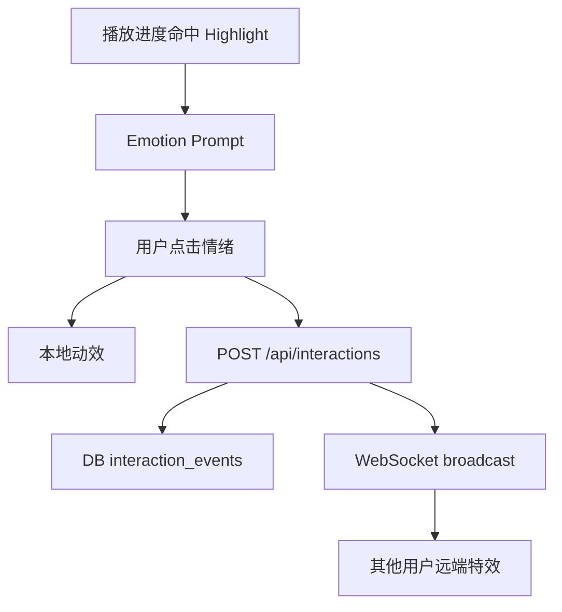

# 短剧即时情绪表达与剧情参与互动 PRD

调研日期：2026-06-08

## 1. 产品背景

短剧用户在高光、反转、打脸、剧尾悬念时有强烈表达冲动，但传统弹幕和评论需要输入文字，表达成本高，也容易打断观看。课题目标是提供更丰富、更即时、更视觉化的互动能力，让用户在不离开播放场景的前提下完成情绪表达，并进一步参与剧情。

当前项目已经实现：

- 高光卡片和情绪互动按钮。
- 弹幕和弹幕设置。
- WebSocket 同房间互动广播。
- 分支选择和 AI 剧情续写。
- AIGC 插片、加速包、个性化分支视频。

本 PRD 目标是在现有基础上设计更丰富的用户互动体系。

## 2. 外部产品调研

### 2.1 YouTube Live：实时聊天、投票、Q&A、Reaction

YouTube Live Chat 支持实时聊天、Top Chat 过滤、Live Poll、Live Q&A、表情和 Reactions。官方帮助文档提到，Live Chat 让创作者与观众实时互动，Live Poll 可设置 2-4 个选项，Reactions 可让观众对直播中发生的内容做匿名反应。

参考：

- [YouTube Help: Learn about Live Chat](https://support.google.com/youtube/answer/15268877?hl=en-EN)
- [YouTube Help: Use live chat during your live stream or Premiere](https://support.google.com/youtube/answer/2524549?hl=en-MY)

可借鉴点：

- 投票不只适合直播，也适合短剧分支选择。
- 匿名 Reaction 适合降低表达压力。
- Top Chat 机制启发我们做“高质量互动浮层”，过滤低质弹幕。

### 2.2 Twitch：Channel Points、Prediction、Poll

Twitch 的 Channel Points 让观众在观看时积累点数并兑换互动奖励。Predictions 让观众对接下来会发生什么下注/预测，适合高期待场景。

参考：

- [Twitch Help: Channel Points Guide for Viewers](https://help.twitch.tv/s/article/viewer-channel-point-guide?language=en_US)
- [Twitch Help: Channel Points Predictions](https://help.twitch.tv/s/article/channel-points-predictions?language=ru)

可借鉴点：

- “预测剧情走向”比普通点赞更能增加参与感。
- 观看行为可以沉淀为互动权益。
- 短剧可设计“猜她会不会反击”“男主会不会亮身份”的轻量预测。

### 2.3 TikTok LIVE：虚拟礼物和屏幕动效

TikTok LIVE Gifts 让用户用虚拟礼物实时表达支持，礼物会产生强视觉反馈。官方支持页说明用户可以在 LIVE 中选择 Gift 并发送，用于实时反应和表达欣赏。

参考：

- [TikTok Support: Send a Gift during a LIVE](https://support.tiktok.com/en/live-gifts-wallet/gifts/send-a-gift-during-a-live-on-tiktok?lang=en)
- [TikTok Newsroom: Updating gifting policies](https://newsroom.tiktok.com/en-us/updating-our-gifting-policies-to-protect-our-community?lang=en)

可借鉴点：

- 情绪表达可以资产化为动效礼物。
- 高价值礼物不适合答辩 MVP，但免费情绪礼物适合做互动资产包。
- 需要安全和合规策略，避免诱导付费。

### 2.4 Bilibili：弹幕、高能进度条、互动视频

Bilibili 的弹幕文化代表了“边看边表达”的典型场景，高能进度条用热点线条标识视频热区。Bilibili 的高能进度条活动页说明了用波浪形线条标识热点的思路。

参考：

- [Bilibili 高能进度条公测反馈页](https://www.bilibili.com/blackboard/activity-KMbzFht4z.html)
- [Bilibili 外链播放器使用文档](https://player.bilibili.com/)

可借鉴点：

- 互动热力可体现在进度条上。
- 弹幕不是唯一形态，可以结合热力、表情雨、时间点共鸣。
- 高能点可反向帮助用户定位爽点。

### 2.5 Netflix Interactive：双向叙事

Netflix 早期互动故事强调非线性叙事，用户选择会影响后续内容。Netflix 官方文章提到互动叙事让创作者可以讲非线性故事，并让观看从单向变成双向。

参考：

- [About Netflix: Interactive Storytelling on Netflix](https://about.netflix.com/news/interactive-storytelling-on-netflix-choose-what-happens-next)

可借鉴点：

- 分支选择必须低打断、强反馈。
- 选项文案要非常短，用户不应长时间停留思考。
- 短剧可比长剧更适合高频小分支。

## 3. 目标用户与场景

### 3.1 用户类型

| 用户 | 特征 | 需求 |
| --- | --- | --- |
| 爽剧轻度用户 | 快速刷剧，少输入 | 一键表达爽、笑、气、破防 |
| 高参与用户 | 喜欢弹幕和互动 | 看到其他人的反应，参与投票 |
| 剧情共创用户 | 愿意选择或输入 Prompt | 改变剧情走向，生成后续 |
| 社交观看用户 | 想和朋友一起看 | 同步观看、共同选择、房间共鸣 |

### 3.2 关键场景

- 高光反转：用户想喊“爽”“炸裂”“离谱”。
- 反派压迫：用户想替主角出气。
- 搞笑桥段：用户想和别人一起笑。
- 甜/虐/泪点：用户想表达磕、破防、心疼。
- 剧尾追更：用户想参与“下一集怎么走”。
- 分支选择：用户想让剧情按自己的选择发展。

## 4. 产品目标

### 4.1 核心目标

- 降低表达门槛：1 秒内完成互动。
- 增强共鸣感：能看到“此刻很多人和我一样”。
- 增强参与感：用户选择能影响剧情展示。
- 增强回访：用户的选择、分支、评论被保存。

### 4.2 指标

| 指标 | 定义 | 目标 |
| --- | --- | --- |
| 高光互动点击率 | 高光曝光后点击人数 / 曝光人数 | > 20% |
| 互动完成耗时 | 从高光出现到用户点击 | P50 < 2s |
| 分支选择率 | 分支浮层曝光后选择人数 / 曝光人数 | > 30% |
| 评论转化率 | 生成剧情后评论人数 / 生成剧情人数 | > 5% |
| 二次互动率 | 单集内互动 2 次以上用户比例 | > 15% |

## 5. 功能方案总览

| 功能 | 类型 | 当前状态 | 建议优先级 |
| --- | --- | --- | --- |
| 一键情绪按钮 | 高光表达 | 已有基础 | P0 增强 |
| 情绪礼物/动效包 | 高光表达 | 部分动效已有 | P0 |
| 同看人数和远端特效 | 社交共鸣 | 已有 WebSocket 基础 | P0 |
| 剧情预测投票 | 参与剧情 | 未完整实现 | P0 |
| 高能热力条 | 内容导航 | 有 timeline API 基础 | P1 |
| 分支共创 | 剧情参与 | 已有基础 | P0 |
| 互动成就/能量值 | 留存 | 未实现 | P1 |
| 好友同看房间 | 社交 | 未实现 | P2 |
| AI 复盘卡 | 情绪总结 | 未实现 | P1 |

## 6. P0 功能一：高光情绪按钮 2.0

### 6.1 用户故事

作为短剧用户，当主角打脸反派或出现反转时，我希望不用输入文字，只点一下就能表达“爽”“炸裂”“笑疯了”，并看到屏幕上有明显反馈。

### 6.2 交互设计

- 高光命中时底部或中下部出现 2-4 个情绪按钮。
- 按钮随高光类型变化：
  - 打脸爽点：爽、反杀、封神
  - 搞笑包袱：笑、离谱
  - 泪点破防：破防、抱抱
  - 剧情悬念：炸裂、上头
- 用户点击后：
  - 本地立即播放动效。
  - 上报后端。
  - WebSocket 广播给同剧同集其他用户。

### 6.3 现有代码落点

- Flutter：`player_page.dart`、`highlight_emotion_prompt.dart`、`highlight_effect_overlay.dart`
- 控制器：`interaction_controller.dart`
- 后端：`backend/app/api/interactions.py`
- 服务：`backend/app/domains/interactions/service.py`
- 资产：`data/effects/manifest.json`、`flutter_app/assets/lottie/highlight`

### 6.4 需要实现/增强的函数

Flutter：

```dart
List<EmotionAction> actionsForHighlight(Highlight highlight)
```

根据高光类型返回按钮。

```dart
Future<void> submitEmotionAction(EmotionAction action, Highlight highlight)
```

本地动效 + 后端上报 + 乐观更新。

后端：

```python
async def InteractionService.submit(payload: InteractionIn) -> InteractionOut
```

当前已有，需确保 `effect`、`highlight_id`、`client_event_id` 完整。

新增建议：

```python
async def InteractionService.reaction_distribution(episode_id: str, highlight_id: int) -> dict:
    """返回某高光下各情绪动作分布。"""
```

### 6.5 数据流



## 7. P0 功能二：剧情预测投票

### 7.1 用户故事

作为用户，在剧情反转前，我希望猜下一步会发生什么，并在揭晓后看到自己是否猜中。

### 7.2 场景

- 主角被逼到绝境：猜“会不会反杀”。
- 女主误会男主：猜“会不会当场解释”。
- 剧尾悬念：猜“下一集谁出现”。

### 7.3 PRD

#### 展示时机

- 高光点前 5-8 秒。
- 剧尾前 15 秒。
- 分支点前 3 秒。

#### 选项

- 2-4 个。
- 文案不超过 10 字。
- 支持 AI 根据剧情上下文生成，也支持运营配置。

#### 结果

- 用户投票后展示实时百分比。
- 剧情揭晓后展示“你猜中了 / 你站错队了”。
- 可累计“神预言”成就。

### 7.4 数据模型

建议新增：

```python
class PredictionPoll(Base):
    id: str
    episode_id: str
    highlight_id: int | None
    ts_in_video: float
    question: str
    options_json: list[dict]
    correct_option_id: str | None
    status: str  # scheduled/open/closed/revealed
```

```python
class PredictionVote(Base):
    id: int
    poll_id: str
    user_id: str
    option_id: str
    created_at: datetime
```

### 7.5 API

```http
GET /api/predictions/episodes/{episode_id}
POST /api/predictions/{poll_id}/vote
POST /api/predictions/{poll_id}/reveal
GET /api/predictions/{poll_id}/summary
```

### 7.6 核心函数

```python
async def list_episode_polls(episode_id: str, user_id: str) -> list[PredictionPollOut]:
    """返回播放页需要预加载的预测投票。"""

async def submit_vote(poll_id: str, user_id: str, option_id: str) -> PredictionVoteOut:
    """提交投票，保证同一用户只投一次。"""

async def poll_summary(poll_id: str) -> PredictionSummaryOut:
    """返回各选项票数和百分比。"""

async def reveal_poll(poll_id: str, correct_option_id: str) -> PredictionSummaryOut:
    """揭晓投票结果。"""
```

Flutter：

```dart
void PredictionController.onTick(double seconds)
```

命中展示窗口时弹出预测卡。

```dart
Future<void> PredictionController.vote(PredictionOption option)
```

提交投票并展示百分比。

## 8. P0 功能三：情绪礼物 / 免费动效包

### 8.1 用户故事

作为用户，我希望用更有画面感的方式表达情绪，比如撒花、心动、雷击、王冠、冲锋，而不是只点一个普通按钮。

### 8.2 设计原则

- 免费，不做真实付费，避免答辩和合规风险。
- 与剧情类型绑定。
- 动效 1-2 秒，不遮挡字幕太久。
- 支持多人叠加但要限流。

### 8.3 数据模型

已有 `data/effects/manifest.json`，建议扩展：

```json
{
  "code": "gift_power_flare",
  "label": "燃爆",
  "emotion": "燃",
  "highlight_types": ["高能冲突", "反杀逆袭"],
  "asset": "assets/lottie/highlight/gift_power_flare.json",
  "cooldown_ms": 1500,
  "max_remote_per_second": 3
}
```

### 8.4 核心函数

```python
def load_effect_manifest(data_root: str) -> dict:
    """加载互动资产配置。"""

def effect_for_action(action: str, highlight_type: str) -> str:
    """根据互动动作和高光类型选择动效。"""
```

Flutter：

```dart
Future<void> EffectAssetRegistry.load()
```

```dart
Widget HighlightEffectOverlay(...)
```

当前已有，可增强远端动效队列。

## 9. P1 功能四：高能热力条

### 9.1 用户故事

作为用户，我希望在进度条上看到哪里是高能点，可以快速定位爽点，也能看到大家在哪些时间点互动最多。

### 9.2 数据来源

- `highlights`：AI 高光。
- `interaction_timeline`：用户互动热力。
- `danmaku_hot_words`：弹幕热词。

### 9.3 API

已有：

```http
GET /api/interactions/timeline/{episode_id}
```

建议新增聚合：

```http
GET /api/episodes/{episode_id}/heatmap
```

返回：

```json
{
  "episode_id": "ep_063",
  "buckets": [
    {
      "ts_start": 50,
      "ts_end": 60,
      "heat": 0.92,
      "sources": ["highlight", "interaction", "danmaku"],
      "label": "打脸爽点"
    }
  ]
}
```

### 9.4 核心函数

```python
async def build_episode_heatmap(episode_id: str, bucket_size: int = 10) -> EpisodeHeatmapOut:
    """融合高光、互动和弹幕生成热力条。"""
```

Flutter：

```dart
Widget InteractionHeatStrip(...)
```

当前已有 `interaction_heat_strip.dart`，可接入真实聚合数据。

## 10. P1 功能五：AI 情绪复盘卡

### 10.1 用户故事

作为用户，看完一集后，我希望看到“本集我参与了哪些高光，我的情绪曲线是什么”，并可以分享。

### 10.2 内容

- 本集最爽瞬间。
- 我点击最多的情绪。
- 全站最多人破防/炸裂的时间点。
- 我的分支选择路径。
- AI 生成一句“本集观后感”。

### 10.3 核心函数

```python
async def build_user_episode_recap(user_id: str, episode_id: str) -> UserEpisodeRecapOut:
    """生成用户本集互动复盘。"""

def generate_recap_text(profile: dict, episode_summary: str) -> str:
    """生成可分享文案。"""
```

## 11. P2 功能六：同看房间

### 11.1 用户故事

作为用户，我希望邀请朋友一起看短剧，看到朋友的互动和分支选择。

### 11.2 功能

- 创建房间。
- 邀请码进入。
- 房主控制播放进度。
- 分支选择可投票。
- 房间弹幕和表情单独隔离。

### 11.3 数据模型

```python
class WatchRoom(Base):
    id: str
    episode_id: str
    owner_user_id: str
    playback_position: float
    status: str
```

```python
class WatchRoomMember(Base):
    room_id: str
    user_id: str
    role: str
```

### 11.4 WebSocket 事件

```json
{"type": "playback_sync", "position": 123.4, "playing": true}
{"type": "reaction", "action": "爽", "effect": "gift_power_flare"}
{"type": "branch_vote", "option_id": "b1"}
```

## 12. 优先级排期

### 阶段 A：答辩前 1-2 天

1. 高光情绪按钮 2.0：补全类型到动效映射。
2. 剧情预测投票：先做本地/后端固定配置，至少一集一个投票。
3. 高能热力条：接入互动 timeline。
4. 情绪礼物资产：用现有 Lottie 资产配置化。

### 阶段 B：答辩后 1-2 周

1. 用户复盘卡。
2. 预测投票 AI 生成选项。
3. 成就系统和互动能量值。
4. 运营后台配置互动策略。

### 阶段 C：中长期

1. 好友同看房间。
2. 多人分支投票。
3. 个性化互动推荐。
4. A/B 实验和增长分析。

## 13. 风险和约束

| 风险 | 说明 | 应对 |
| --- | --- | --- |
| 互动遮挡剧情 | 动效过多影响观看 | 限制时长、透明度、远端节流 |
| 用户选择疲劳 | 弹窗过多 | 冷却时间、仅高强度高光触发 |
| 低质弹幕污染 | 影响观看体验 | Top Chat 思路、敏感词和举报 |
| 分支生成慢 | AIGC 依赖外部模型 | 预生成 + fallback |
| 付费礼物合规 | 不适合学生答辩 | 做免费动效，不做支付 |

## 14. 与现有代码的集成点

| 功能 | 后端 | Flutter |
| --- | --- | --- |
| 情绪按钮 | `interactions.py`、`InteractionService` | `interaction_controller.dart`、`highlight_emotion_prompt.dart` |
| 情绪礼物 | `assets.py`、effect manifest | `effect_asset_registry.dart`、`HighlightEffectOverlay` |
| 预测投票 | 新增 `api/predictions.py` | 新增 `PredictionController`、`PredictionOverlay` |
| 高能热力条 | `InteractionService.timeline` | `interaction_heat_strip.dart` |
| AI 复盘卡 | 新增 `recap` domain | 新增 `EpisodeRecapSheet` |
| 同看房间 | 新增 `watch_room` domain + WebSocket | 新增 `WatchRoomController` |

## 15. 参考资料

- [YouTube Help: Learn about Live Chat](https://support.google.com/youtube/answer/15268877?hl=en-EN)
- [YouTube Help: Use live chat during your live stream or Premiere](https://support.google.com/youtube/answer/2524549?hl=en-MY)
- [Twitch Help: Channel Points Guide for Viewers](https://help.twitch.tv/s/article/viewer-channel-point-guide?language=en_US)
- [Twitch Help: Channel Points Predictions](https://help.twitch.tv/s/article/channel-points-predictions?language=ru)
- [TikTok Support: Send a Gift during a LIVE](https://support.tiktok.com/en/live-gifts-wallet/gifts/send-a-gift-during-a-live-on-tiktok?lang=en)
- [TikTok Newsroom: Updating gifting policies](https://newsroom.tiktok.com/en-us/updating-our-gifting-policies-to-protect-our-community?lang=en)
- [Bilibili 高能进度条公测反馈页](https://www.bilibili.com/blackboard/activity-KMbzFht4z.html)
- [Bilibili 外链播放器使用文档](https://player.bilibili.com/)
- [About Netflix: Interactive Storytelling on Netflix](https://about.netflix.com/news/interactive-storytelling-on-netflix-choose-what-happens-next)
