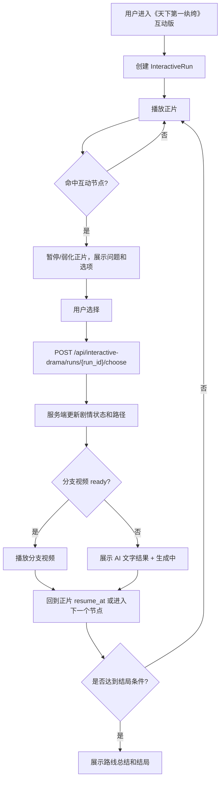
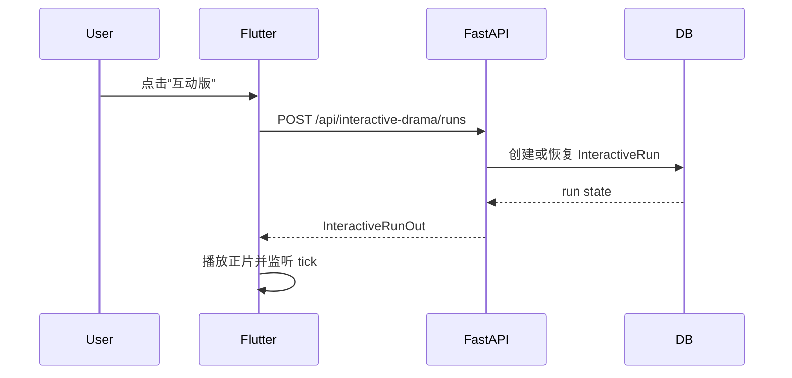
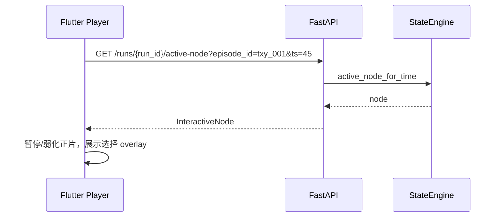
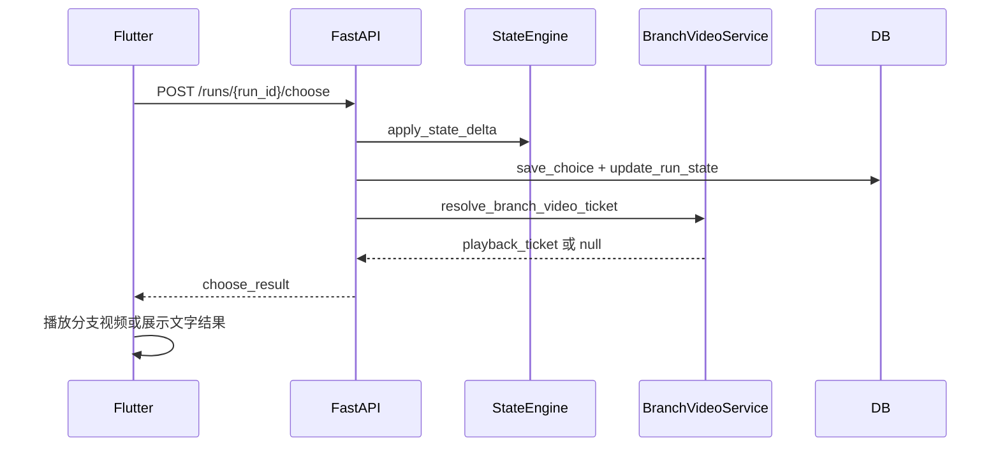
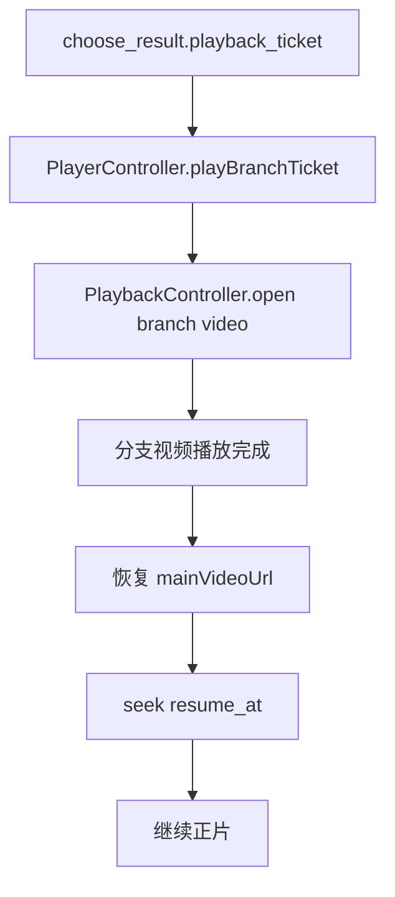

# 《天下第一纨绔》互动版短剧 PRD 与技术方案

> 项目：short-drama-interaction  
> 日期：2026-06-09  
> 目标：基于现有短剧素材，另做一版“Netflix Interactive 风格”的双向叙事短剧，让用户选择真正影响后续剧情、分支视频、AI 续写和个人剧情路径。

## 1. 结论摘要

推荐把《天下第一纨绔》作为主展示的互动版短剧。

原因不是“这部剧名字更适合互动”，而是它的主角身份天然具备可选择的策略空间：用户可以决定主角继续装纨绔、突然露锋芒、暗中设局、拉拢盟友、救人立威或感情线升温。每个选择都可以改变后续冲突、阵营关系和主角名声，适合做成“观看从单向变成双向”的互动版。

互动版目标不是简单在正片上弹几个按钮，而是形成一套独立的剧情路径系统：

```text
正片关键节点
  -> 用户选择
  -> 记录个人分支状态
  -> 播放预生成/生成中的分支视频
  -> 更新主角名声、盟友、敌人警惕值等状态
  -> 回到正片或进入下一分支节点
  -> 形成可回看的个人剧情路径
```

## 2. 产品定位

### 2.1 普通分支和互动版短剧的区别

现有项目已经有：

- 高光互动：爽、笑、哭、弹幕、点赞。
- AI 剧情续写：用户选择后生成文字剧情。
- 个性化分支视频：用户选择后插播 AIGC 或素材 fallback 视频。

互动版短剧需要更进一步：

| 能力 | 普通分支 | 互动版短剧 |
|---|---|---|
| 选择影响 | 只影响当前一段内容 | 影响后续节点、角色关系、结局 |
| 状态记录 | 记录一次 branch pick | 记录完整个人剧情路径 |
| 剧情结构 | 单点分支 | 多层分支图 |
| 内容形态 | 文字或短视频插片 | 正片 + 分支视频 + AI 续写 + 路径总结 |
| 复看价值 | 较低 | 可解锁不同路线和结局 |

### 2.2 用户目标

- 用户看剧时能替主角做关键选择。
- 每次选择都能立即看到结果，不只是弹一个提示。
- 后续剧情能记住之前的选择。
- 用户能看到“我的路线”：装纨绔路线、硬刚路线、权谋路线、情感路线等。
- 用户可以重开同一集，尝试不同路线。

### 2.3 业务目标

- 提升关键集的停留时长和复看率。
- 把“短剧追更焦虑”转成“路线探索”。
- 形成答辩亮点：不仅实现互动组件，还把一部剧改造成双向叙事产品。
- 复用现有 AI 续写、分支视频、AIGC 插片、互动统计等能力。

## 3. 剧情方案设计

### 3.1 互动版主线设定

剧名：天下第一纨绔 互动版

主角核心身份：

- 表面：纨绔、荒唐、不被看好。
- 暗线：有能力、有底牌、善于借身份误导对手。
- 用户选择的本质：决定主角如何使用“纨绔面具”。

### 3.2 状态变量设计

互动版需要维护剧情状态，不能只存用户点了哪个按钮。

```python
class InteractiveDramaState(BaseModel):
    reputation: int = 0          # 名声：越高越被正派认可
    disguise: int = 100          # 伪装值：越高越像纨绔，敌人越轻敌
    power: int = 0               # 势力：盟友、资源、钱、人脉
    suspicion: int = 0           # 敌人警惕值：越高越容易被针对
    romance: int = 0             # 情感线进度
    justice: int = 0             # 正义/民心
    route_tags: list[str] = []   # 当前路线标签
    flags: dict[str, bool] = {}  # 已触发关键事件
```

示例：

| 用户选择 | 状态变化 | 后续影响 |
|---|---|---|
| 继续装纨绔 | disguise +20, suspicion -10 | 敌人轻敌，后续可偷听情报 |
| 当场硬刚 | reputation +15, suspicion +20 | 爽感强，但敌人提前针对 |
| 暗中设局 | power +10, disguise +10 | 后续可触发反钓幕后人 |
| 救下弱者 | justice +20, romance +5 | 解锁民心/情感支线 |
| 拉拢盟友 | power +20 | 后续有盟友救场 |

### 3.3 路线设计

MVP 先做 4 条路线，不追求无限分支：

| 路线 | 关键词 | 体验 |
|---|---|---|
| 装纨绔暗线 | 伪装、偷听、反钓 | 用户像在下棋，爽点后置 |
| 正面硬刚线 | 打脸、立威、公开反击 | 爽感强，冲突密集 |
| 权谋设局线 | 借势、交易、联盟 | 技术文档里最好讲，体现状态机 |
| 情感守护线 | 救人、信任、关系升温 | 增加情绪层次，避免全是打脸 |

### 3.4 推荐分支节点

每集 1-2 个关键节点，前 3 集作为互动版 Demo。

#### 第 1 集：身份亮相局

触发点：主角被轻视、被逼表态。

问题：

```text
众人把他当成没用纨绔，他该怎么破局？
```

选项：

| 选项 | 分支效果 |
|---|---|
| 继续装纨绔 | 维持伪装，暗中观察谁在煽风点火 |
| 当场露一手 | 立刻打脸，获得名声但提高敌人警惕 |
| 借酒设局 | 表面胡闹，实际诱导对手说漏嘴 |

#### 第 2 集：宴会羞辱局

问题：

```text
宴会上有人故意羞辱主角，他要怎么回应？
```

选项：

| 选项 | 分支效果 |
|---|---|
| 装醉反套话 | 解锁幕后线索 |
| 公开反击 | 增加名声和敌人警惕 |
| 替女主解围 | 增加情感线和民心 |

#### 第 3 集：盟友选择局

问题：

```text
主角拿到第一条关键线索，下一步先找谁？
```

选项：

| 选项 | 分支效果 |
|---|---|
| 找旧友借势 | 增加势力 |
| 独自追查 | 增加风险但获取隐藏情报 |
| 先保护家人 | 解锁守护路线 |

### 3.5 结局设计

MVP 不需要做十几个结局，先做 3 个可演示结局：

| 结局 | 触发条件 |
|---|---|
| 扮猪吃虎结局 | disguise 高、suspicion 低、暗线证据齐 |
| 当场封神结局 | reputation 高、justice 高 |
| 权谋翻盘结局 | power 高、route_tags 包含 alliance |

## 4. 功能需求

### 4.1 MVP 范围

P0 必做：

- 为《天下第一纨绔》建立互动剧配置。
- 支持多层分支图。
- 支持用户选择后更新剧情状态。
- 支持分支视频播放或素材 fallback。
- 支持回到正片或跳到下一互动节点。
- 支持“我的剧情路线”展示。

P1 增强：

- AI 根据当前状态生成分支说明和下一步选择。
- 自定义 Prompt 分支。
- 多结局总结卡。
- 用户重开路线。

P2 展示加分：

- 后台配置互动节点和状态变量。
- 路线热力图：其他用户选择比例。
- 互动版专属录屏脚本和答辩讲解。

### 4.2 端上页面

新增或增强：

- 互动版入口卡：标识“天下第一纨绔 · 互动版”。
- 播放页互动选择 Overlay。
- 分支结果播放页/插播层。
- 我的路线浮层。
- 结局总结页。

### 4.3 用户流程



## 5. 技术选型

### 5.1 总体选型

| 模块 | 选型 | 原因 |
|---|---|---|
| 客户端 | Flutter | 现有项目已使用，支持 macOS/iOS/Android |
| 后端 | FastAPI + SQLAlchemy Async | 现有项目稳定，接口开发快 |
| 数据库 | PostgreSQL / 本地开发兼容现有 DB | 需要存 run、choice、state |
| AI 文本 | Doubao-Seed-2.0-lite / Ark Chat Completions | 已接入，适合低延迟剧情生成 |
| 视频生成 | Seedance real + 素材 fallback hybrid | 演示稳定，真实生成可作为加分项 |
| 视频播放 | 复用 `PlaybackController` + `insert_clip_controller` | 已支持插片回正片 |
| 内容理解 | 复用 `narrative_events` + `story_memory` | 已有剧情事件和摘要 |

### 5.2 为什么不做完全实时无限生成

互动版短剧需要“选择后立即有内容”。完全实时生成视频会导致等待长、成本高、失败不可控。

推荐混合方案：

```text
主选项：预生成分支视频，保证点击即播
自由输入：先生成文字剧情，异步生成视频
失败兜底：同集素材 fallback 或 AI 文字续写
```

这样既能展示技术复杂度，又能保证录屏和答辩稳定。

## 6. 代码目录设计

### 6.1 后端新增目录

```text
backend/app/api/interactive_drama.py

backend/app/domains/interactive_drama/
  __init__.py
  schemas.py
  repository.py
  service.py
  state_engine.py
  node_planner.py
  route_summary.py
  video_bridge.py
  quality_guard.py
```

### 6.2 Flutter 新增目录

```text
flutter_app/lib/features/interactive_drama/
  data/interactive_drama_api.dart
  data/interactive_drama_models.dart
  controllers/interactive_drama_controller.dart
  widgets/interactive_entry_card.dart
  widgets/interactive_choice_overlay.dart
  widgets/route_state_panel.dart
  widgets/ending_summary_sheet.dart
```

### 6.3 数据文件

```text
data/interactive_drama/
  tianxiadyi_graph.json
  tianxiadyi_endings.json
  tianxiadyi_state_rules.json
```

示例 `tianxiadyi_graph.json`：

```json
{
  "drama_id": "tianxiadyi",
  "version": "interactive-v1",
  "episodes": [
    {
      "episode_id": "txy_001",
      "nodes": [
        {
          "node_id": "txy001_intro_mask",
          "ts_in_video": 45.0,
          "resume_at": 57.0,
          "question": "众人把他当成没用纨绔，他该怎么破局？",
          "options": [
            {
              "option_id": "keep_mask",
              "label": "继续装纨绔",
              "state_delta": {"disguise": 20, "suspicion": -10},
              "route_tags": ["mask"],
              "branch_video_session_hint": "txy001_keep_mask"
            },
            {
              "option_id": "show_skill",
              "label": "当场露一手",
              "state_delta": {"reputation": 15, "suspicion": 20},
              "route_tags": ["hard_punchy"],
              "branch_video_session_hint": "txy001_show_skill"
            }
          ]
        }
      ]
    }
  ]
}
```

## 7. 后端函数设计

### 7.1 Schema

文件：`backend/app/domains/interactive_drama/schemas.py`

```python
class InteractiveDramaState(BaseModel):
    reputation: int = 0
    disguise: int = 100
    power: int = 0
    suspicion: int = 0
    romance: int = 0
    justice: int = 0
    route_tags: list[str] = Field(default_factory=list)
    flags: dict[str, bool] = Field(default_factory=dict)


class InteractiveOption(BaseModel):
    option_id: str
    label: str
    description: str = ""
    state_delta: dict[str, int] = Field(default_factory=dict)
    route_tags: list[str] = Field(default_factory=list)
    next_node_id: str | None = None
    branch_video_session_hint: str = ""


class InteractiveNode(BaseModel):
    node_id: str
    episode_id: str
    ts_in_video: float
    resume_at: float
    question: str
    options: list[InteractiveOption]
    condition: dict = Field(default_factory=dict)


class InteractiveRunOut(BaseModel):
    run_id: str
    drama_id: str
    user_id: str
    current_episode_id: str
    state: InteractiveDramaState
    selected_path: list[dict] = Field(default_factory=list)
    active_node: InteractiveNode | None = None
    status: str = "active"


class InteractiveChooseIn(BaseModel):
    node_id: str
    option_id: str
    client_event_id: str = ""


class InteractiveChooseOut(BaseModel):
    run: InteractiveRunOut
    story_text: str = ""
    playback_ticket: dict | None = None
    next_node: InteractiveNode | None = None
    ending: dict | None = None
```

### 7.2 Repository

文件：`backend/app/domains/interactive_drama/repository.py`

```python
class InteractiveDramaRepository:
    def load_graph(self, drama_id: str) -> InteractiveGraph:
        """读取 data/interactive_drama/{drama_id}_graph.json。"""

    async def create_run(
        self,
        drama_id: str,
        user_id: str,
        episode_id: str,
    ) -> InteractiveRunModel:
        """创建用户个人互动路线。"""

    async def get_run(self, run_id: str) -> InteractiveRunModel | None:
        """查询互动路线。"""

    async def save_choice(
        self,
        run: InteractiveRunModel,
        node: InteractiveNode,
        option: InteractiveOption,
        state_before: dict,
        state_after: dict,
    ) -> InteractiveChoiceModel:
        """保存一次用户选择，保证幂等。"""

    async def update_run_state(
        self,
        run: InteractiveRunModel,
        state: InteractiveDramaState,
        current_node_id: str | None,
    ) -> InteractiveRunModel:
        """更新路线状态。"""
```

建议新增数据库表：

```python
class InteractiveRunModel(Base):
    __tablename__ = "interactive_runs"
    id = mapped_column(String(96), primary_key=True)
    drama_id = mapped_column(String(64), index=True)
    user_id = mapped_column(String(64), index=True)
    current_episode_id = mapped_column(String(64), index=True)
    current_node_id = mapped_column(String(96), default="")
    state_json = mapped_column(JSON, default=dict)
    selected_path_json = mapped_column(JSON, default=list)
    status = mapped_column(String(32), default="active")
    created_at = mapped_column(DateTime, default=datetime.utcnow)
    updated_at = mapped_column(DateTime, default=datetime.utcnow)


class InteractiveChoiceModel(Base):
    __tablename__ = "interactive_choices"
    id = mapped_column(String(96), primary_key=True)
    run_id = mapped_column(String(96), index=True)
    node_id = mapped_column(String(96), index=True)
    option_id = mapped_column(String(96), index=True)
    state_before_json = mapped_column(JSON, default=dict)
    state_after_json = mapped_column(JSON, default=dict)
    playback_ticket_json = mapped_column(JSON, default=dict)
    created_at = mapped_column(DateTime, default=datetime.utcnow)
```

### 7.3 State Engine

文件：`backend/app/domains/interactive_drama/state_engine.py`

```python
def apply_state_delta(
    state: InteractiveDramaState,
    option: InteractiveOption,
) -> InteractiveDramaState:
    """根据选项更新 reputation/disguise/power 等状态，数值限制在 0-100。"""


def append_route_tags(
    state: InteractiveDramaState,
    option: InteractiveOption,
) -> InteractiveDramaState:
    """把选项 route_tags 写入状态，去重保序。"""


def evaluate_node_condition(
    state: InteractiveDramaState,
    condition: dict,
) -> bool:
    """判断节点是否可见，例如 power >= 30 才能触发盟友救场。"""


def pick_next_node(
    graph: InteractiveGraph,
    current_node: InteractiveNode,
    option: InteractiveOption,
    state: InteractiveDramaState,
) -> InteractiveNode | None:
    """根据 option.next_node_id 或状态条件选择下一个节点。"""


def evaluate_ending(
    state: InteractiveDramaState,
    selected_path: list[dict],
) -> dict | None:
    """判断是否达到结局，并返回结局卡配置。"""
```

### 7.4 Node Planner

文件：`backend/app/domains/interactive_drama/node_planner.py`

```python
def active_node_for_time(
    graph: InteractiveGraph,
    episode_id: str,
    ts_in_video: float,
    state: InteractiveDramaState,
    handled_node_ids: set[str],
) -> InteractiveNode | None:
    """播放器 tick 时查询当前时间是否命中互动节点。"""


async def enrich_node_with_ai_options(
    node: InteractiveNode,
    run: InteractiveRunOut,
    narrative_context: BranchGenerationContext,
) -> InteractiveNode:
    """P1：用 Doubao 根据当前状态微调选项描述，但不改变 option_id。"""
```

### 7.5 Video Bridge

文件：`backend/app/domains/interactive_drama/video_bridge.py`

```python
async def resolve_branch_video_ticket(
    db: AsyncSession,
    run: InteractiveRunModel,
    node: InteractiveNode,
    option: InteractiveOption,
    user: CurrentUser,
) -> dict | None:
    """把互动剧选项映射到 branch_video session/option，返回可播放 ticket。"""


async def create_branch_video_if_needed(
    db: AsyncSession,
    episode_id: str,
    ts_in_video: float,
    option_label: str,
    user: CurrentUser,
) -> dict | None:
    """自由分支或未预热分支时触发个性化分支视频生成。"""
```

这里复用已有能力：

- `backend/app/domains/branch_video/service.py`
- `backend/app/domains/branch_video/worker.py`
- `backend/app/domains/aigc_video/service.py`

### 7.6 Service

文件：`backend/app/domains/interactive_drama/service.py`

```python
class InteractiveDramaService:
    async def start_run(
        self,
        drama_id: str,
        episode_id: str,
        user: CurrentUser,
    ) -> InteractiveRunOut:
        """开始或恢复一条互动路线。"""

    async def get_run(
        self,
        run_id: str,
        user: CurrentUser,
    ) -> InteractiveRunOut:
        """查询路线状态。"""

    async def get_active_node(
        self,
        run_id: str,
        episode_id: str,
        ts_in_video: float,
        user: CurrentUser,
    ) -> InteractiveNode | None:
        """播放器 tick 查询当前是否应弹出互动选择。"""

    async def choose(
        self,
        run_id: str,
        payload: InteractiveChooseIn,
        user: CurrentUser,
    ) -> InteractiveChooseOut:
        """处理用户选择：更新状态、保存路径、生成/获取分支视频、判断结局。"""

    async def reset_run(
        self,
        run_id: str,
        user: CurrentUser,
    ) -> InteractiveRunOut:
        """重开互动路线。"""
```

### 7.7 API

文件：`backend/app/api/interactive_drama.py`

```python
router = APIRouter(prefix="/api/interactive-drama", tags=["interactive-drama"])


@router.post("/runs", response_model=InteractiveRunOut)
async def start_run(payload: InteractiveRunCreateIn, db: AsyncSession = Depends(get_db)):
    return await InteractiveDramaService(db).start_run(...)


@router.get("/runs/{run_id}", response_model=InteractiveRunOut)
async def get_run(run_id: str, db: AsyncSession = Depends(get_db)):
    return await InteractiveDramaService(db).get_run(...)


@router.get("/runs/{run_id}/active-node", response_model=InteractiveNode | None)
async def active_node(run_id: str, episode_id: str, ts_in_video: float, db: AsyncSession = Depends(get_db)):
    return await InteractiveDramaService(db).get_active_node(...)


@router.post("/runs/{run_id}/choose", response_model=InteractiveChooseOut)
async def choose(run_id: str, payload: InteractiveChooseIn, db: AsyncSession = Depends(get_db)):
    return await InteractiveDramaService(db).choose(...)


@router.post("/runs/{run_id}/reset", response_model=InteractiveRunOut)
async def reset_run(run_id: str, db: AsyncSession = Depends(get_db)):
    return await InteractiveDramaService(db).reset_run(...)
```

## 8. Flutter 函数设计

### 8.1 Models

文件：`flutter_app/lib/features/interactive_drama/data/interactive_drama_models.dart`

```dart
class InteractiveDramaState {
  final int reputation;
  final int disguise;
  final int power;
  final int suspicion;
  final int romance;
  final int justice;
  final List<String> routeTags;
  final Map<String, bool> flags;
}

class InteractiveNode {
  final String nodeId;
  final String episodeId;
  final double tsInVideo;
  final double resumeAt;
  final String question;
  final List<InteractiveOption> options;
}

class InteractiveRun {
  final String runId;
  final String dramaId;
  final String userId;
  final String currentEpisodeId;
  final InteractiveDramaState state;
  final List<Map<String, dynamic>> selectedPath;
  final InteractiveNode? activeNode;
  final String status;
}
```

### 8.2 API Client

文件：`flutter_app/lib/features/interactive_drama/data/interactive_drama_api.dart`

```dart
class InteractiveDramaApi {
  Future<InteractiveRun> startRun({
    required String dramaId,
    required String episodeId,
  });

  Future<InteractiveRun> getRun(String runId);

  Future<InteractiveNode?> getActiveNode({
    required String runId,
    required String episodeId,
    required double tsInVideo,
  });

  Future<InteractiveChooseResult> choose({
    required String runId,
    required String nodeId,
    required String optionId,
  });

  Future<InteractiveRun> resetRun(String runId);
}
```

### 8.3 Controller

文件：`flutter_app/lib/features/interactive_drama/controllers/interactive_drama_controller.dart`

```dart
class InteractiveDramaController extends ChangeNotifier {
  InteractiveRun? run;
  InteractiveNode? pendingNode;
  bool isChoosing = false;
  String? error;

  Future<void> startForEpisode(Episode episode);

  Future<void> onPlaybackTick({
    required String episodeId,
    required double seconds,
  });

  Future<BranchPlaybackTicket?> chooseOption(InteractiveOption option);

  void dismissNode();

  Future<void> resetRoute();
}
```

### 8.4 UI Widgets

```text
interactive_entry_card.dart
  - 展示“进入互动版”
  - 显示已解锁路线数量

interactive_choice_overlay.dart
  - 展示问题、三个选项、状态影响提示
  - 点击后调用 chooseOption

route_state_panel.dart
  - 展示名声/伪装/势力/警惕值
  - 展示当前路线标签

ending_summary_sheet.dart
  - 展示结局名称、路线总结、重新挑战按钮
```

## 9. 数据流走向

### 9.1 进入互动版



### 9.2 命中节点



### 9.3 选择分支



### 9.4 播放分支视频并回正片



## 10. 与现有代码的复用关系

| 新互动版能力 | 复用现有模块 |
|---|---|
| 剧情事件上下文 | `backend/app/domains/narrative/*` |
| AI 文字续写 | `backend/app/domains/story_chat/*` |
| 分支视频规划 | `backend/app/domains/branch_video/*` |
| AIGC 视频生成 | `backend/app/domains/aigc_video/*` |
| 播放器插播 | `flutter_app/lib/features/player/controllers/player_controller.dart` |
| 个性化分支 Overlay | `flutter_app/lib/features/branch_video/widgets/personalized_branch_overlay.dart` |
| 互动事件上报 | `backend/app/domains/interactions/*` |

新模块只负责“互动剧状态和分支图编排”，不重复造视频生成和 AI 续写。

## 11. 实现排期

### P0：3 天可演示版本

1. 写 `data/interactive_drama/tianxiadyi_graph.json`，覆盖 3 集 5 个节点。
2. 新增 `interactive_drama` 后端 domain。
3. 新增 start/get/active-node/choose API。
4. Flutter 新增 `InteractiveDramaController` 和 `InteractiveChoiceOverlay`。
5. 选择后先走 branch video ready/fallback，失败走 AI 文字结果。
6. 展示路线状态面板。

### P1：2 天增强

1. 接入 Doubao 根据状态生成节点描述。
2. 加 3 个结局总结卡。
3. 加“重开路线”和“我的路线”列表。
4. 加用户选择比例和互动热力。

### P2：1-2 天答辩包装

1. 录制 3 分钟互动版演示路径。
2. 技术文档加入双向叙事流程图。
3. 后台展示互动节点配置和路线数据。

## 12. 评分表达

答辩时可以这样讲：

```text
我们不是只做了一个“选择按钮”，而是把《天下第一纨绔》重新设计成了互动版短剧。
用户每一次选择都会改变主角的伪装值、名声、势力和敌人警惕值。
这些状态会影响后续节点是否出现、分支视频播放什么、最后进入哪个结局。
技术上我们把 Netflix Interactive 的双向叙事思路落到了短剧场景：
用剧情图做可控结构，用 Doubao 做文本生成，用 AIGC/素材 fallback 做视频分支，用状态机保证选择能被后续剧情记住。
```

## 13. 风险与兜底

| 风险 | 兜底 |
|---|---|
| AIGC 视频生成慢 | 主路线预生成，现场只播放 ready 分支 |
| 生成视频不贴正片 | 质量闸门 + 同集素材 fallback |
| 分支过多开发不完 | MVP 只做 3 集 5 节点 3 结局 |
| AI 续写跑偏 | 固定剧情图约束 option_id，只让 AI 写描述 |
| 正片回跳体验断裂 | 每个节点配置 resume_at，统一由播放器恢复 |
| 数据状态混乱 | 所有选择写入 InteractiveRun，不依赖前端临时状态 |

## 14. 最小代码落地清单

后端：

- `backend/app/api/interactive_drama.py`
- `backend/app/domains/interactive_drama/schemas.py`
- `backend/app/domains/interactive_drama/repository.py`
- `backend/app/domains/interactive_drama/state_engine.py`
- `backend/app/domains/interactive_drama/service.py`
- `backend/app/domains/interactive_drama/video_bridge.py`
- `data/interactive_drama/tianxiadyi_graph.json`

Flutter：

- `flutter_app/lib/features/interactive_drama/data/interactive_drama_api.dart`
- `flutter_app/lib/features/interactive_drama/data/interactive_drama_models.dart`
- `flutter_app/lib/features/interactive_drama/controllers/interactive_drama_controller.dart`
- `flutter_app/lib/features/interactive_drama/widgets/interactive_choice_overlay.dart`
- `flutter_app/lib/features/interactive_drama/widgets/route_state_panel.dart`

集成点：

- `backend/app/main.py` include router。
- `backend/app/models.py` 增加 `InteractiveRunModel` 和 `InteractiveChoiceModel`。
- `flutter_app/lib/features/player/player_page.dart` 挂载互动版 Overlay。
- `flutter_app/lib/features/player/controllers/player_controller.dart` 增加播放互动分支 ticket 的入口或复用现有 branch ticket。

## 15. MVP 验收标准

- 进入《天下第一纨绔》互动版后能创建 run。
- 播放到节点时出现互动选择。
- 用户选择后状态数值变化可见。
- 选择被保存，刷新后路线不丢。
- 至少一个选项能播放分支视频并回到正片。
- 分支视频不可用时能展示 AI 文字结果，不阻塞。
- 至少能触发一个结局总结卡。

