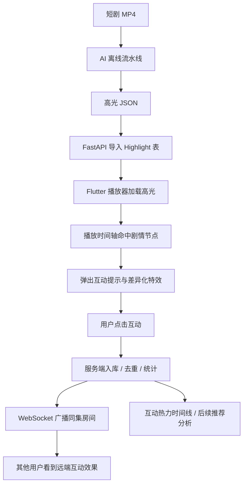
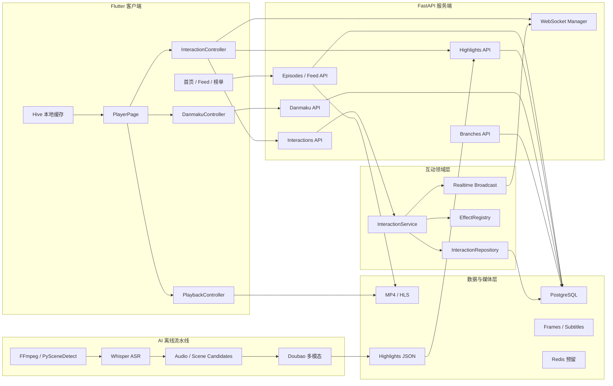
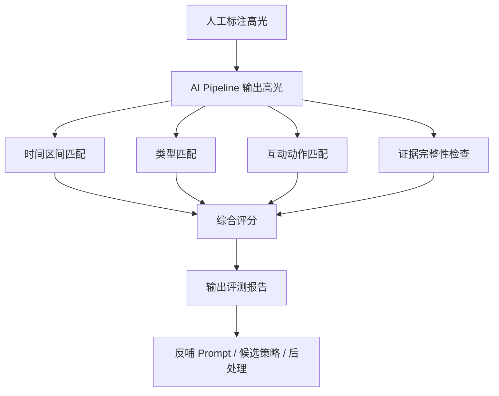

## 短剧即时互动系统技术文档（优秀案例风格版）

## 业务课题（摘要展示）：

## 课题：

基于短剧剧情的 AI 即时互动激发系统

## 课题要求：

围绕短剧播放场景，设计并实现一个具备“内容理解、沉浸播放、即时互动、实时同步、剧情分支”能力的全栈系统。系统需要能够对短剧内容进行 AI 高光识别，并在用户观看到关键剧情节点时触发互动提示，使观众可以在“爽点、笑点、反转、破防、名场面”等时刻进行即时表达。

项目需覆盖以下能力：

- 实现一个可运行的短剧客户端，支持剧集浏览、沉浸式播放、弹幕、收藏、续播等基础观看能力。
- 实现 AI 离线高光识别流水线，将原始短剧视频转化为结构化高光点数据。
- 实现服务端 API，支持剧集、高光、弹幕、互动事件、剧情分支、播放进度等数据管理。
- 实现 WebSocket 实时互动广播，模拟多人同看氛围。
- 实现互动热力时间线、差异化高光特效和剧情分支选择，提升短剧观看的参与感。
- 形成清晰的工程分层、技术选型说明、核心实现分析和后续优化方向。

## 代码仓库：

本地项目目录：

```text
/Users/daiqixu/Desktop/duanjujifa/short-drama-interaction
```

核心代码模块：

```text
flutter_app/     Flutter 客户端
backend/         FastAPI 服务端
ai_pipeline/     AI 高光离线流水线
data/            视频、帧、字幕、高光、HLS 等数据产物
scripts/         构建与导入辅助脚本
```

## 项目优秀成果展示（基于当前代码完成）：

本项目最终形成了一个完整的短剧互动播放系统。相比普通播放器，系统的核心特点是：不是只播放视频，而是围绕剧情高光建立“AI 识别 -> 时间轴触发 -> 用户点击 -> 实时广播 -> 数据沉淀”的业务闭环。

整体业务流程如下：



项目完成的主要成果包括：

| 成果模块 | 完成内容 | 对应代码 |
|---|---|---|
| Flutter 客户端 | 首页、短剧 Feed、好片榜、沉浸式播放器、弹幕、高光互动、分支选择、收藏、会员页 | `flutter_app/lib/` |
| FastAPI 服务端 | 剧集、高光、互动、弹幕、用户、分支、媒体、推荐、会员等 API | `backend/app/api/` |
| AI 高光识别 | 抽帧、ASR、音频峰值、镜头切点、多模态高光判断、JSON 输出 | `ai_pipeline/` |
| 实时互动 | 互动事件入库、幂等去重、统计汇总、WebSocket 广播 | `backend/app/domains/interactions/` |
| 弹幕系统 | 弹幕拉取、发送、设置保存、屏蔽词、热词、举报 | `danmaku.py`、`danmaku_controller.dart` |
| 多码率播放 | MP4 Range、HLS master、清晰度档位、客户端自动降档 | `main.py`、`build_hls.py`、`PlayerController` |
| 剧情分支 | 分支点、分支选项、分支视频切换、AI 续写接口 | `branches.py`、`BranchChoiceOverlay` |

---

## 一、项目分析报告

## 1. 功能描述

## 1.1 沉浸式短剧播放

系统客户端使用 Flutter 实现竖屏短剧播放体验。播放页采用全屏 `Stack` 布局，将视频、弹幕、互动特效、顶部栏、底部栏、右侧互动栏、分支选择浮层分别放置在不同层级，形成类似短剧 App 的沉浸式观看体验。

主要功能包括：

- 自动加载剧集信息与播放源。
- 支持 HLS 和 MP4 播放。
- 支持剧集上一集/下一集切换。
- 支持单击播放暂停、双击喜欢、左右快进快退。
- 支持播放进度本地缓存和服务端同步。
- 支持缓冲检测和清晰度自动降档。

核心入口：

```text
flutter_app/lib/features/player/player_page.dart
flutter_app/lib/features/player/controllers/player_controller.dart
flutter_app/lib/features/player/controllers/playback_controller.dart
```

设计思考：

短剧播放场景中，用户观看动作非常连续，任何操作延迟都会影响沉浸感。因此播放器的基础交互必须尽量本地即时完成，例如双击喜欢、暂停反馈、高光动效、弹幕发送等都优先在本地展示，再异步同步到服务端。

## 1.2 AI 高光识别

AI 高光识别是本项目区别于普通播放器的核心能力。系统通过离线流水线将每一集短剧处理成结构化高光点数据，每个高光点包含起止时间、剧情类型、互动按钮、强度和描述。

当前高光识别流程：

```text
短剧 MP4
  -> FFmpeg / PySceneDetect 抽帧
  -> Whisper ASR 生成字幕
  -> audio_highlight 检测音频峰值
  -> scene_detect 检测镜头切点
  -> build_windows 聚合 8 秒窗口
  -> Doubao 多模态模型判断高光
  -> 输出 highlights.json
```

高光数据示例：

```json
{
  "ts_start": 125.3,
  "ts_end": 132.8,
  "type": "身份反转",
  "interaction": "震惊",
  "intensity": 0.92,
  "description": "男主揭露真相，女配当场崩溃"
}
```

设计思考：

短剧高光不是单纯的画面变化，也不是单纯的台词关键词。真正有效的高光往往由“画面、台词、情绪、剧情结构”共同决定。因此系统采用多模态策略，将关键帧与字幕一起送入模型判断，而不是只依赖音量峰值或镜头切换。

## 1.3 即时互动与同看氛围

当用户播放到高光时间段时，客户端会展示互动提示。用户可以点击“爽、笑、燃、震惊、破防、喜欢”等互动动作，系统立即触发本地特效，同时向服务端提交互动事件。

互动事件提交后，服务端会：

1. 判断是否为重复事件。
2. 将事件写入数据库。
3. 计算当前互动统计。
4. 广播给同一剧集房间内的其他 WebSocket 用户。

对应接口：

```text
POST /api/interactions
GET  /api/interactions/summary/{episode_id}
GET  /api/interactions/multi-summary/{episode_id}
GET  /api/interactions/timeline/{episode_id}
WS   /api/interactions/ws/{episode_id}
```

设计思考：

同看互动的重点不是做复杂聊天，而是在关键情绪时刻给用户一种“大家都在这里一起笑、一起爽、一起震惊”的氛围。因此远端互动特效不应过强，避免覆盖当前用户的观看焦点。

## 1.4 弹幕与热词

项目实现了完整弹幕链路：后端存储弹幕，客户端按播放时间投递弹幕，用户可发送弹幕，也可调整弹幕显示参数。

弹幕能力包括：

- 按剧集获取弹幕。
- 按播放时间投递弹幕。
- 用户发送弹幕，本地即时显示。
- 弹幕字号、透明度、速度、显示区域设置。
- 屏蔽词过滤。
- 弹幕举报。
- 热词统计。

对应代码：

```text
backend/app/api/danmaku.py
flutter_app/lib/features/player/controllers/danmaku_controller.dart
```

设计思考：

弹幕设置属于高频 UI 行为，用户拖动滑块时不能每次都请求服务端。因此客户端先保存到 Hive 本地，随后通过 500ms debounce 同步服务端，兼顾即时体验和后端压力。

## 1.5 剧情分支与 AI 续写

项目支持两种剧情扩展方式：

1. 固定分支：在指定时间点出现选择卡，用户选择后切换到预先剪辑好的分支视频。
2. AI 续写：用户基于当前剧情选择方向，由 AI 生成后续剧情文本和选项。

固定分支数据模型：

```text
BranchFork  剧情分叉点
Branch      分支选项和视频片段
```

分支播放流程：

```text
播放到 ts_in_video
  -> InteractionController 命中 pendingFork
  -> BranchChoiceOverlay 展示选项
  -> 用户选择 branch
  -> 提交 branch_pick 互动事件
  -> 如存在 video_url，则切换播放分支视频
```

设计思考：

分支选择本质上也是一种互动行为，因此系统将 `branch_pick` 作为互动事件上报，复用互动入库、统计和广播能力。这样做可以避免为分支单独设计一套割裂的数据链路。

## 1.6 用户行为与推荐扩展

系统已经为后续个性化推荐和运营分析预留数据基础，包括：

- 播放进度：`PlaybackProgress`
- 收藏动作：`UserEpisodeAction`
- 互动事件：`InteractionEvent`
- 弹幕热词：`DanmakuItem`
- 高光热力：`timeline`

当前 Feed 和 Picks 接口已有基础推荐形态：

```text
GET /api/feed/shorts
GET /api/feed/picks
```

设计思考：

短剧推荐不应只依赖剧集元信息。后续可以将“某个高光点互动率高、某集完播率高、某类弹幕热词多、某用户偏好某类高光”等行为信号纳入推荐排序，使 AI 高光识别与内容分发形成闭环。

---

## 2. 工程组织设计

## 2.1 整体目录结构（三端分层）

项目采用“客户端 + 服务端 + AI 离线流水线”的全栈结构。

```text
short-drama-interaction/
├── flutter_app/                      # Flutter 客户端
│   ├── lib/core/                     # 路由、主题、配置、用户会话
│   ├── lib/data/                     # ApiClient 与数据模型
│   ├── lib/features/home/            # 首页
│   ├── lib/features/player/          # 播放器核心模块
│   ├── lib/features/picks/           # 好片榜
│   ├── lib/features/shorts/          # 短剧 Feed
│   ├── lib/features/favorites/       # 收藏页
│   ├── lib/features/profile/         # 个人页
│   └── lib/features/membership/      # 会员页
│
├── backend/                          # FastAPI 服务端
│   ├── app/api/                      # API 路由
│   ├── app/domains/interactions/     # 互动领域层
│   ├── app/services/                 # AI 服务 / WebSocket 管理
│   ├── app/scripts/                  # 数据导入与 HLS 构建
│   ├── app/models.py                 # SQLAlchemy 数据模型
│   ├── app/schemas.py                # Pydantic DTO
│   └── app/main.py                   # 应用入口与静态媒体服务
│
├── ai_pipeline/                      # AI 高光离线处理
│   ├── run_pipeline.py               # 流水线入口
│   ├── extract_frames.py             # 视频抽帧
│   ├── whisper_asr.py                # ASR 字幕
│   ├── audio_highlight.py            # 音频峰值
│   ├── scene_detect.py               # 镜头检测
│   └── highlight_detector.py         # 多模态高光判断
│
├── data/                             # 本地数据产物
│   ├── frames/                       # 抽帧图片
│   ├── subtitles/                    # 字幕 JSON
│   ├── highlights/                   # 高光 JSON
│   ├── hls/                          # HLS 多码率资源
│   └── branches.json                 # 分支配置
│
└── scripts/                          # 辅助脚本
```

设计思考：

整体目录不是按文件类型简单堆放，而是按“运行端”和“业务职责”划分。Flutter 端关注用户体验，Backend 端关注数据和实时能力，AI Pipeline 端关注内容理解。这种拆分让每一层都可以独立迭代。

## 2.2 客户端工程组织设计

Flutter 客户端采用“Feature 页面 + Controller 状态 + Data 模型 + Shared 组件”的组织方式。

| 层级 | 代表文件 | 职责 |
|---|---|---|
| Core 层 | `config.dart`、`router.dart`、`theme.dart` | 全局配置、路由、主题 |
| Data 层 | `api_client.dart`、`models.dart` | HTTP/WebSocket 数据协议 |
| Feature 层 | `home_page.dart`、`player_page.dart` | 页面业务入口 |
| Controller 层 | `player_controller.dart`、`interaction_controller.dart` | 状态管理与业务逻辑 |
| Widget 层 | `highlight_panel.dart`、`player_bottom_bar.dart` | 可复用 UI 组件 |

播放器模块内部进一步拆分：

```text
PlayerController
├── PlaybackController      # 播放器内核
├── DanmakuPlayerController # 弹幕引擎
└── InteractionController   # 高光 / 互动 / 分支 / WebSocket
```

设计思考：

播放器页面功能复杂，如果所有逻辑都写在 `PlayerPage` 中，会导致页面难以维护。因此项目使用聚合控制器模式，让页面只负责展示，业务逻辑下沉到 Controller。

## 2.3 服务端工程组织设计

后端采用 API 层、领域层、服务层、数据层的分层结构。

```text
api/
  episodes.py       # 剧集接口
  highlights.py     # 高光接口
  interactions.py   # 互动接口
  danmaku.py        # 弹幕接口
  branches.py       # 分支接口
  users.py          # 用户进度与收藏
  feed.py           # Feed 与榜单
  media.py          # 媒体资产

domains/interactions/
  service.py         # 互动业务编排
  repository.py      # 数据库访问
  effect_registry.py # action -> effect 映射
  realtime.py        # WebSocket 广播封装
  schemas.py         # 互动领域 DTO
  storm.py           # 高峰互动预留
```

设计思考：

互动逻辑是项目后端最复杂的部分，包含去重、入库、统计、广播、特效映射等多个步骤。因此项目没有把这些逻辑全部放在 `interactions.py` 路由里，而是拆到 `domains/interactions` 领域模块中，保持 API 层轻量。

## 2.4 AI Pipeline 工程组织设计

AI Pipeline 按“视频特征、音频特征、字幕特征、多模态判断”拆分。

| 模块 | 功能 | 设计价值 |
|---|---|---|
| `extract_frames.py` | 抽取镜头中心帧和固定间隔帧 | 提供视觉证据 |
| `whisper_asr.py` | 生成字幕和时间戳 | 提供剧情语义 |
| `audio_highlight.py` | 检测音频能量峰 | 召回争吵、打斗、BGM 起势 |
| `scene_detect.py` | 检测镜头切点 | 召回转场、反应镜头 |
| `highlight_detector.py` | 调用 Doubao 判断高光 | 输出结构化结果 |
| `run_pipeline.py` | 串联全流程 | 支持单集和批量处理 |

设计思考：

AI 高光识别后续一定会持续迭代。如果把抽帧、ASR、候选召回、模型调用都写在一个脚本里，调参会非常困难。当前拆分方式使每个环节可以单独替换，例如 Whisper 可以替换为 FunASR，Doubao 可以替换为 Qwen3-VL，本地候选策略也可以独立升级。

---

## 3. 技术架构设计

## 3.1 核心架构图



## 3.2 技术选型

## 3.2.1 客户端技术选型

| 技术维度 | 选型 | 设计思考 |
|---|---|---|
| 跨端框架 | Flutter 3 | 一套代码覆盖 Android、iOS、macOS，适合课程项目快速交付，也适合移动端沉浸式 UI |
| 路由与依赖 | flutter_modular | 路由和依赖注入集中管理，降低页面之间直接耦合 |
| 状态分发 | ChangeNotifier + AnimatedBuilder | 当前状态量集中在播放器模块，轻量方案足够，避免过度引入复杂状态框架 |
| 视频播放 | media_kit / media_kit_video | 支持多平台视频播放，能承载 MP4 与 HLS 播放需求 |
| 弹幕渲染 | canvas_danmaku | 封装弹幕绘制、暂停、恢复、清屏，适合播放器内弹幕层 |
| 本地存储 | Hive CE | 适合播放进度、收藏、弹幕设置等轻量 KV 数据 |
| 网络请求 | Dio | 支持超时、拦截器、日志和统一错误处理 |
| 实时通信 | web_socket_channel | 与 FastAPI WebSocket 对接简单，适合互动广播 |
| 动效资源 | Lottie + 自定义 Painter | 高光特效既可以复用 Lottie，也可以通过 Painter 生成差异化效果 |

选择 Flutter 的原因：

- 短剧播放器需要大量动画、手势、叠层 UI，Flutter 的声明式 UI 和渲染能力更适合快速实现。
- 项目同时存在 macOS 本地演示和移动端交付需求，Flutter 可以降低多端维护成本。
- 当前代码已形成 Feature + Controller 分层，继续使用 Flutter 符合已有工程方向。

## 3.2.2 服务端技术选型

| 技术维度 | 选型 | 设计思考 |
|---|---|---|
| Web 框架 | FastAPI | 原生 async，接口声明清晰，支持 OpenAPI 和 WebSocket |
| ORM | SQLAlchemy 2.0 async | 与 asyncpg 配合，适合异步数据库读写 |
| 数据库 | PostgreSQL 16 | 支持关系数据、索引和 JSON 字段，适合高光 raw、互动 payload 存储 |
| 实时通信 | FastAPI WebSocket | 当前用户规模下内存房间足够，后续可接 Redis 横向扩展 |
| DTO 校验 | Pydantic v2 | 保证前后端字段协议稳定 |
| 配置管理 | pydantic-settings | `.env` 与默认路径统一管理 |
| 容器化 | Docker Compose | 本地快速启动 PostgreSQL、Redis、Backend |
| 异步 HTTP | httpx | 用于 AI 模型接口请求 |

选择 FastAPI 的原因：

- 项目既需要 REST API，也需要 WebSocket，FastAPI 能在同一服务中承载两类协议。
- async 路由可以避免互动广播、数据库写入、AI 调用等 IO 操作阻塞。
- Pydantic Schema 能清晰约束客户端字段，降低 Flutter 联调成本。

## 3.2.3 AI 与媒体处理技术选型

| 技术维度 | 选型 | 设计思考 |
|---|---|---|
| 视频处理 | FFmpeg | 工业标准工具，负责抽帧、取时长、转码、HLS 切片 |
| 镜头检测 | PySceneDetect | 成本低、接入简单，适合硬切和镜头变化召回 |
| ASR | Whisper | 本地可运行，支持中文，输出带时间戳字幕 |
| 音频候选 | numpy RMS / Z-score | 无需重依赖，快速召回高能音频片段 |
| 多模态模型 | Doubao / 火山方舟 | 当前项目已接入，适合“关键帧 + 字幕”剧情高光判断 |
| HLS 多码率 | FFmpeg HLS | 输出 480p/720p/1080p 或 540p/720p/1080p，适配弱网播放 |

AI 选型判断：

1. 为什么不用纯规则：

纯规则可以发现音量峰值、镜头切换，但无法理解“这句台词是不是身份反转”“这个沉默是不是悬念”。短剧高光本质是剧情语义判断，规则只能做候选召回。

2. 为什么不用实时大模型：

短剧视频内容固定，在线实时推理会带来高延迟和高成本。离线批处理一次，线上只下发 JSON，是更适合播放器场景的方案。

3. 为什么当前选 Doubao：

项目中已经实现 Doubao 多模态调用，能结合关键帧和字幕输出结构化 JSON。对于课程项目和小规模内容库，继续使用 Doubao 作为主模型最稳。

4. 后续可替代方案：

后续可引入 Qwen3-VL、FunASR、SenseVoice、CLIP/OpenCLIP 或轻量 reranker，用于降低成本、增强中文场景识别和提升召回质量。

## 3.2.4 存储与基础设施选型

| 技术维度 | 选型 | 设计思考 |
|---|---|---|
| 结构化数据 | PostgreSQL | 存储剧集、高光、互动、弹幕、分支、用户行为 |
| 本地客户端缓存 | Hive | 保存进度、收藏、弹幕设置，保证离线和弱网体验 |
| 媒体文件 | 本地 data 目录 | 本地演示方便，后续可迁移对象存储 |
| HLS 分发 | FastAPI 静态流式响应 | 当前适合本地开发，生产建议切换 Nginx/CDN |
| Redis | 预留 | 后续用于 WebSocket 横向扩展、频控、热力缓存 |

## 3.3 系统架构设计

系统整体采用“离线内容理解 + 在线轻量触发 + 实时互动广播”的架构。

## （1）客户端交互层

客户端负责所有直接面对用户的体验：

- 展示首页、Feed、榜单、收藏、个人页。
- 播放短剧视频。
- 渲染弹幕、互动特效和分支选择。
- 管理播放进度和本地缓存。
- 通过 WebSocket 接收远端互动。

客户端不直接进行 AI 推理，只消费服务端下发的结构化高光数据。

## （2）服务端业务层

服务端负责统一管理数据和状态流：

- 剧集、媒体、HLS 资源。
- AI 高光查询与导入。
- 弹幕查询、发送、举报、设置。
- 互动事件写入、去重、统计、广播。
- 用户播放进度和收藏。
- 分支剧情配置和 AI 续写。

## （3）AI 离线层

AI Pipeline 在内容上线前运行：

- 对视频抽帧。
- 对音频做 ASR。
- 结合音频峰值、镜头切点和固定窗口生成候选。
- 调用多模态模型判断高光。
- 输出结构化 JSON。

## （4）数据存储层

PostgreSQL 承担核心结构化数据存储；本地 `data/` 目录承担媒体和 AI 产物存储；Hive 承担客户端本地状态存储。

## 3.4 数据流与状态流设计

## （1）高光数据流

```text
短剧 MP4
  -> ai_pipeline 生成 highlights.json
  -> POST /api/highlights/import/{episode_id}
  -> Highlight 表
  -> GET /api/highlights/{episode_id}
  -> InteractionController.highlights
  -> 播放 tick 命中 activeHighlight
  -> UI 展示高光互动提示
```

关键点：

- AI 输出先落地 JSON，便于人工检查。
- 后端导入后形成统一数据表，前端不关心模型细节。
- 播放器只做时间命中，不做在线 AI 推理。

## （2）互动数据流

```text
用户点击高光互动
  -> Flutter 本地触发 effectPulse
  -> POST /api/interactions
  -> InteractionService 去重和入库
  -> InteractionRepository 统计 count
  -> WebSocket 广播 interaction message
  -> 其他客户端触发 remoteEffectPulse
```

关键点：

- 本地先反馈，保证交互即时。
- 服务端再统计，保证数据一致。
- WebSocket 广播，保证同看氛围。

## （3）播放状态流

```text
media_kit position stream
  -> PlayerController
  -> DanmakuPlayerController.onTick
  -> InteractionController.onTick
  -> saveProgressIfNeeded
  -> Hive + POST /api/users/progress
```

关键点：

- 所有与播放时间相关的模块都由同一个 position stream 驱动。
- seek 时统一重置弹幕和互动状态。
- 本地进度优先恢复，服务端进度为跨端能力预留。

## （4）弹幕状态流

```text
GET /api/danmaku/{episode_id}
  -> 按 ts 排序
  -> 播放 tick 到达时间点
  -> canvas_danmaku 渲染
  -> 用户发送弹幕
  -> 本地 addDanmaku
  -> POST /api/danmaku
```

关键点：

- 弹幕渲染不依赖每秒请求服务端。
- seek 后重置 `_emitIndex`，避免弹幕重复或漏发。
- 设置本地即时生效，远端异步保存。

---

## 4. 核心功能技术实现分析

## 4.1 播放器状态管理实现

核心设计：聚合控制器 + 单一播放时间轴。

播放器的复杂度来自多个模块同时依赖播放进度。如果弹幕、高光、分支各自监听和处理时间，很容易出现不同步。因此项目让 `PlayerController` 作为唯一聚合层。

核心代码片段：

```dart
_positionSubscription = playback.player.stream.position.listen((d) {
  if (_disposed) return;
  danmaku.onTick(d);
  interaction.onTick(d.inMilliseconds / 1000.0);

  final dur = playback.duration.inMilliseconds / 1000.0;
  if (dur > 0) {
    interaction.notifyEnding(d.inMilliseconds / 1000.0, dur);
  }

  _saveProgressIfNeeded(d);
});
```

设计思考：

- `PlaybackController` 只关注视频播放。
- `DanmakuPlayerController` 只关注弹幕。
- `InteractionController` 只关注高光、分支和互动。
- `PlayerController` 将三者用统一时间轴串起来，避免页面组件承担过多业务逻辑。

## 4.2 高光命中与展示控制

核心设计：时间区间命中 + 展示时长限制 + seek 粘性。

高光命中逻辑在 `InteractionController.onTick` 中完成。播放时间进入某个高光的 `ts_start` 和 `ts_end` 之间时，控制器设置 `activeHighlight`，页面随即展示高光互动面板。

实现要点：

- 每个高光有最大展示时长，防止遮挡视频。
- 用户关闭过的高光进入 `_suppressedHighlightIds`。
- 用户手动 seek 到高光点时，保持 3-8 秒粘性展示。
- 命中新高光时触发一次入口动效。

设计思考：

短剧播放器的高光提示必须克制。高光识别的目的是增强情绪，而不是打断观看。因此需要限制展示时间、支持关闭、处理 seek 场景。

## 4.3 AI 高光识别实现

核心设计：先召回候选，再由多模态模型精判。

`highlight_detector.py` 中定义了短剧高光类型：

```python
HIGHLIGHT_TYPES = [
    "家族冲突", "护短撑腰", "身份反转", "年龄反差梗", "打脸爽点", "反杀逆袭",
    "高能冲突", "反派压迫", "搞笑包袱", "离谱吐槽", "颜值名场面", "CP磕糖",
    "泪点破防", "治愈和解", "剧情悬念", "上头追更", "角色高光", "名台词",
]
```

模型输入由窗口构成：

```text
[窗口0] ts=xx.xs 台词：...
图片：该窗口代表帧
[窗口1] ts=xx.xs 台词：...
图片：该窗口代表帧
```

模型输出要求：

- `is_highlight`
- `type`
- `interaction`
- `intensity`
- `description`
- `narrative_role`
- `trigger`
- `evidence`

设计思考：

高光识别不能只让模型“写一段总结”，必须要求严格 JSON。这样后端才能自动导入，前端才能直接触发。`evidence` 字段也很重要，它可以减少模型凭短剧套路脑补。

## 4.4 互动事件提交与幂等处理

核心设计：客户端 local-first，服务端幂等保护。

服务端核心逻辑在 `InteractionService.submit`：

```python
async def submit(self, payload: InteractionIn) -> InteractionOut:
    if payload.client_event_id:
        existing = await self.repo.get_by_client_event_id(payload.client_event_id)
        if existing:
            return await self._to_out(existing)

    recent_duplicate = await self.repo.get_recent_duplicate(payload)
    if recent_duplicate:
        return await self._to_out(recent_duplicate)

    effect = effect_for_action(payload.action, payload.effect)
    event = await self.repo.create(payload, effect)
    result = await self._to_out(event)
    await broadcast_interaction(result)
    await maybe_fire_storm(payload.episode_id, payload.action)
    return result
```

设计思考：

互动按钮存在天然连点风险。如果只在客户端防抖，弱网重试仍然可能产生重复事件。因此服务端同时使用 `client_event_id` 和近时段重复检测，保证数据统计更稳定。

## 4.5 互动特效映射机制

核心设计：action 与 effect 解耦。

后端 `effect_registry.py` 将用户动作映射到标准特效：

| 动作 | 标准特效 | 语义 |
|---|---|---|
| 笑出鹅叫 | `goose_laugh` | 搞笑类互动 |
| 喜欢 | `like` | 基础情感反馈 |
| 爽 | `power_cheer` | 打脸、反杀、燃点 |
| 哭 | `tear_drop` | 虐心、破防 |
| 炸裂 | `shock_burst` | 反转、震惊 |
| 等等 | `suspense_hold` | 悬念、屏息 |
| 心动 | `heart_bloom` | 甜蜜、CP |
| 治愈 | `healing_light` | 和解、温暖 |
| 封神 | `god_mode` | 名场面 |
| 上头 | `hype_burst` | 追更、上头 |

设计思考：

如果客户端直接写死每个中文动作对应的动画，后续运营新增动作会非常麻烦。通过服务端统一 registry，可以让 action、同义词、展示 label、基础热度和 effect 形成可维护映射。

## 4.6 WebSocket 实时互动广播

核心设计：按 episode_id 建立房间。

WebSocket 路由：

```python
@router.websocket("/ws/{episode_id}")
async def ws_room(websocket: WebSocket, episode_id: str):
    await ws_manager.connect(episode_id, websocket)
    await broadcast_presence(episode_id)
    try:
        while True:
            await websocket.receive_text()
    except WebSocketDisconnect:
        ws_manager.disconnect(episode_id, websocket)
        await broadcast_presence(episode_id)
```

广播消息结构：

```json
{
  "type": "interaction",
  "episode_id": "ep_063",
  "action": "爽",
  "effect": "power_cheer",
  "ts": 125.3,
  "display_count": 1352
}
```

设计思考：

项目当前目标是本地演示和小规模互动，因此内存房间足够。后续如果多实例部署，可以将广播层替换为 Redis Pub/Sub 或 Redis Streams，而客户端协议不需要变化。

## 4.7 弹幕渲染实现

核心设计：服务端存储，客户端按时间投递。

`DanmakuPlayerController` 在播放 tick 中不断检查下一条弹幕是否到达：

```dart
void onTick(Duration now) {
  if (_disposed) return;
  if (!enabled || engine == null) return;
  final secs = now.inMilliseconds / 1000.0 + timeOffset;
  if (secs < 0) return;
  while (_emitIndex < _items.length && _items[_emitIndex].ts <= secs) {
    _emit(_items[_emitIndex++]);
  }
}
```

seek 后重新定位弹幕：

```dart
void resetTo(Duration now) {
  final secs = now.inMilliseconds / 1000.0 + timeOffset;
  engine?.clear();
  _emitIndex = _items.indexWhere((d) => d.ts > secs);
  if (_emitIndex < 0) _emitIndex = _items.length;
}
```

设计思考：

弹幕最容易出现的问题是 seek 后重复、暂停后继续飘、设置变更不生效。当前实现通过播放器状态流控制弹幕引擎，并在 seek 时重置 index，解决了大部分播放同步问题。

## 4.8 HLS 多码率与自动降档

核心设计：服务端生成多码率资源，客户端根据播放状态自动切换。

HLS 构建脚本输出：

```text
data/hls/{episode_id}/
├── master.m3u8
├── 480p/index.m3u8
├── 720p/index.m3u8
└── 1080p/index.m3u8
```

客户端清晰度来源：

```dart
List<VideoQuality> get qualityOptions {
  final options = <VideoQuality>[];
  if (hlsReady && (hlsUrl?.isNotEmpty ?? false)) {
    options.add(VideoQuality(label: '自动', url: hlsUrl!, isAuto: true));
  }
  options.addAll(hlsVariants.where((item) => item.url.isNotEmpty));
  if (videoUrl.isNotEmpty) {
    options.add(VideoQuality(label: hlsReady ? '原片' : '默认', url: videoUrl));
  }
  return options;
}
```

弱网降档逻辑：

- 监听播放器 buffering 状态。
- 如果 30 秒内出现 2 次以上超过 1.5 秒的缓冲。
- 自动切换到下一档较低清晰度。
- 保持当前播放进度并恢复播放。

设计思考：

短剧用户对卡顿非常敏感。相比让用户手动调清晰度，轻量自动降档可以提高弱网可用性。当前策略简单但有效，后续可以引入真实带宽估计。

## 4.9 剧情分支实现

核心设计：分支点作为时间 cue，分支选择作为互动事件。

分支数据模型：

```text
BranchFork
  id
  episode_id
  ts_in_video
  prompt_text

Branch
  fork_id
  choice_label
  video_url
  duration
  next_fork_id
```

客户端触发逻辑：

```text
InteractionController.onTick
  -> _matchFork(seconds)
  -> pendingFork != null
  -> BranchChoiceOverlay 展示
  -> chooseBranch
  -> POST branch_pick
  -> playback.open(branch.videoUrl)
```

设计思考：

分支剧情与高光互动都属于“时间轴上的 cue”。当前代码分别处理，后续可以抽象出统一 Cue Engine，使高光、分支、运营卡、广告、彩蛋都用统一调度机制。

---

## 5. 自动化评测与质量保障设计

参考测试开发优秀案例的思路，本项目后续可以把“AI 高光识别质量”做成可量化评测，而不是只靠主观感觉。

## 5.1 高光识别评测工作流

核心逻辑：多维取证 -> 交叉验证 -> 综合判决 -> 量化归档。



## 5.2 评价指标设计

| 指标 | 含义 | 作用 |
|---|---|---|
| Recall@K | AI 输出前 K 个高光是否覆盖人工高光 | 衡量召回 |
| Precision@Trigger | 实际触发的高光有多少是有效高光 | 衡量误报 |
| Time MAE | 高光起止时间与人工标注偏差 | 衡量定位 |
| Type Accuracy | 高光类型是否匹配 | 衡量剧情理解 |
| Interaction Accuracy | 推荐互动按钮是否合理 | 衡量产品可用性 |
| Evidence Completeness | 是否有台词/画面/音频证据 | 衡量可解释性 |
| Density Error | 单集高光密度是否过高或过低 | 衡量观看体验 |

## 5.3 工程质量检查项

| 检查项 | 验证方式 |
|---|---|
| 剧集接口 | `GET /api/episodes` 返回剧集数据 |
| 高光接口 | `GET /api/highlights/{episode_id}` 返回时间有序高光 |
| 视频播放 | Flutter 播放页能播放 MP4/HLS |
| Range 请求 | 拖动进度条时 `/videos` 返回 206 |
| 弹幕同步 | 播放到指定时间弹幕出现，seek 后不重复 |
| 互动上报 | 点击互动后数据库新增事件 |
| 幂等去重 | 同一 `client_event_id` 不重复计数 |
| WebSocket 广播 | 双端同集观看时远端能收到互动 |
| 分支触发 | 到达分支点出现选择卡 |
| 进度恢复 | 退出后重新进入能续播 |

---

## 6. 实践总结与优化方向

## 6.1 实践总结

## （1）AI 高光识别要离线化

短剧内容在上线前已经确定，不需要在线实时识别。离线识别的优势是成本低、延迟低、可审核、可重复调参。线上只做时间轴触发，播放体验更稳定。

## （2）播放器系统的关键是统一时间轴

弹幕、高光、分支、剧尾特效、进度保存都依赖播放时间。项目通过 `PlayerController` 统一监听 position stream，使所有模块共用同一个播放时钟，避免状态错位。

## （3）互动体验要 local-first

用户点击按钮后必须立刻看到反馈，不能等服务端返回。项目中本地先触发动效，服务端异步入库和广播，这种设计更符合短剧高频互动场景。

## （4）技术选型要服务业务闭环

本项目不是为了使用 AI 而使用 AI，而是让 AI 高光真正进入播放链路。Doubao、Whisper、FFmpeg、FastAPI、Flutter、WebSocket 等技术选型，都围绕“剧情理解 -> 播放触发 -> 用户互动 -> 数据沉淀”展开。

## 6.2 优化方向

| 方向 | 当前状态 | 优化建议 |
|---|---|---|
| 高光评测 | 有 AI 输出，缺少标注评测 | 建立 golden set，计算召回率和误报率 |
| 候选召回 | 有抽帧、音频峰值、镜头切点 | 增加字幕 embedding、关键词、历史互动热力 |
| 模型能力 | 当前关键帧 + 字幕 | POC 原生视频片段理解和 Qwen3-VL 自部署 |
| 后处理 | 已有同类合并 | 增加密度上限、同类降权、低置信过滤 |
| 实时扩展 | 内存 WebSocket 房间 | 接入 Redis Pub/Sub 或 Redis Streams |
| 弹幕体验 | 已支持设置和屏蔽 | 增加泳道密度控制和低质弹幕过滤 |
| Cue Engine | 高光和分支分别处理 | 统一高光、分支、运营卡、彩蛋调度 |
| 推荐排序 | 当前模拟分数 | 引入完播率、互动率、收藏率、复看率 |
| 数据看板 | 有 timeline API | 建立高光 CTR、留存、跳出、复看分析 |
| 媒体分发 | FastAPI 本地文件服务 | 生产环境迁移到对象存储 + CDN |

---

## 二、VibeCoding 思考

## 1. 开发实践过程

本项目适合使用 AI 辅助开发，但需要先明确系统边界，再让 AI 参与具体实现。整体实践过程可以分为四步：

1. 先拆业务闭环：短剧播放、AI 高光、互动触发、实时广播、数据沉淀。
2. 再拆工程模块：Flutter、FastAPI、AI Pipeline、data 产物。
3. 再让 AI 协助生成局部代码：路由、Schema、Prompt、组件、文档。
4. 最后人工做架构收敛：状态流、时间轴、幂等、性能和体验细节。

## 2. 体感

## 2.1 开发效率提升明显

AI 对 FastAPI 路由、Pydantic Schema、Flutter UI 组件、Prompt 初稿和技术文档生成非常有效。尤其是高光识别 Prompt、互动动作映射表、API 文档和答辩材料，AI 可以快速生成可迭代版本。

## 2.2 架构判断仍需要人工把关

播放器和实时互动系统的难点不在单个函数，而在状态边界。例如：

- 高光提示什么时候出现和消失。
- seek 后弹幕和高光如何重置。
- 弱网互动如何避免重复入库。
- 本地即时反馈和服务端统计如何保持一致。
- 分支视频切换后主线状态如何隔离。

这些问题需要结合真实产品体验和代码结构判断，不能完全依赖 AI 生成。

## 3. AI 指令迭代过程示例

## 3.1 关于 AI 高光识别 Prompt

初始 Prompt 容易出现的问题：

- 模型把所有冲突都标为“名场面”。
- 模型输出自然语言，无法直接导入数据库。
- 模型缺少证据字段，难以判断是否脑补。

优化后的 Prompt 方向：

```text
你是短剧剧情高光编辑。
给你若干时间窗口，每个窗口包含关键帧和同时段字幕。
请判断是否为适合触发互动的剧情高光。
高光类型只能从给定枚举中选择。
必须输出严格 JSON 数组。
每条结果必须包含 is_highlight、type、interaction、intensity、
description、narrative_role、trigger、evidence。
没有画面或台词证据时，is_highlight=false。
```

优化效果：

- 输出结构稳定，后端可自动解析。
- 高光类型更细，能区分身份反转、打脸爽点、泪点破防。
- `evidence` 字段方便后续人工审核。

## 3.2 关于播放器控制器拆分

初始实现如果全部写在 `PlayerPage`，会出现：

- 页面状态过多。
- 播放、弹幕、互动互相影响。
- seek、切集、切分支时难以维护。

优化后的设计：

```text
PlayerPage
  -> 只负责 UI 组合

PlayerController
  -> 聚合 playback / danmaku / interaction

PlaybackController
  -> 只处理视频播放

DanmakuPlayerController
  -> 只处理弹幕

InteractionController
  -> 只处理高光、互动、分支、WebSocket
```

优化效果：

- 页面更薄。
- 时间轴逻辑集中。
- 每个控制器职责清晰。
- 后续新增功能不容易破坏已有模块。

## 4. 写好 Prompt 的 3 个核心要素

## 4.1 明确角色

例如“你是短剧剧情高光编辑”，比“帮我分析视频”更容易得到符合业务的结果。

## 4.2 明确输入和输出

必须告诉模型输入是什么、输出字段是什么、格式是什么，尤其是要强调严格 JSON。

## 4.3 明确判断标准

要告诉模型什么算高光，什么不算高光。例如“只有画面或台词证据不足时才给 is_highlight=false”，可以减少模型脑补。

---

## 三、项目价值总结

本项目的核心价值在于将短剧播放从“视频播放工具”升级为“AI 内容理解驱动的互动体验系统”。

对用户而言，系统在关键剧情节点提供即时表达入口，使观看体验更有参与感。

对内容方而言，AI 高光、互动热力、弹幕热词和播放行为可以反哺剪辑、推荐和运营。

对工程侧而言，项目形成了完整的全栈闭环：

```text
AI 离线处理
  -> 服务端数据建模
  -> Flutter 播放器时间轴触发
  -> 实时互动广播
  -> 用户行为沉淀
```

从技术选型来看，Flutter、FastAPI、PostgreSQL、WebSocket、FFmpeg、Whisper、Doubao 的组合符合本项目阶段目标：既能快速交付，又保留后续扩展空间。后续如果进入更大规模生产环境，可以继续在模型评测、Redis 横向扩展、CDN 分发、推荐排序和运营看板方向演进。
